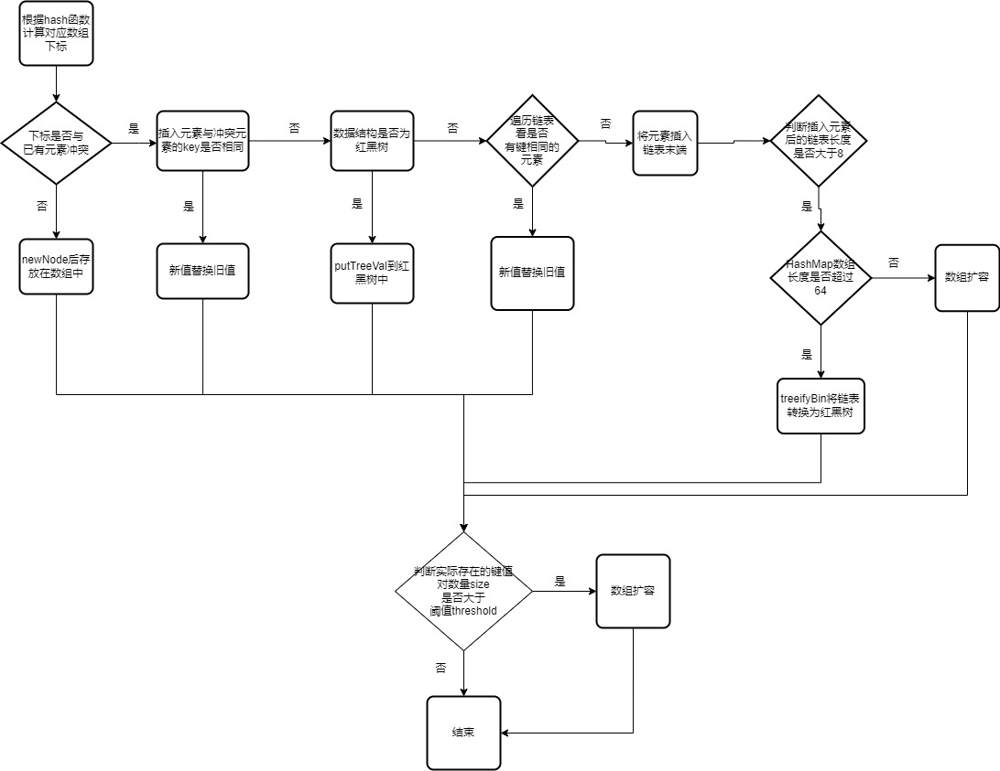

https://zhuanlan.zhihu.com/p/79219960

流程图：
1.什么时候会出现hash冲突？为什么会出现？
2.出现hash冲突后如何得知当前数据结构是红黑树还是链表？

putVal参数：
1.evict参数，何为创建模式

存数组
[Hashmap节点中Node数据结构浅谈](https://blog.csdn.net/weixin_43919032/article/details/114229234)
1.如果当前数组是空的，通过resize()方法创建一个新数组
2.根据(n-1)&hash计算在数组中插入的位置，hash=hash(key)
[Java中HashMap的hash方法原理是什么]https://blog.csdn.net/qq_51598480/article/details/122408456
为什么和length-1与？
[移位运算符，如何理解补码](https://zhuanlan.zhihu.com/p/396803121)
[Java中取余(%)和取模(Math.floorMod)的区别](https://blog.csdn.net/qq_43842093/article/details/123621321)
Java %是取余  
与运算和取模的关系
[初级--05--- 取模运算转化为位运算、位运算进行加减乘除](https://blog.csdn.net/weixin_48052161/article/details/121444170)
取模的数b，要满足b为2的整数次幂

3.如果在数组中的位置冲突：
1）数组中原元素的key与当前元素的key是否相同，相同则替换，否则下一步
2) 用instanceof判断插入的数据结构是红黑树还是链表  [java中 instanceof 的用法](https://blog.csdn.net/YXXXYX/article/details/120205124)
3) 如果是红黑树直接putTreeVal
4) 如果数据结构是链表，遍历链表看是否存在与当前元素的key相同的元素，存在就直接使用新的value替换掉旧的，不存在直接newNode并判断当前链表长度是否大于阈值8且数组长度是否超过64，是则执行链表转红黑树，
5) 插入后判断实际存在的键值对数量size是否大于阈值threshold，如果大于就开始扩容

