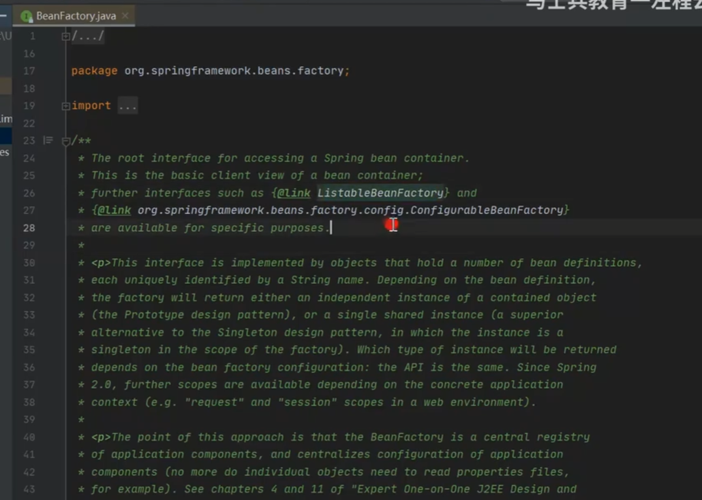
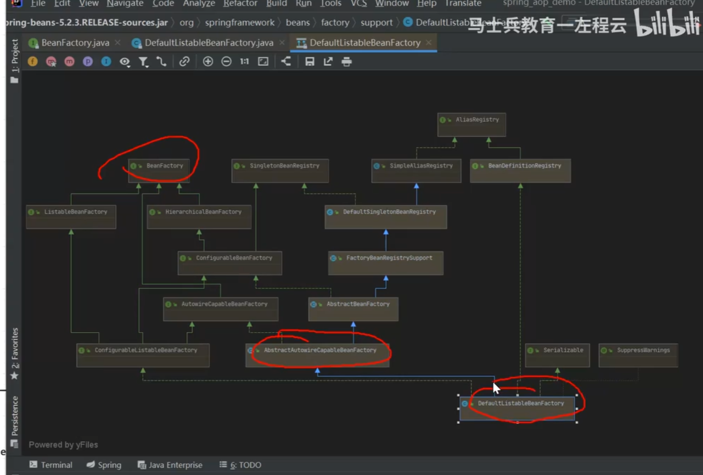

注意这三个东西

BeanFactoryPostProcessor案例

# 4.Spring是如何解决循环依赖的问题的？
三级缓存，提前暴露对象，aop
总：什么是循环依赖问题,A依赖B，B依赖A
分：先说明bean的创建过程：实例化、初始化（填充属性）
    1、先创建A对象，实例化A对象，此时A对象中的b属性为空，填充属性b
    2、从容器中查找B对象，如果找到了，直接赋值不存在循环依赖问题，找不到直接创建B对象
    3、实例化B对象，此时B对象中的a属性为空，填充属性a
    4、从容器中查找A对象，找不到，直接创建
    形成闭环的原因

    此时，如果仔细琢磨的化，会发现A对象是存在的，只不过此时的A对象不是一个完整的状态，只完成了实例化但是未完成初始化，如果在程序调用过程中，拥有了某个对象的引用，能否在后期给他完成复制操作，可以优先把非完整状态的对象优先赋值，等待后续操作来完成赋值，相当于提前暴露了某个不完整对象的引用，相当于提前暴露了某个不完整对象的引用，所以