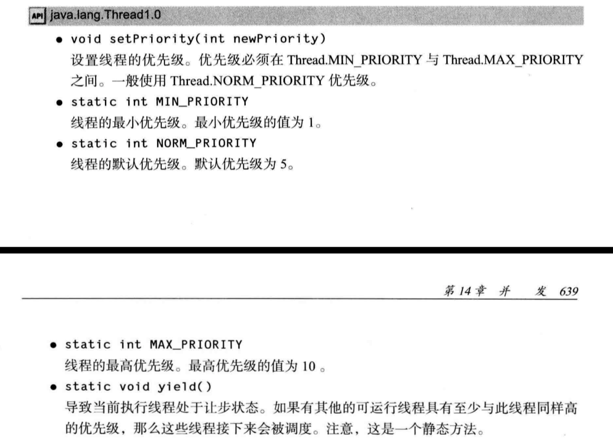

线程属性包括：
1.线程优先级
2.守护线程
3.线程组
4.处理未捕获异常的处理器

# 1.线程优先级
## 继承：
    默认情况下，一个线程继承它的父线程的优先级
## 设置：
    java 线程的优先级是一个整数，其取值范围是 1（Thread.MIN_PRIORITY ）- 10 （Thread.MAX_PRIORITY ）。
    默认情况下，每一个线程都会分配一个优先级 NORM_PRIORITY（5）。

## 线程执行的顺序非常依赖于平台
    每当线程调度器有机会选择新线程时，它首先选择具有较高优先级的线程。
    但是，线程 优先级是高度依赖于系统的。
    当虚拟机依赖于宿主机平台的线程实现机制时，Java线程的优先级被映射到宿主机平台的优先级上，优先级个数也许更多，也许更少。
    例如，Windows有7个优先级别。一些Java优先级将映射到相同的操作系统优先级。在Oracle为 Linux提供的Java虚拟机中，线程的优先级被忽略一所有线程具有相同的优先级。

## API

# 2.守护线程
https://blog.csdn.net/shimiso/article/details/8964414

# 3.未捕获异常处理器

