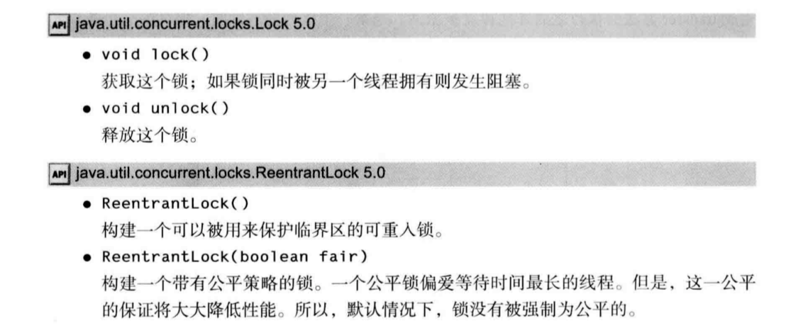

竞争条件：两个线程存取相同的对象，并且每一个线程都调用了一个修改该对象状态的方法。

# 1.竞争条件的一个例子

# 2.竞争条件详解

# 3.锁对象
## 用ReentrantLock保护代码块的基本结构：
```java
myLock.lock();    // a ReentrantLock object
try{
    critical section
}
finally{
    myLock.unlock();   // make sure the clock is unlocked even if an exception is thrown  
}
```
## 如何实现保护？
这一结构确保任何时刻只有一个线程进入临界区。一旦一个线程封锁了锁对象，其他任何线程都无法通过lock语句。当其他线程调用lock时，它们被阻塞，直到第一个线程释放锁对象。


==注意==：
1.必须把解锁操作放在finally子句之内。不然的话，若临界区的代码抛出异常，其他线程将永远被阻塞
2.如果使用锁，就不能使用带资源的try语句。

## 锁是可重入的
锁保持一个持有计数(hold count)来跟踪对lock方法的嵌套调用。线程在每一次调用 lock 都要调用unlock来释放锁。由于这一特性，被一个锁保护的代码可以调用另一个使用相同的锁的方法。

例如，transfer方法调用 getTotalBalance方法，这也会封锁 bankLock 对象，此时 bankLock 对象的持有计数为2。当 getTotalBalance方法退出的时候，持有计数变回 1。当 transfer方法推出的时候，持有计数变为0.线程释放锁。

## API



# 4.条件对象
```java
账活动之间修改余额。通过使用锁来保护检査与转账动作来做到这一点： public void transfer(int from, int to, int amount) 
{
    bankLock.lock(); 
    try {
        while (accounts[from] < amount) {
            sufficentFunds.await();
        // transfer funds
        ...
        sufficentFunds.signalAll();
        }
    }
    finally{
        bankLock.unlock();
    }
}
```
当调用await方法时，线程被阻塞，并放弃了锁
注意调用 signalAll 不会立即激活一个等待线程。它仅仅解除等待线程的阻塞，以便这些线程可以在当前线程退出同步方法之后，通过竞争实现对对象的访问。
另一个方法signal , 则是随机解除等待集中某个线程的阻塞状态。


## 等待获得锁的线程和调用await方法的线程有什么不同？


## API


# 5.synchronized关键字

## 总结锁和条件：
1.锁用来保护代码片段，任何时刻只能有一个线程执行被保护的代码。
2.锁可以管理试图进入被保护代码段的线程。
3.锁可以拥有一个或多个相关的条件对象。
4.每个条件对象管理那些已经进入被保护的代码段但还不能运行的线程。


## 一个方法用synchronized关键字声明
### 域方法
从1.0 版开始，Java中的每一个对象都有一个内部锁。

```java
public synchronized void method{
    //method body
}

// 等价于

public void method{
    try{
        //method body
    }   
    finally{
        this.intrinsicLock.unlock();
    }

}
```

### 静态方法
将静态方法声明为synchronized也是合法的。如果调用这种方法，该方法获得相关的类对象的内部锁。例如，如果 Bank类有一个静态同步的方法，那么当该方法被调用时，Bankclass对象的锁被锁住。因此，没有其他线程可以调用同一个类的这个或任何其他的同步静态方法。


## 方法
wait方法添加一个线程到等待集
notifyALL/notify方法解除等待线程的阻塞状态。

等价于 intrinsicCondition.await();     intrinsicCondition.signalAll();

==注释==：wait、notifyAll 以及 notify 方法是 Object 类的 final 方法。Condition 方法必须被命 名为 await、signalAll 和 signal 以便它们不会与那些方法发生冲突。


# 建议


# 6.同步阻塞

```java
synchronized (obj) // this is the syntax for a synchronized block 
{
    //critical section 
}
//于是它获得 Obj 的锁。
```


# 7.监视器概念

# 8.Volatile域
volatile关键字为实例域的同步访问提供了一种免锁机制。
https://blog.csdn.net/itachi85/article/details/50274169


# 9.final变量


# 10.原子性

# 