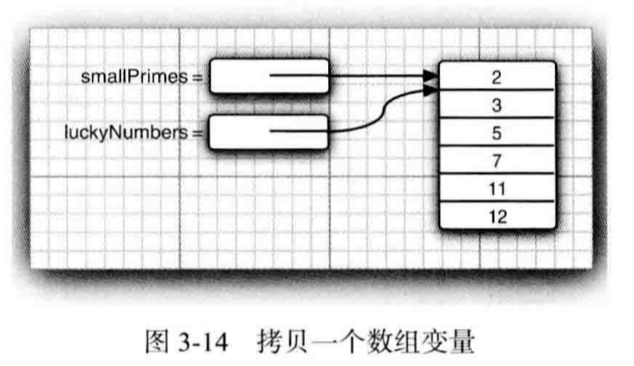
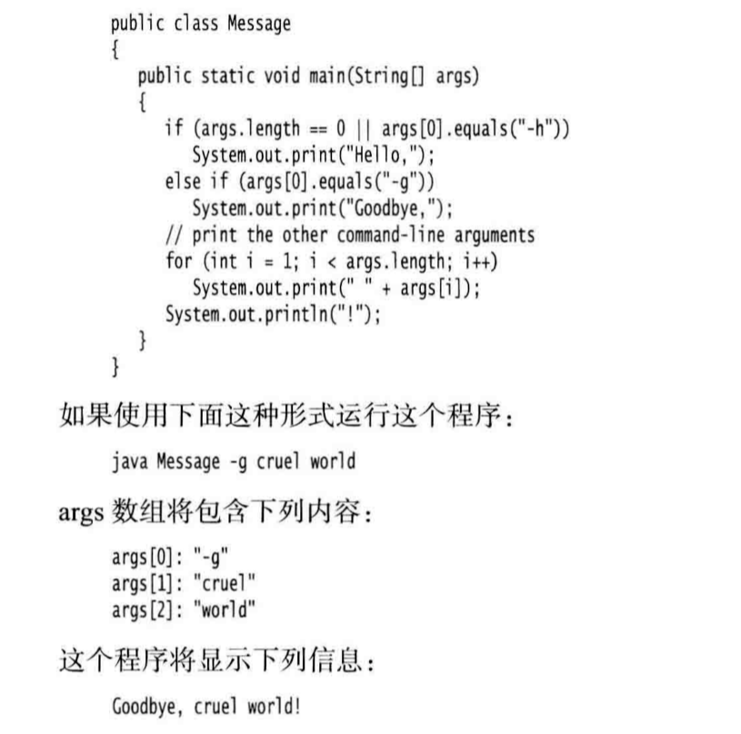
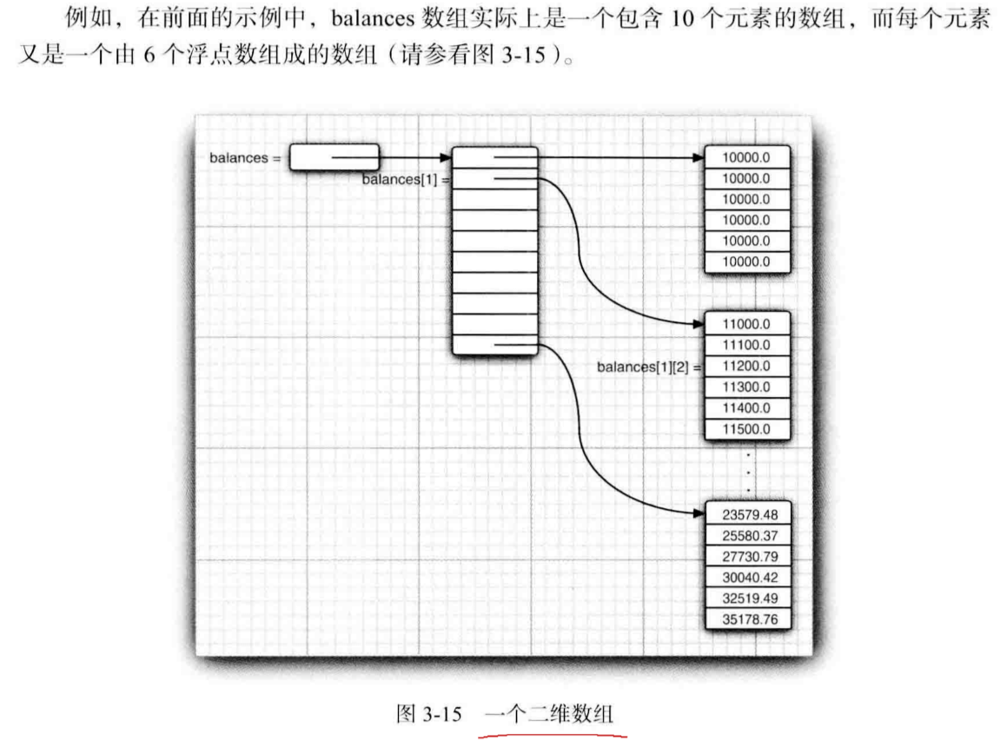

==声明数组并初始化：==
```java
int[] a = new int[100];
int n=100;
int[] b = new int[n]; //数组长度不要求是常量
```
注意：创建一个数字数组时，所有元素都初始化为0。boolean数组的元素会初始化为false。对象数组的元素则初始化为一个特殊值null（==如，字符串数组初始化后不是空串==）。

==获得数组元素个数使用array.length==


# 1.for each循环
## 逐个打印集合中每个元素
for (variable : collection)  statement
```java
for(int element : a)
    System.out.println(element);
```
优点：遍历集合中的每个元素更简易

## 用字符串打印数组中所有值
```java
System.out.println(Arrays.toString(a))  // 打印[1,2,3,4,5]
```

# 2.数组初始化及匿名函数
## 创建数组对象并同时赋予初始值
```java
int[] smallPrimes={2，3，5，7，11，13}； //注意不用调用new
```
## 初始化一个匿名数组

==可用于在不创建新变量的情况下重新初始化一个数组==
```java
smallPrimes=new int[]{17,19,23,29,31,37};
```

# 3.数组拷贝
## 引用数组(=运算符)
```java
int[] luckyNumbers = smallPrimes;
luckyNumvers[5] = 12; // 现在smallPrimes也是12
```


## 深拷贝(Arrays.copyOf)
```java 
int[] copiedLuckyNumbers = Arrays.copyOf(luckyNumbers, luckyNumbers.length) ;    
// 第二个参数是新数组的长度，通常用来增加数组的大小
luckyNumbers=Arrays.copyOf(luckyNumbers,2*luckyNumbers.length);
// 如果数组元素是数值型，那么多余的元素将被赋值为0；如果数组元素是布尔型，则将赋值为false。
```

# 4.命令行参数
每一个 Java应用程序都有一个带 String arg[]参数的main方法。这个参数表明main方法将接收一个字符串数组，也就是命令行参数



# 5.数组排序
 ## 优化的快速排序算法
 ```java
 int[] a = new int[100];
 Arrays.sort(a);
 ```


# 6.多维数组
## 创建二维数组
```java
double[][] balances;
balances=new double[NYEARS][NRATES];
int[][] magicSquare={{16,3,2,13},{5,10,11,8},{9,6,7,12},{4,15,14,1}
}
```
## 原理
 
### 交换行

### 构造不规则数组
```java
int[][] odds=new int[NMAX+1];
for(int n=0;n<=NMAX;n++)
    odds[n]=new int[n+1];
```


## 访问二维数组的所有元素

### 两个for循环嵌套

###  两个for each循环嵌套
```java
for(double[] row:a)
    for (double value : row)
        do something with value
```
### 快速打印一个二维数组
```java
System.out.println(Arrays.deepToString(a));
```


 
# java.util.Arrays
```java
static String toString(type[] a)
static type copyOf(type[] a,int length)
static type copyOfRange(type[] a,int start, int end )
static void sort(type[] a)
static int binarySearch(typpe[] a,type v)
static int binarySearch(type[] a, int start ,int end,type v)
static void fill(type[] a,type v)
static boolean equals(type[] a,type[] b) 
```

