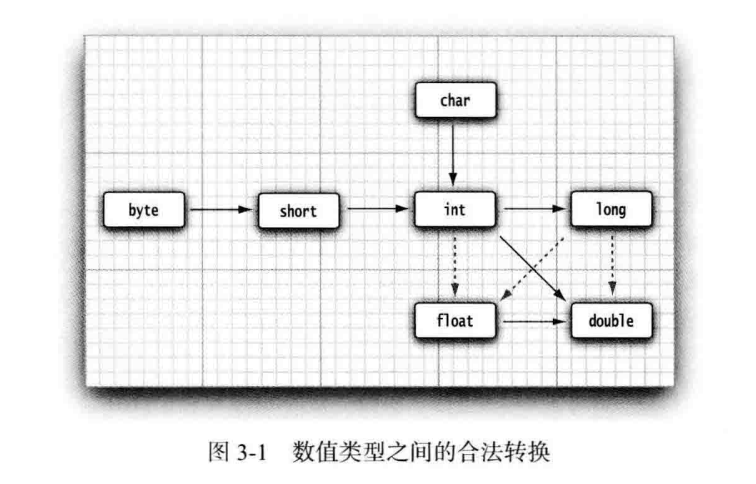

# 1.数学函数与常量
平方根 Math.sqrt()
幂运算 Math.pow(x,a)
整数求余  floorMod()
三角函数：
Math.sin    Math.cos    Math.tan Math.atan  Math.atan2
指数函数、自然对数和以10为底的对数：
Math.exp   Math.log  Math.log10
Java还提供了两个用于表示pi和e常量的近似值：
Math.PI   Math.E

静态导入可以在使用上述方法和变量时不用加前缀Math
```java
import static java.lang.Math.*;
```

# 2.数值类型之间的转换

虚箭头表示可能有精度损失的转换
例子：
## int型转换为float型：
```javak
    int n=123456789;
    float f=n; //f is 1.23456792E8
```


# 3.强制类型转换
## 浮点转化为整型：
```java
    double x=9.997;
    int nx=(int) x;
```
    强制类型转换通过截断小数部分将浮点值转换为整型

```java
    double x=9.997;
    int nx = (int) Math.round(x);
```
    用Math.round方法对浮点数进行舍入运算，返回long类型后再进行强制类型转换

## 超出表示范围：
```java
    System.out.println((byte)300);
```

# 4.结合赋值和运算符
```java
    x+=4;   //等价于x=x+4
```
如果运算符得到一个值，其类型与左侧操作数的类型不同，就会发生强制类型转换。
```java
x+=3.5  //等价于x=(int)(x+3.5)
```

# 5.自增与自减运算符
```java
    int n=12;
    n++;   //现在n=13
    int q=7;
    int w=7;
    int a=2*++q;
    int b=2*++w;
```

# 6.关系和boolean运算符
## 关系运算符
    ==  !=  < > <= >=
## 逻辑运算符
    && ||   它们都是按照“短路”方式来求值的

## 三元操作符
    condition ? expression1 : expression2
    如果条件为true，则该表达式为expression1的值，否则为expression2的值

```java
    x<y? x:y
```

# 7.位运算符
四个位运算符：
    &("and")   |("or")  ^("xor") ~("not")

A = 0011 1100
B = 0000 1101

A&B = 0000 1100
A |  B = 0011 1101
A^B = 0011 0001
~A = 1100 0011


    
## 利用位运算符取得整数中的各个位
    例如求整数变量n从右边数第4位：
```java
    int fourthBitFromRight = (n & 0b1000) /0b1000
```

## 计算布尔值
不采用“短路”方式求值，得到计算结果之前两个操作数都要计算(==注意与逻辑运算符不同==)

## 移位运算符
<< 左移  >> 有符号右移，空缺位用0填充  >>> 无符号右移，空缺位用0填充

# 8.括号与运算符级别


# 9.枚举类型

