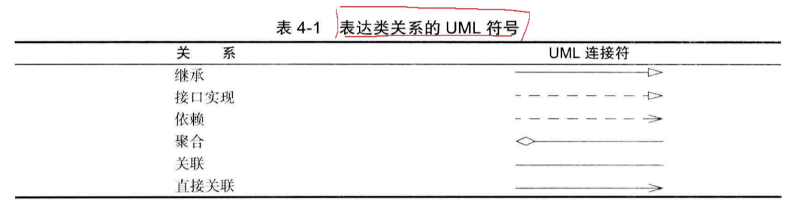

public 任何类的任何方法
private 自身类的方法
如果没有指定public或private，这个部分（类、方法或变量）可以被同一个包中的所有方法访问
# 1.类

# 2.对象
## 三个主要特性：1.行为 2.状态 3.标识

# 3.识别类

# 4.类之间的关系
## 依赖
## 聚合
## 继承
## 表达类关系的UML符号

# 5.方法
访问器方法：域访问器：只返回实例域值
更改器方法