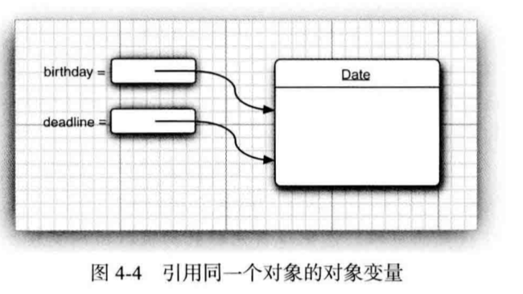

# 1.对象与对象变量
## 对象的使用
```java
new Date()     //构造了一个对象，这个对象被初始化为当前的日期和时间
System.out.println(new Date()) ; //将对象传递给方法
String s= new Date().toString();  //使用对象的方法 
```

## 对象变量
一个对象变量并没有实际包含一个对象，而仅仅引用一个对象。 
在Java中，任何对象变量的值都是对存储在另外一个地方的一个对象的引用。new操作符的返回值也是一个引用。
```java
Date deadline=new Date();
Date birthday;
birthday=deadline;
```


## 使用clone方法获得对象的完整拷贝


# 2.Java类库中的LocalDate类


# 3.更改器方法与访问器方法
## 访问器方法：只访问对象而不修改对象
域访问器：只返回实例域值

## 更改器方法：修改对象，对象的状态会改变

