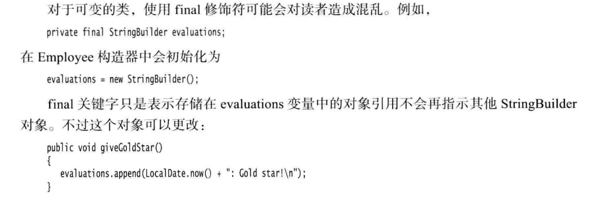

# 1.一个源文件的类的编写
源文件名必须与public类的名字相匹配。在一个源文件中，只能有一个公有类，但可以有任意数目的非公有类。


# 2.多个源文件的使用


# 3.剖析Employee类


# 4.从构造器开始
1.构造器与类同名，在构造Employee类的对象时，构造器会运行，以便将实例域初始化位所希望的状态。
2.每个类可以有一个以上的构造器
3.构造器可以有0个、1个或多个参数
4.构造器没有返回值
5.构造器总是伴随着new操作一起调用
==注意：不要在构造器中定义与实例域重名的局部变量==

# 5.隐式参数与显式参数
方法用于操作对象以及存取它们的实例域。例如，方法：
```java
public void raiseSalary(double byPercent)
{   
    double raise = salary*byPercent/100;
    salary+=raise;
}
```
该方法有两个参数。
隐式参数：出现在方法名前的Employee类对象。（但没有出现在方法声明中）
显式参数：位于方法名后面括号中的数值
在每一个方法中，关键字this表示隐式参数。如可以用下列方法编写raiseSalary方法：
```java
public void raiseSalary(double byPercent)
{
    double raise = this.salary*byPercent/100;
    this.salary+=raise;
}
```

==问题：什么是内联方法？==


# 6.封装的优点
类应该提供以下三项内容:
1.一个私有的数据域。
2.一个公有的域访问器方法。
3.一个公有的域更改器方法。

好处：
1.可以改变内部实现。
2.更改器方法可以执行错误检查，然而直接对域进行赋值将不会进行这些处理。例如，setSalary 方法可以检查薪金是否小于0。

==警告==:不要编写返回引用可变对象的访问器方法，有可能破坏封装性。
例子：


如何优化：
如果需要返回一个可变数据域的拷贝，就应该使用clone。
```java
class Employee
{
    ...
    public Date getHireDay()
    {
        return (Date) hireDay.clone();
    }
    ...
}
```


# 7.基于类的访问权限
一个方法可以访问所属类的==所有对象==的==私有数据==。
例子：
比较两个雇员姓名的equals方法
```java
class Employee
{
    ...
    public boolean equals(Employee other)
    {
        return name.equals(other.name);
    }
}
```
调用方式：
```java
if(harry.equals(boss))...
```
这个方法不仅访问harry的私有域，还访问了boss的私有域。

# 8.私有方法
## 什么情况下使用？
有时，可能希望将一个计算代码划分成若干个独立的辅助方法。通常， 这些辅助方法不应该成为公有接口的一部分，这是由于它们往往与当前的实现机制非常紧密，或者需要一个特别的协议以及一个特别的调用次序。最好将这样的方法设计为private的。

## 好处
如果数据的表达方式发生了变化，一个方法可能会变得难以实现，或者不再需要。对于私有方法，如果果改用其他方法实现相应的操作，则不必保留原有的方法。==原因==：它不会被外部的其他类操作调用，可以将其删去。如果方法是公有的，就不能将其删去，因为其他的代码很可能依赖它。


# 9.final实例域
## 怎么用？
将实例域定义为final，在每一个构造器执行后，这个域的值被设置，并且在后面的操作中，不能够对它进行修改。

## 用在哪？
大都应用于基本类型域，或不可变类的域。
即基本数据类型或String类

## 用于可变类


