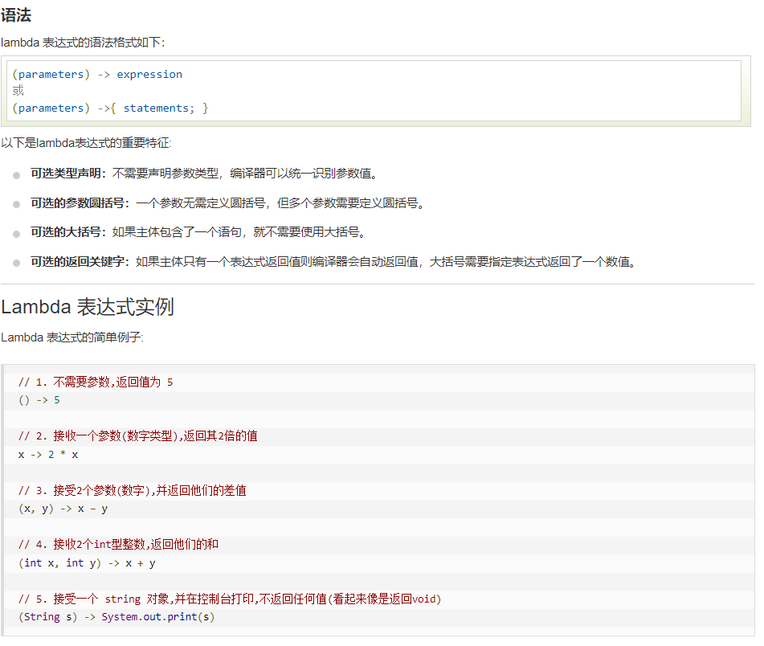
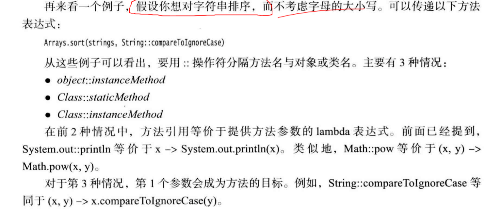

# 1.为什么引入lambda表达式
lambda表达式是一个可传递的代码块，可以在以后执行一次或多次。

# 2.lambda表达式的语法

# 3.函数式接口
对于只有一个抽象方法的接口，需要这种接口的对象时，就可以提供一个lambda表达式。这种接口称为函数时接口。
```java
Arrays.sort(words,(first,second) -> first.length() - second.length());
```


# 4.方法引用



# 5.构造器引用
```java
Person::new;
```
## 得到一个Person引用数组
```java
Person[] people = stream.toArray(Person::new)
```

# 6.变量作用域
1.在表达式中引用可变变量是不合法的，lambda表达式中捕获的变量必须实际上是最终变量(effectively final)
2.在lambda表达式中声明与一个局部变量同名的参数或局部变量是不合法的。
3.在一个lambda表达式中使用this关键字没有特殊之处


# 7.处理lambda表达式


# 8.再谈Comparator


