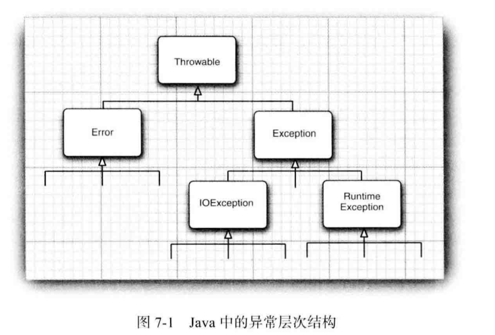

如果由于出现错误而使得某些操作没有完成， 程序应该： 
回到一种安全状态，并能够让用户执行一些其他的命令；
或者允许用户保存所有操作的结果，并以妥善的方式终止程序。
做到这些的难点是：检测（或引发）错误条件的代码通常离 那些能够让数据恢复到安全状态，或者能够保存用户的操作结果，并正常地退出程序的代码很远。
==异常处理的任务==：将控制权从错误产生的地方转移给能够处理这种情况的错误处理器。
==程序中可能会出现的错误和问题==:
1.用户输入错误
2.设备错误
3.物理限制
4.代码错误

# 7.1.1 异常分类

Error类：Error类层次结构描述了 Java 运行时系统的内部错误和资源耗尽错误。应用程序不应该抛出这种类型的对象。如果出现了这样的内部错误，除了通告给用户，并尽力使程序安全地终止之外，再也无能为力了。这种情况很少出现。
派生于 RuntimeException 的异常包含下面几种情况： 
•错误的类型转换。 
•数组访问越界
•访问 null 指针 
不是派生于 RuntimeException的异常包括：
•试图在文件尾部后面读取数据。 
•试图打开一个不存在的文件。
•试图根据给定的字符串查找 Class 对象， 而这个字符串表示的类并不存在。

非受查（unchecked）异常：派生于Error类或RuntimeException类的所有异常
受查（checked）异常：所有其他的异常
==注意==：编译器将核查是否为所有的受査异常提供了异常处理器。