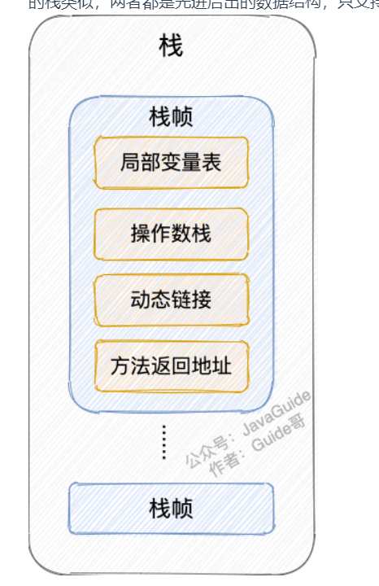

# 1.什么是JVM？

# 2.类加载器（Class文件如何从硬盘中到内存里？）
loading： 将class文件二进制字节装到内存里  
linking:
    verification：验证是否符合class文件标准
    preparation：将class文件静态变量赋默认值
    resolution：常量池的符号引用转换为直接的内存地址
initializing：静态变量赋为初始值，调用静态代码块

## loading后内存中发生了什么？
一个class被load到内存后，内存里创建了两块内容，第一块是硬盘中class文件的所有二进制内容，第二块是生成的class类对象指向第一块的内容，之后我们自己new的实例通过访问class类对象来访问class类文件

# 方法区理解
https://blog.csdn.net/A_art_xiang/article/details/118568601

# 看Javaguide

