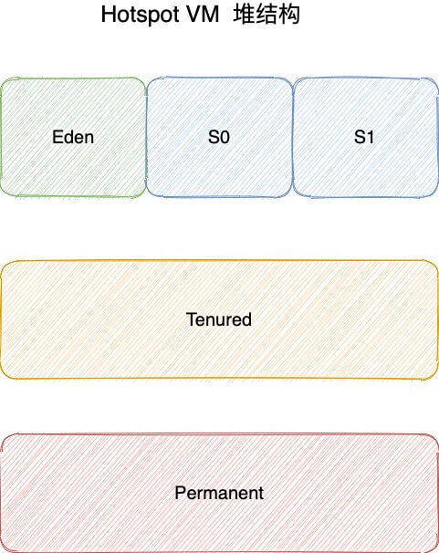

# 2.运行时数据区域
## 2.1程序计数器
存储的内容是下一个需要执行的命令的地址
为什么程序计数器不会发生OutOfMemoryError？
https://blog.csdn.net/liulangcheshou/article/details/91448156
==注意==：程序计数器是唯一一个不会出现 OutOfMemoryError 的内存区域，它的生命周期随着线程的创建而创建，随着线程的结束而死亡。

## 2.2 Java虚拟机栈

## 2.3 本地方法栈
和虚拟机栈所发挥的作用非常相似，区别是：虚拟机栈为虚拟机执行Java 方法（也就是字节码）服务，而本地方法栈则为虚拟机使用到的Native 方法服务。

## 2.4 堆
### 此内存区域的唯一目的就是存放对象实例，几乎所有的对象实例以及数组都在这里分配内存。

### 从 JDK 1.7 开始已经默认开启逃逸分析，如果某些方法中的对象引用没有被返回或者未被外面使用（也就是未逃逸出去），那么对象可以直接在栈上分配内存。

### JDK 8 版本之后 PermGen 已被 Metaspace(元空间) 取代，元空间使用的是直接内存。

## 2.5 方法区
方法区与Java堆一样，是各个线程共享的内存区域，它用于存储已被虚拟机加载的类信息、常量、静态变量、即时编译器编译后的代码等数据。

## 2.6 运行时常量池
JDK1.7 之前运行时常量池逻辑包含字符串常量池存放在方法区, 此时 hotspot 虚拟机对方法区的实现为永久代
JDK1.7 字符串常量池被从方法区拿到了堆中, 这里没有提到运行时常量池,也就是说字符串常量池被单独拿到堆,运行时常量池剩下的东西还在方法区, 也就是 hotspot 中的永久代 。
JDK1.8 hotspot 移除了永久代用元空间(Metaspace)取而代之, 这时候字符串常量池还在堆, 运行时常量池还在方法区, 只不过方法区的实现从永久代变成了元空间(Metaspace)
[JVM常量池中存储的是对象还是引用](https://www.zhihu.com/question/57109429)

## 2.7 直接内存