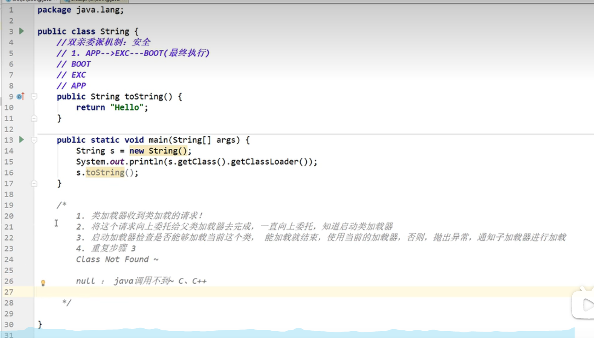

https://zhuanlan.zhihu.com/p/476252005

https://blog.csdn.net/m0_52982868/article/details/122656085

https://www.cnblogs.com/wql025/p/14829643.html
[JVM方法到底如何执行](http://www.360doc.com/content/20/0905/19/835902_934142427.shtml)
[JVM运行时数据区](https://baijiahao.baidu.com/s?id=1728148093938246786&wfr=spider&for=pc)
1.JVM的位置

3.类加载器
类的加载：将某个字节码文件加载到内存中
作用：加载Class文件  new Student() 对实例的引用放在Java栈，具体的实例放在堆
    1.虚拟机自带的加载器
    2.启动类（根）加载器
    3.扩展类加载器
    4.应用程序（系统类）加载器

[双亲委派机制](https://blog.csdn.net/axiaobaoa/article/details/125011774)

OOM错误示例：
```java
import java.util.Random;

public class Hello{

    String str="sdasfdsafasfasdsa";
    while(true){
        str+=str+new Random().nextInt(88888888)+new Random().nextInt(99999999);
    }
}
```

栈溢出示例：
```java
public class Test{
    public static void main(String[] args){
        Test test=new Test();
        test.a();
    }
    public void a(){
        b();
    }
    public void b(){
        a();
    }
}
```