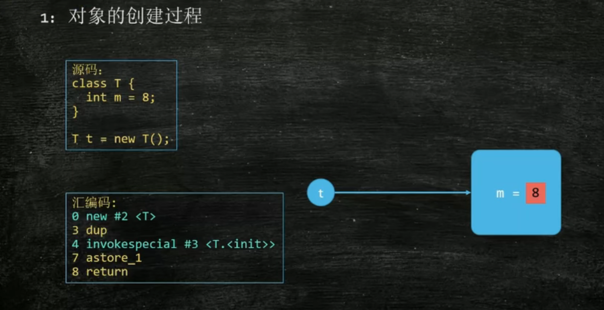
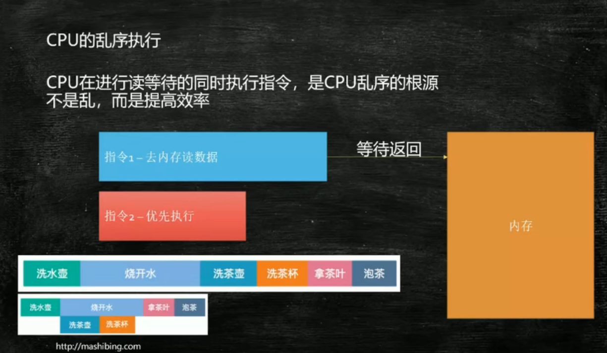
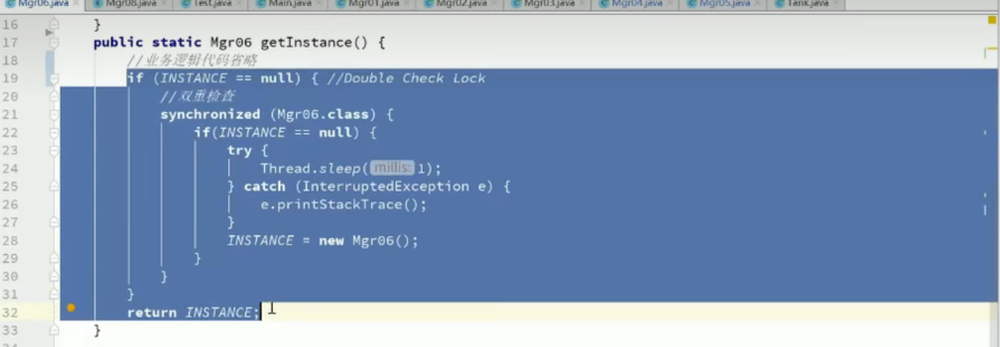
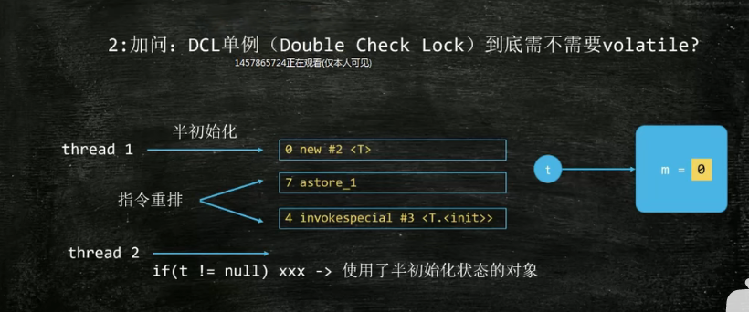
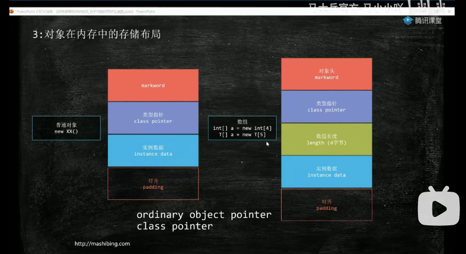
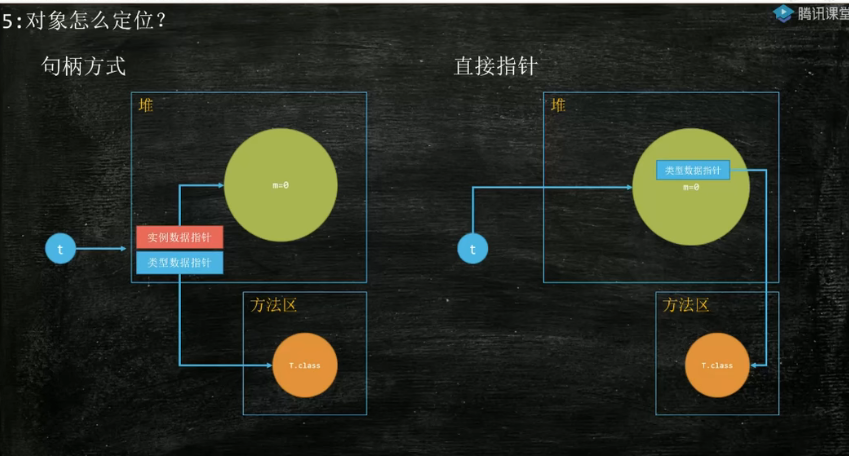
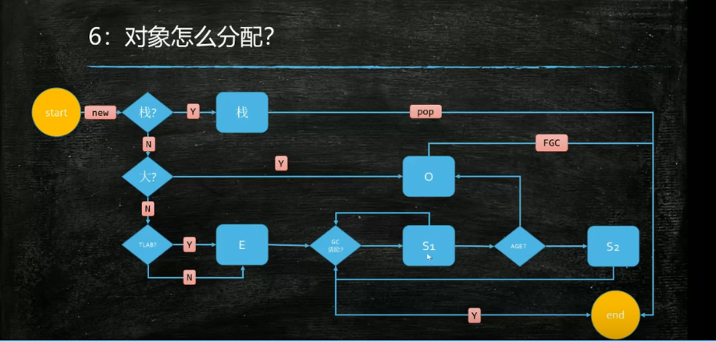
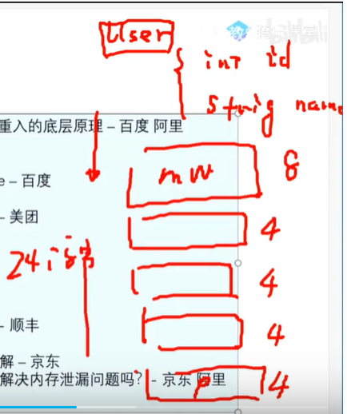
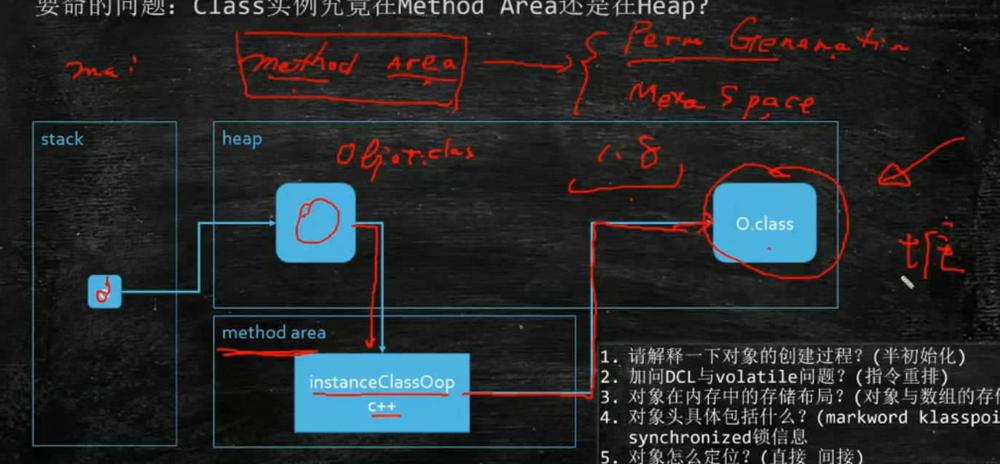

[a](https://www.bilibili.com/video/BV1S34y1m7sX?p=61&vd_source=7116afddac4acaa2875e31b432e7f0ed)
# 1.请解释一下对象的创建过程？（半初始化）

0: 开辟空间存放T实例（成员变量为默认值）
3：调用T的初始化方法
7：将t和实例建立联系

# 2.DCL单例（Double Check Lock）到底需不需要volatile？
volatile: 修饰一个变量时，表示进程间可见和禁止重排序
==什么是重排序？==
表示这块内存的

==什么是DCL单例==

https://www.zhihu.com/question/308850392


乐观锁 ABA问题
==CAS(Compare And Swap)== 自选琐 乐观锁   替代重量级琐的一种上锁方式
比如有一个原来的值为0，有一堆线程对其进行递增，一般为了保持线程一致性需要对++进行上锁，但是有一种简单的方式可以不用上synchronized。
==比较并交换==：将0读到自己线程的内存里来，将0改为1，将1写回去的时候，先判断原来的0是不是依然为0，如果发现已经被别的线程改为8了，那就将8拿过来改为9再往回设置看是不是依然为8
==ABA问题==：0可能被线程2改为8
后，被线程3改回为0，在线程1看来0没有变化。简单的值ABA问题没有影响，但是引用类型则有可能影响业务逻辑。
    如何解决：增加一个值，版本号




# 3.对象在内存中的存储布局
共4个部分，markword(8字节)和Class pointer(4字节)共同构成Object Header
Class pointer指向T.class
padding是指整个字节数不能被8整除，padding补全是指能被8整除，读写起来效率较高

## 使用JOL查看对象布局

# 4.对象头包括什么？
## markword：
    1.锁信息
    2.GC
    3.HashCode（Identity HashCode）
        
## classpointer：
    为什么大多时候是4字节有时是8字节，CPU有三个总线，数据总线，地址总线，控制总线，对于64位CPU的地址总线，内存往往没有8字节大的地址去寻址，则压缩为32位（4字节），当内存超过32G时，则膨胀为8字节。


# 5.对象怎么定位？
## 什么是对象定位？
```java
    T t=new T();
```
t怎么找到new出来的T实例就是对象定位
## 两种方式：
直接指针：是直接指向类型数据指针
句柄方式：指向一组指针，第一个是实例数据指针，第二个是类型数据指针


## 句柄方式的优势是什么？
GC在进行复制时t的值不需要变，方便GC回收

## 什么是GC复制？
一个对象new出来放在年轻代，经过一定的年龄之后会放到老年代，所以对象在内存里面有复制的过程

# 6：对象怎么分配？
1.对象优先分配在栈上，好处：回收的时候不需要GC的介入，效率非常高
有一些对象不是很大(Xss设置最大栈的大小)而且不存在逃逸，那么它就可以被分配在栈上
2.如果栈上分配不下怎么办？
如果很大，放到老年代，经过FGC该对象才会被回收
3.如果不大，则放到线程本地缓冲区TLAB（ThreadLocalAllocationBuffer）
4.如果线程本地缓冲区分配不下，就分配到伊甸区
5.分配在伊甸区的对象会经历YGC清除，如果未被清除则进入Surviver1区，再经历YGC清除并涨年龄，年龄够大就进入老年区，不够大则进入Surviver2区，再经历YGC清除并涨年龄，年龄够大就进入老年区，不够大则进入Surviver1区，循环往复。

## 什么是对象不存在逃逸？
对象只在m2方法里存活，没有别人可以访问到他

存在逃逸的情况：
m1方法用到了m2中new的对象

## 什么是线程本地缓存区？
假设有T1、T2、T3线程，它们在JVM启动后都会往伊甸区分配对象，它们有可能去抢同一个位置（碰撞指针），JVM需要花额外CPU资源去协调，与其这样不如给它们每个线程一个自己的小空间，自己的线程分配对象时优先往TLAB分配


# 7.一个Object占多少字节？
```java
Object o=new Object();
```
markword8个字节，classpointer4个字节，padding4个字节，共16个字节
 


# 8.Class对象是在堆里还是在方法区？

method area是接口，perm Generation（JDK1.7）和meta space（JDK1.8）是实现类

class对象在堆里方便我们做反射用


# 9.类加载加载过程？
类加载到方法区
方法区里面一块是代码 
另一块存放类的信息等
loading： 将class文件二进制字节装到内存里  
linking:
    verification：验证是否符合class文件标准
    preparation：将class文件静态变量赋默认值
    resolution：常量池的符号引用转换为直接的内存地址
initializing：静态变量赋为初始值，调用静态代码块


