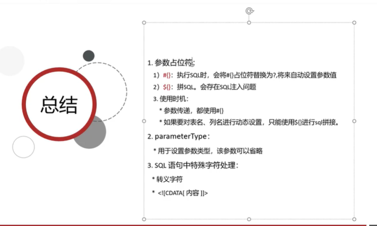

# 什么是MyBatis？

## JDBC缺点->MyBatis

# 快速入门
## 案例需求

1.定义pojo类来映射返回数据
2.编写核心配置文件：设置datasource

## 解决SQL语句警告提示

# Mapper代理开发

## 关于Resource资源
resource资源下的文件在编译后会放到java包对应的目录下

# MyBatis核心配置文件

# 配置文件完成增删改查

## 环境配置

### MyBatisX插件

## 查询所有结果

## 查看详情

### 参数占位符  #{}  ${}
1.#{}  
会将其替换为？，为了防止SQL注入

2.${}
拼SQL，会存在SQL注入问题  

3.使用时机：
参数传递的时候#{}
表名或列名不固定的情况下：${}

不开启useServerPrepStmts
都会用statement

开启useServerPrepStmts
用preparedstatement
对${}占位符，拼好了，预编译然后执行

对#{}占位符用?替代后，预编译然后执行

## 条件查询
### 多条件查询

#### 参数传递的方式
1.MyBatis不知道把哪个参数值传给哪个占位符，所以如果是多个参数的话，需要用@Param注解标注
2.用一个对象去存储所有参数，属性名需要和占位符名保持一致，MyBatis根据占位符名去找到对应的值
3.也可以用一个Map去存储所有参数，原理和2一样

### 动态条件查询
多条件查询时有的条件用户没有输入怎么查询呢？

### 单条件动态查询
