https://blog.csdn.net/lsdstone/category_11932547.html

# 1.说一下你在项目中的redis的应用场景？
    1.5大value类型：根据redis课有场景介绍
        1)String：
            字符串  存数据：session、token、图片地址、序列化对象
            数值   计数：规避并发下对数据库的事务操作
            bitmap  活跃用户情况、用户签到情况、用户行为统计
        2）List：底层的数据结构是双向链表，有一个头指针和一个尾指针分别指向链表的首部和尾部，可以用来当作栈、队列、数组、阻塞单播队列
        3）hash：
            可以理解为把value当作一个hashmap，应用场景有存用户信息，商品信息等
            HSET、HMSET、HGET、HMGET
        4）set： 
            主要特征就是无序、去重，那么可以存放一些不能重复的数据，比如记录点赞的用户，
            另外还有很多集合操作，所以可以用来求共同好友、做好友推荐等
            SPOP、SRANDMEMBER命令的应用场景有抽奖系统，
        5）sorted set：
            和set相比增加了一个权重参数score，集中的元素就可以按照score的大小来进行排序
            应用场景：微信步数排行榜
            命令ZRANGE从小到大排序、ZREVRANGE从大到小排序
            实现上使用了跳表的数据结构，增删查改的平均性能较其他平衡树更好
    2.基本上就是缓存
    3.token session 为的是服务无状态，看项目有哪些数据结构或对象，在单机里需要单机锁，在多级需要分布式琐，抽出来放入redis
    4.[redis无锁应对并发控制访问](https://blog.csdn.net/ggh0314/article/details/117559690)
        1）把多个操作在Redis中实现成一个操作，单命令操作 INCR  DECR
        2）把多个操作写到一个Lua脚本中，以原子性方式执行单个Lua脚本

# 2.redis是单线程还是多线程？
    1.无论什么版本，工作线程就是一个
    2.6.x高版本出现了IO多线程
    3.单线程，满足redis的串行原子，只不过IO多线程后，把输入/输出放到更多的线程里去并行，好处如下：执行时间缩短，更快；更好地压榨系统及硬件的资源（网卡能够高效的使用）
    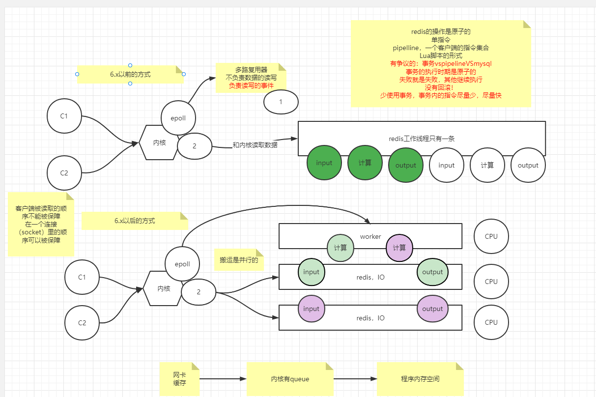
# 3.redis存在线程安全的问题吗？为什么？
    重复2的单线程串行
    redis可以保障内部串行
    外界使用的时候要保障，业务上要自行保障顺序

# 4.缓存穿透、缓存击穿、缓存雪崩
    大量请求过来时，会堆积在redis中
    以上问题，核心就是避免DB无效/重复请求，结合图去理解
    涉及一些架构思想上的提升
## 缓存穿透：
    解释：大量请求来查询一笔数据库中没有的数据
    解决：
        1.第一笔穿透请求对mysql数据库进行查询后通过set key null来告知redis数据库中没有该数据，这样之后的穿透请求就可以直接返回
        2.使用布隆过滤器
        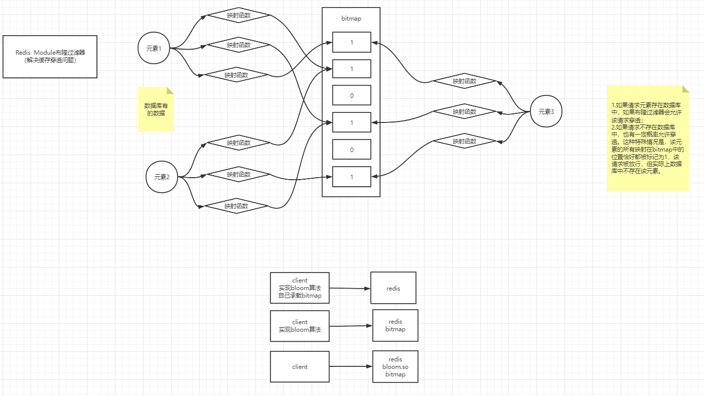

## 缓存击穿：
    解释: 大量请求来查询一笔数据库中有但是redis中没有的数据
    解决：实现分布式锁

## 缓存雪崩：
    解释：大量请求来查询多笔数据库中有但是redis中没有的数据
    解决：多把分布式锁

# 5.缓存如何淘汰过期的keys？
    1.后台在轮询，分段分批的删除那些过期的key
    2.请求的时候判断是否已经过期了
    尽量把内存无用空间收回来

    过期删除策略
    前面介绍的LRU和LFU算法都是在Redis内存占用满的情况下的淘汰策略，那么当内存没占满时在Redis中过期的key是如何从内存中删除以达到优化内存占用的呢？ 

    官网：https://redis.io/commands/expire#expire-accuracy 

    在Redis中过期的key不会立刻从内存中删除，而是会同时以下面两种策略进行删除：

    惰性删除：当key被访问时检查该key的过期时间，若已过期则删除；已过期未被访问的数据仍保持在内存中，消耗内存资源；
    定期删除：每隔一段时间，随机检查设置了过期的key并删除已过期的key；维护定时器消耗CPU资源；
    Redis每10秒进行一次过期扫描：

    随机取20个设置了过期策略的key；
    检查20个key中过期时间中已过期的key并删除；
    如果有超过25%的key已过期则重复第一步；
    这种循环随机操作会持续到过期key可能仅占全部key的25%以下时，并且为了保证不会出现循环过多的情况，默认扫描时间不会超过25ms；

# 6.缓存是如何淘汰的？
    0.内存空间不足的情况下
    1.淘汰机制里有不允许淘汰
    2.lru/lfu/random/TTL
    3.全空间
    4.设置过过期的key的集合中

    内存淘汰策略
    Redis中共有下面八种内存淘汰策略：

    volatile-lru：设置了过期时间的key使用LRU算法淘汰；
    allkeys-lru：所有key使用LRU算法淘汰；
    volatile-lfu：设置了过期时间的key使用LFU算法淘汰；
    allkeys-lfu：所有key使用LFU算法淘汰；
    volatile-random：设置了过期时间的key使用随机淘汰；
    allkeys-random：所有key使用随机淘汰；
    volatile-ttl：设置了过期时间的key根据过期时间淘汰，越早过期越早淘汰；
    noeviction：默认策略，当内存达到设置的最大值时，所有申请内存的操作都会报错(如set,lpush等)，只读操作如get命令可以正常执行；

# 7.如何进行缓存预热？
    1.提前把数据塞入redis(你知道哪些是热数据吗？肯定不知道，会造成上线很多数据没有缓存命中)
    2.开发逻辑上也要规避差集（你没缓存的），会造成击穿，穿透，雪崩
    3.一劳永逸，未来也不怕
    结合第4个问题

# 8.数据库与缓存不一致如何解决？
    1.我们可以使用分布式事务来解决（意义不大），读多写稀有情况
    2.redis是缓存，更倾向于稍微的有时差
    3.减少DB的操作
    4.落地还是cannal
## Cache Aside Pattern旁路缓存模式
    1.写：更新db，删除cache
    2.读：读cache，读不到从db读，读完后更新cache
    缺陷：
    1.首次请求数据不存在    解决：预存
    2.写操作频繁导致cache频繁被删除，影响缓存命中率    解决：更新db的同时更新cache，不过需要加一个锁/分布式锁来保证更新cache的时候不存在线程安全问题
## Read/Write Through Pattern
    1.写：看cache有没有，没有直接写db，有就先更新cache，再更新db
    2.读：看cache有没有，没有cache就从数据库去读，读完自己先更新了再返回

# 9.简述一下主从不一致的问题？
    1.redis的确默认是弱一致性，异步的同步
    2.锁不能用主从（单实例/分片集群/readlock）==> redisson
    3.在配置中提供了必须有多少个client连接能同步，你可以配置同步因子，趋向于强一致性
    4.wait 

#  10.描述一下redis持久化方式
    1.RDB,AOF；主从同步也算持久化
        Redis支持两种不同的持久化操作，一种叫快照snapshotting(redis database,RDB)，另一种是只追加文件(append-only file，AOF)。
        RDB：
            通过创建快照来获得内存里的数据在某个时间的副本并进行备份，一方面可以用于复制到其他服务器，另一方面可以在重启服务的时候使用
            redis默认的持久化方式就是快照持久化,在redis.config中有默认的配置：
            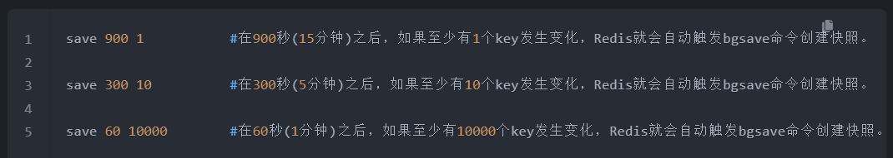
        AOF：
            实时性更好，是主流的持久化方式
            默认redis没有开启，通过appendonly yes参数开启
            ==开启==后每执行一条更改语句就会将该命令写入内存缓存server.aof_buf
            根据appendfsync配置来决定==何时==将其同步到硬盘中的AOF文件，有三种不同的方式：
                1.每次收到更改数据的命令都进行写入 
                2.每秒钟进行一次写入  
                3.由操作系统决定何时进行写入
    2.高版本：开启AOF，AOF是可以通过执行日志得到全部内存数据的方式,但是追求性能
    2.1 体积变大，重复无效指令  重写，后台用线程把内存的kv生成指令写在新的AOF
    2.2 4.x 新增更有性能模式：把重写方式换成直接RDB放到aof文件头部，比2.1的方法快
    ，再追加日志
## [AOF重写](https://blog.csdn.net/hezhiqiang1314/article/details/69396887)
    为什么需要重写？    
        时间越长AOF文件会变得非常大，一方面计算机存储压力很大，另一方面还原出数据库状态的所需要的时间增加
    如何重写？
        fork出一个后台线程把内存里的kv生成指令写在新的AOF用来替代现有的AOF文件，原始的aof文件肯定很多的冗余指令，比如有很多条rpush，但在新aof文件中就会优化为一条rpush命令压入多个数据。
        同时存在一个问题：子进程在写的时候，服务器进程还要处理新的命令，新的命令有可能对现有的数据进行修改，会让当前数据库的数据和重写后的AOF文件中数据不一致
            解决：redis增加了一个AOF重写缓存，新命令既写入AOF缓冲区也写入AOF重写缓冲区

## [RDB和AOF混合](https://zhuanlan.zhihu.com/p/462906147)
Redis 4.0 开始支持RDB和AOF的混合持久化（默认关闭，可以通过配置项 aof-use-rdb-preamble 开启）。
如果把混合持久化打开，AOF 重写的时候就直接把 RDB 的内容写到 AOF 文件开头。这样做的好处是可以结合 RDB 和 AOF 的优点, 快速加载同时避免丢失过多的数据。当然缺点也是有的，AOF里面的RDB部分是压缩格式不再是AOF格式，可读性较差。

# 11.redis持久化原理
    1.当前线程阻塞服务  不聊
    2.异步后台进程完成持久
    copy on write

# 12.redis实现分布式锁的指令  为什么使用setnxx？  redis的事务中三条指令是什么。第三条指令到达执行失败了，怎么处理
[Redis分布式锁的实现和原理](https://baijiahao.baidu.com/s?id=1730716661153081344&wfr=spider&for=pc)
## 为什么需要分布式锁？
synchronized保证同一时刻只能有1个线程获取到对象锁而处理
不满足现在的业务场景：多台应用服务器
### 什么是分布式锁？
分布式锁，就是控制分布式系统中不同进程共同访问同一共享资源的一种锁的实现。

## redis命令实现分布式锁（解决宕机不释放锁、未完成操作超时释放导致误删、判断和执行非原子操作而导致误删）
setnx key value
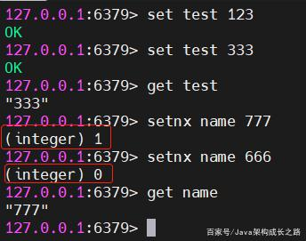

### 版本1：setnx key value
setnx命令取锁，取到就返回1，取不到就返回0；取不到通过while循环一直取
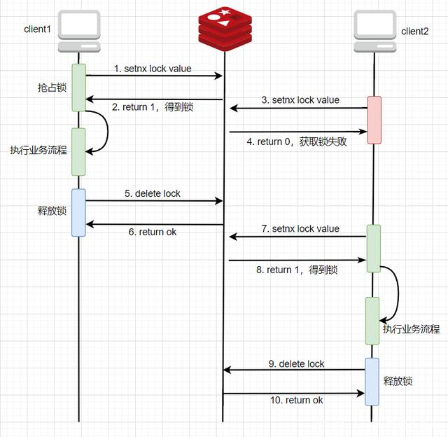

    问题：如果获得锁的程序在释放锁之前宕机了，那么这个key就会永久的存储在Redis中，其他客户端永远得不到这把锁

### 版本2：setnx key value+设置key的过期时间
解决了版本1的问题：
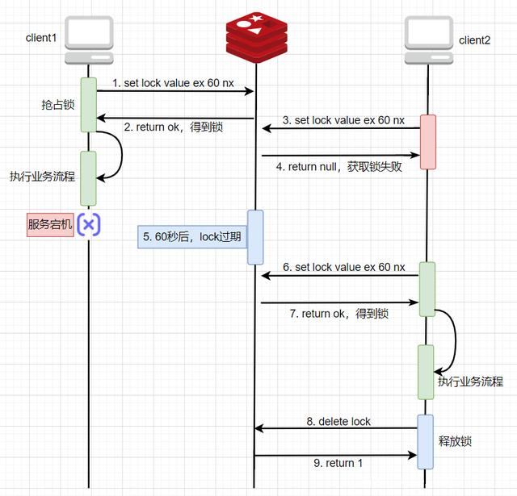

新问题：
业务流程耗时太长导致没有执行完锁就被过期，执行完后调用delete删除了别的进程的锁
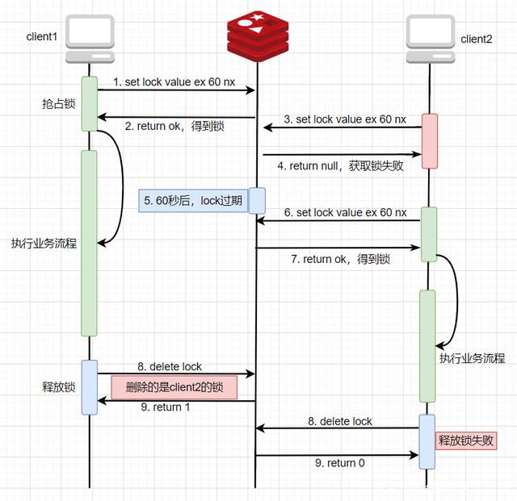

### 版本3：setnx key value+设置key的过期时间+设置唯一value
删除时根据value判断是否为当前线程的锁
解决了版本2的问题：
如果不是自己的锁就不删除
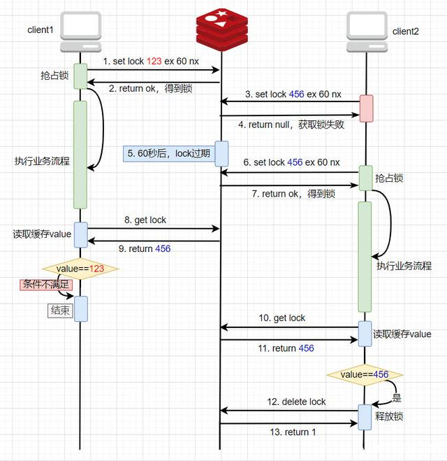

新问题：
判断锁是否属于当前线程和释放锁两个步骤并不是原子操作

情况：
如果线程1通过get操作从Redis中得到的value是123，那么就会执行删除锁的操作，但假如在执行删除锁的动作之前，系统卡顿了几秒钟，恰好在这几秒钟内，key自动过期了，线程2就顺利获取到锁开始执行自己的逻辑了，此时，线程1卡顿恢复了，开始继续执行删除锁的动作，那么此时删除的还是线程2的锁。

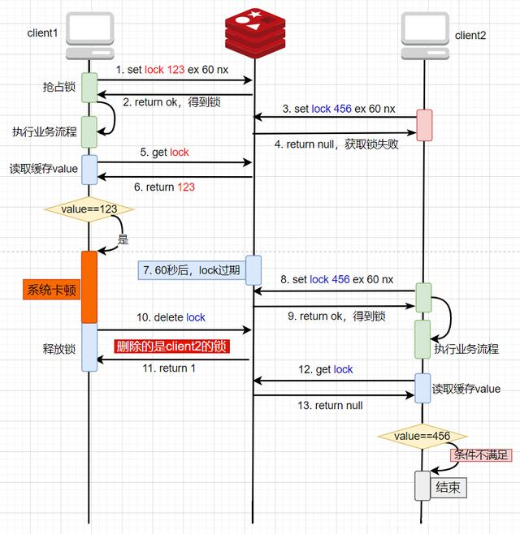

### 版本4： lua脚本
使用lua脚本：把get key value、判断value是否属于当前线程、删除锁这三步写到Lua脚本中，使它们变成一个整体交个Redis执行
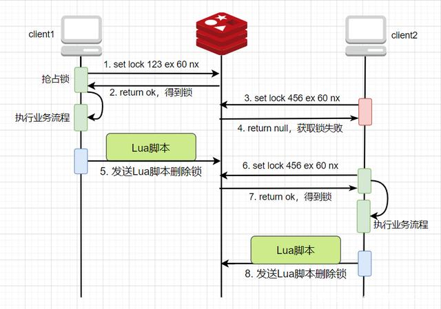
#### 延申
lua脚本实现可重入锁：
    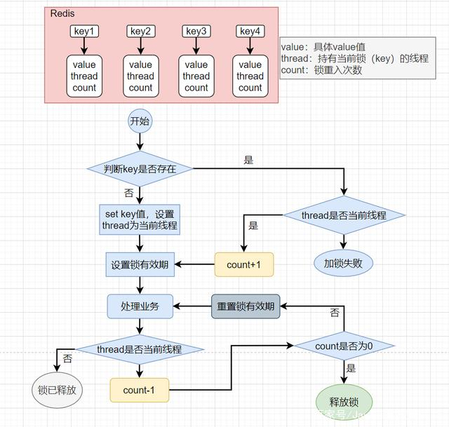

# 13.Redis的运行原理
redis有很多的客户端连接进来，站在redis所在的机器的角度来说，就是有很多socket的连接，并且是打在内核上面的，redis进程可以调用内核上的epoll（epoll负责的是读写的事件）来遍历寻找哪一个客户端发数据过来了。客户端被读取的顺序不能被保障，但是在一个连接里的顺序可以被保障。

# 14.Redis的事务
multi开启事务 exc 执行事务
执行事务前的命令进行语法检查，如有错则执行事务会失败
提交事务后，命令执行失败不会回滚，redis会继续执行命令

# 15.Redis6.x
https://bbs.csdn.net/topics/350057087?locationNum=3&fps=1