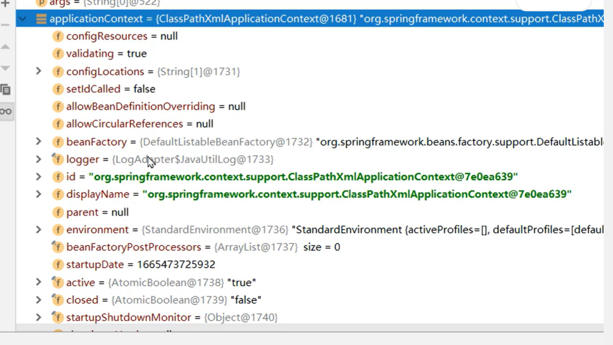
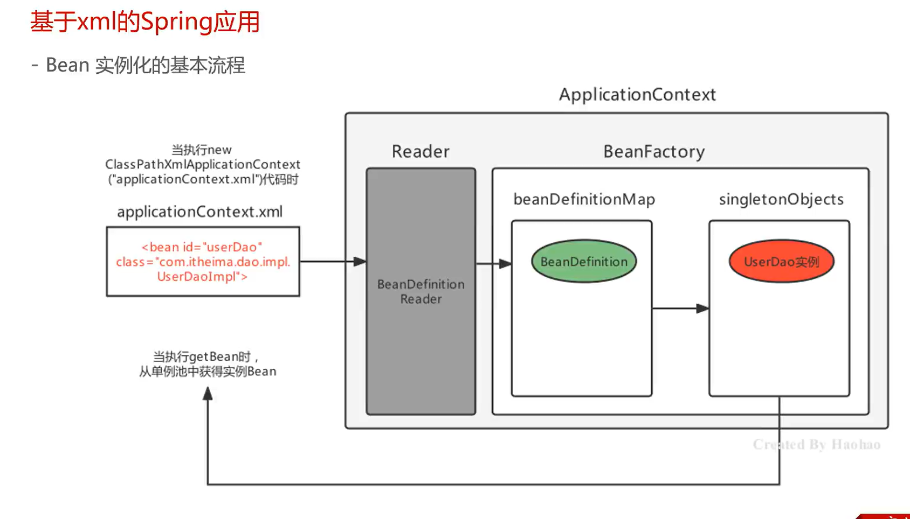
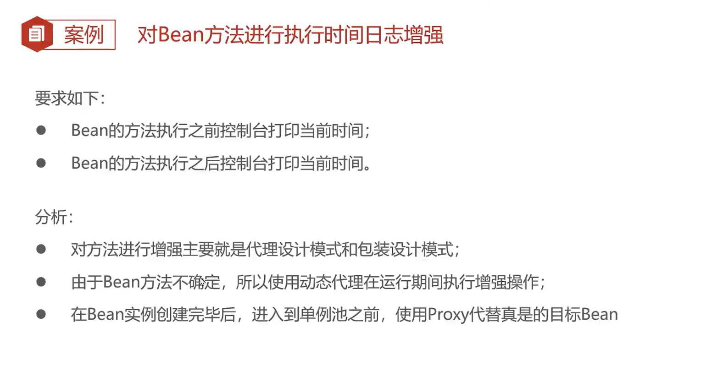
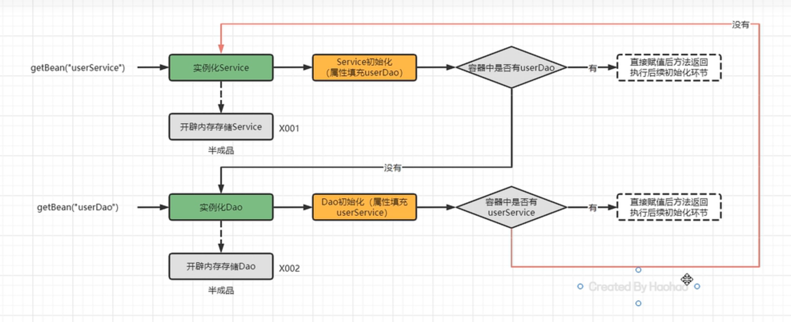

https://www.bilibili.com/video/BV1rt4y1u7q5?p=9&spm_id_from=pageDriver&vd_source=7116afddac4acaa2875e31b432e7f0ed
黑马

# BeanFactory与ApplicationContext
## 他们之间的关系

## ApplicationContext常用

# 基于xml的Spring应用
## SpringBean的配置详解

## beanName的设置    name
1.name="aaa,bbb,ccc" 设置多个别名，容器可通过多个别名获，存在beanfactory的aliasmap里
2.id="userService" 设置id，容器可以通过id名获得，如单例下存在beanfactory的singletonObjects对象里的table（是一个ConcurrentHashMap）可以找到
3.当没有设置id的时候，table里会存了全限定名的key，容器可以通过getBean该key得到bean
总结：配了id的时候，id就是beanName，没有配id配了别名的时候，beanName就是所有别名中的第一个，如果都没有配的话，beanName就是全限定名
## Bean的作用域配置   scope

配置了spring-webmvc后，作用域还有request和session

## Bean的延迟加载    lazy-init

对ApplicationContext有效，对BeanFactory无效

## Bean的初始化和销毁方法配置  init-method/destroy-method

bean对象实例化后会执行init-method方法
ApplicationContext接口没有close方法，ClassPathXmlApplicationContext对象有，执行close方法后会有调用destroy-method方法
### 通过实现InitializingBean接口，完成Bean的初始化操作
执行时机早于init-method方法晚于属性设置

## Bean的实例化配置

使用工厂方法实例化时，容器会将配置的bean工厂方法的返回值作为beanid指向的value。

### 实现FactoryBean规范延迟实例化Bean

注意：

beanfactory的sigletonObject的table里存的是FactoryBean对象，而不是我们想要的DaoImpl
在哪里呢？执行getBean前后对比

getBean前容器里只有FactoryBean对象，要用的时候再去创建对象并缓存在factoryBeanObjectCache里（所以说有延迟功能）

## Bean的依赖注入配置

### 自动装配方式 autowire=byName/byType

注意：byType是和setXXX(UserDao userdao)中的UserDao参数去匹配的

这样写是可以成功注入的

## 命名空间的种类

## beans的profile属性切换环境

## import标签

## alias标签

## 自定义命名空间标签的使用步骤

# Spring的get方法

# Spring配置非自定义Bean

## 配置DruidDataSource

找到DruidDataSource需要配置的属性

## 配置MyBatis的SqlSessionFactory交由Spring管理

# SpringBean的实例化流程

# Spring的后置处理器
BeanFactoryPostProcessor的postProcessBeanFactory方法
BeanDefinitionPostPorcessor的postProcessBeanDefinitionRegistry方法和postProcessBeanFactory方法
## BeanFactory后置处理器

## Spring实例化过程中的体现

## 使用Spring的BeanFactoryPostProcessor扩展点完成自定义注解扫描

## Bean后置处理器

## 案例：对Bean方法执行时间日志增强

### 报错出现

分析：
当使用动态代理后，返回的是代理对象，该对象无法调用init方法，因为JDK代理只能代理接口方法。而init-method的实现原理是容器在初始化阶段去调用init-method。

## 完善实例化过程

## Bean的生命周期

### SpringBean的初始化过程

### Bean实例属性填充

#### 循环依赖

初次实例化bean后，包一层变为ObjectFactory（通过getObject返回该实例化bean）放到容器中

三级缓存流程图

### Aware接口

# Spring整合第三方框架

### 单独MyBatis
1.配置porm文件导入mybatis jar包

查看mybatis官方文档
2.创建XML，构建SqlSessionFactory

配置datasource

3.创建xml关联mapper

xml所在包名和接口代码所在包名一致（注意用/才能创建多级文件夹，而不是.）

4.测试

## 整合MyBatis

# SpringAOP

## AOP相关概念

## 基于XML配置的AOP

### 切点表达式配置方式

### 切点表达式的配置语法

