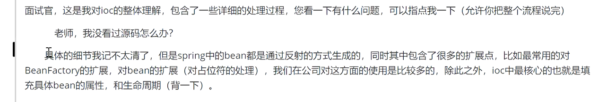
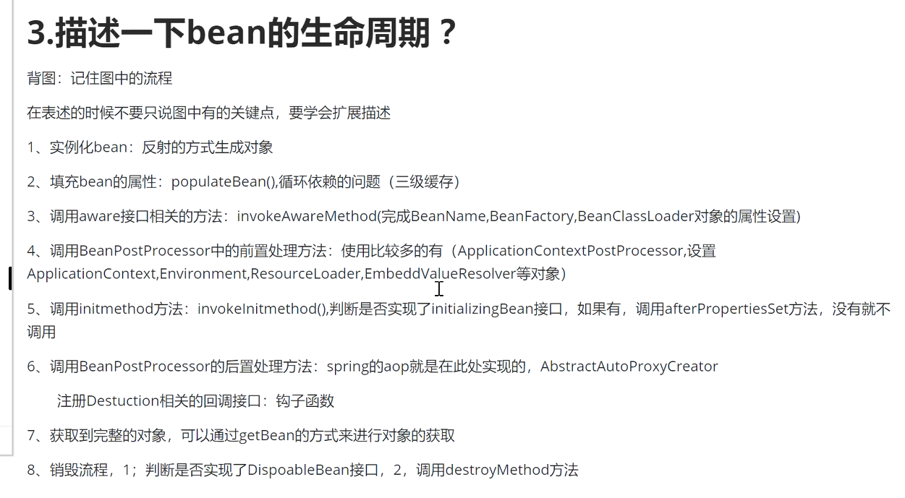

答题技巧：
总：当前问题回答的是哪些具体的点
分：以1，2，3，4，5的方式分细节去描述相关的知识点，如果有哪些点不清楚，直接忽略过去，突出一些二技术名词（核心概念，接口，类，关键方法）
    避重就轻

# 1.Spring IOC的理解，原理与实现？
## 总
控制反转：理论思想，原来的对象是由使用者来进行控制，有了spring后，可以把整个对象交给spring来帮我们进行管理
DI：依赖注入，把对应的属性的值注入到具体的对象中，@Autowired，populateBean完成属性值的注入

容器：存储对象，使用map结构来存储（），在spring中一般存在三级缓存（循环依赖问题），singletonObject存放完整的Bean对象，整个Bean的生命周期，从创建到使用到销毁的过程全部都是由容器管理（Bean的生命周期）

## 分
1.一般聊到ioc容器的时候要涉及到容器的创建过程（beanFactory,DefaultListableBeanFactory）
    ioc容器有一个最上层的根接口叫做beanFactory，它里面只是一个接口，没有提供对应的子类实现，我们在实际中最普遍调用的就是DefaultListableBeanFactory，我们在使用的时候也会优先创建bean工厂，向bean工厂中设置一些参数（BeanPostProcessor，Aware接口的子类)等等属性
2.加载解析bean对象，准备要创建的bean对象的定义对象beanDefinition(xml或者注解的解析过程)
3.beanFactoryPostProcessor的处理，此处是扩展点，PlaceHolderConfigureSupport,ConfigurationClassPostProcessor
4.BeanPostProcessor的注册功能，方便后续对bean对象完成具体的扩展功能
5.通过反射的方式将BeanDefinition对象实例化成具体的bean对象。
6.bean对象的初始化过程（填充属性，调用aware子类的方法，调用BeanPostProcessor前置处理方法，调用init-method方法，调用BeanPostProcessor的后置处理方法）
7.生成完整的bean对象，通过getBean方法可以直接获取
8.销毁过程

# 2.谈一下IOC的底层实现
底层实现：工作原理，过程，数据结构，流程，设计模式，设计思想
你对他的理解，和你了解过的实现过程
反射，工厂，设计模式 关键的几个方法
1.先通过createBeanFactory创建出一个Bean工厂（DefaultListableBeanFactory）
2.开始循环创建对象，因为容器中的bean默认是单例的，所有优先通过getBean,doGetBean从容器中找，找不到的话
3.通过createBean，doCreateBean方法，以反射的方式创建对象，一般情况下使用的是无参的构造（getDeclaredConstructor，newInstance）
4.进行对象的属性填充populateBean
5.进行其他的初始化操作（initializingBean）

# 3.描述一下bean的生命周期？

# 4.Spring是如何解决循环依赖的问题？
