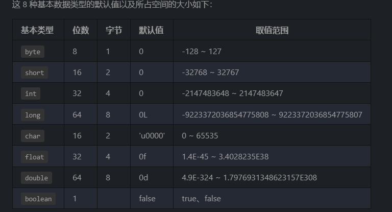

# 基本概念与常识
## Java语言有哪些特点？
1.面向对象
2.平台无关性
3.支持多线程
4.支持网络编程且很方便
5.编译与解释并存
6.简单易学、可靠性、安全性

## JVM vs JDK vs JRE
### JVM

运行Java字节码的虚拟机。
==JVM有针对不同系统的特定实现（Windows，Linux，macOS），目的是使用相同的字节码，它们都会给出相同的结果。== 字节码的输出规范和不同系统的JVM 实现是 Java 语言“一次编译，随处可以运行”的关键所在。

[C为什么不能跨平台](https://www.cnblogs.com/jmsjh/p/7808764.html)

### JDK和JRE
JDK 是 Java Development Kit 缩写，它是功能齐全的 Java SDK。它拥有 JRE 所拥有的一切，还有编译器（javac）和工具（如 javadoc 和 jdb）。它能够创建和编译程序。

SDK全称Software Development Kit
javadoc java文档
jdb  java调试器

JRE 是 Java 运行时环境。它是运行已编译 Java 程序所需的所有内容的集合，包括 Java 虚拟机（JVM），Java 类库，java 命令和其他的一些基础构件。但是，它不能用于创建新程序。

如果你只是为了运行一下 Java 程序的话，那么你只需要安装 JRE 就可以了。如果你需要进行一些 Java 编程方面的工作，那么你就需要安装 JDK 了。但是，这不是绝对的。有时，即使您不打算在计算机上进行任何 Java 开发，仍然需要安装 JDK。例如，如果要使用 JSP 部署 Web 应用程序，那么从技术上讲，您只是在应用程序服务器中运行 Java 程序。那你为什么需要 JDK 呢？因为应用程序服务器会将 JSP 转换为 Java servlet，并且需要使用 JDK 来编译 servlet


## 什么是字节码？采用字节码的好处是什么？
是什么？
在 Java 中，==JVM可以理解的代码就叫做字节码==（即扩展名为 .class 的文件），它不面向任何特定的处理器，只面向虚拟机。
好处是什么？
1.执行效率 2.可移植


## 为什么说Java 语言“编译与解释并存”？
高级编程语言按照程序的执行方式分为两种：
1.编译型：编译型语言 会通过编译器将源代码一次性翻译成可被该平台执行的机器码。一般情况下，编译语言的执行速度比较快，开发效率比较低。常见的编译性语言有 C、C++、Go、Rust 等等。
2.解释型 ：解释型语言会通过解释器一句一句的将代码解释（interpret）为机器代码后再执行。解释型语言开发效率比较快，执行速度比较慢。常见的解释性语言有 Python、JavaScript、PHP 等等。

因为Java程序要经过先变编译（编译型语言的特征），后解释（解释型语言的特征）两个步骤。


## Oracle JDK vs OpenJDK
OpenJDK 是一个参考模型并且是完全开源的，而 Oracle JDK 是 OpenJDK 的一个实现，并不是完全开源的


## Java和C++区别？
1.Java 不提供==指针来直接访问内存==，程序内存更加安全
2.Java 的类是==单继承==的，C++ 支持多重继承；虽然 Java 的类不可以多继承，但是接口可以多继承。
3.Java 有自动内存管理==垃圾回收机制==(GC)，不需要程序员手动释放无用内存。
4.Java只支持方法重载，C++同时支持方法重载和操作符重载。

# 基本语法
## 字符型常量和字符串常量的区别？
形式：字符常量是单引号引起的一个字符，字符串常量是双引号引起的 0 个或若干个字符。
含义：字符常量相当于一个整型值( ASCII 值),可以参加表达式运算; 字符串常量代表一个地址值(该字符串在内存中存放位置)。
占内存大小：字符常量只占 2 个字节; 字符串常量占若干个字节。
[java 字符串 存储_java-字符串的创建和存储机制](https://blog.csdn.net/weixin_39802020/article/details/114430863)

常见的笔试题：

new String("abc")创建了几个对象？

answer：一个或者两个。如果常量池中原来有字符串"abc"，那么只创建一个对象；如果常量池中没有字符串"abc"，那么就创建两个对象(这两个对象分别位于字符串常量池和堆中)。

## 注释有哪几种形式？
1.单行注释
2.多行注释
3.文档注释


## 标识符和关键字的区别是什么？
标识符就是一个名字
赋予了特殊含义的标识符就是关键字

## Java语言关键字有哪些？
default关键字

default 这个关键字很特殊，既属于程序控制，也属于类，方法和变量修饰符，还属于访问控制。

在程序控制中，当在 switch 中匹配不到任何情况时，可以使用 default 来编写默认匹配的情况。
在类，方法和变量修饰符中，从 JDK8 开始引入了默认方法，可以使用 default 关键字来定义一个方法的默认实现。
在访问控制中，如果一个方法前没有任何修饰符，则默认会有一个修饰符 default，但是这个修饰符加上了就会报错


## 自增自减运算符

## continue、break 和 return 的区别是什么？


## 方法
### 什么是方法的返回值？方法有哪几种类型?


### 静态方法为什么不能调用非静态成员？
类加载分配与对象实例化分配

### 静态方法和实例方法有何不同？
[类实例调用静态方法](https://wenku.baidu.com/view/17f2742a5b1b6bd97f192279168884868762b86d.html)

    1.调用方式
    类.方法
    对象.方法

    2.访问类成员是否存在限制
    静态方法只允许访问静态成员

### 重载和重写的区别
    重载就是同样的一个方法能够根据输入数据的不同，做出不同的处理

    重写就是当子类继承自父类的相同方法，输入数据一样，但要做出有别于父类的响应时，你就要覆盖父类方法


## ==和equals()的区别
Object类equals()方法：
```java
public boolean equals(Object obj) {
     return (this == obj);
}
```

## hashCode()与equals()
hashCode()通常用来将对象的内存地址转换成整数之后返回

相同：都是用于比较两个对象是否相等

### 为什么要有HashCode？
这是因为在一些容器（比如 HashMap、HashSet）中，有了 hashCode() 之后，判断元素是否在对应容器中的效率会更高（参考添加元素进HastSet的过程）！
https://blog.csdn.net/qq_36853276/article/details/121296804

### 那为什么两个对象有相同的 hashCode 值，它们也不一定是相等的？
因为 hashCode() 所使用的哈希算法也许刚好会让多个对象传回相同的哈希值。越糟糕的哈希算法越容易碰撞，但这也与数据值域分布的特性有关（所谓哈希碰撞也就是指的是不同的对象得到相同的hashCode)。

### 为什么重写equals()时必须重写hashCode()方法？
如果重写equals()时没有重写hashCode()方法的话就可能会导致equals方法判断是相等的两个对象，hashCode 值却不相等。

## 什么是可变长参数？

可变长参数就是允许在调用方法时传入不定长度的参数。


### 遇到方法重载的情况怎么办呢？会优先匹配固定参数还是可变参数的方法呢？
    答案是会优先匹配固定参数的方法，因为固定参数的方法匹配度更高。


# 基本数据类型

对应的包装类

Java 里使用 long 类型的数据一定要在数值后面加上 L，否则将作为整型解析。
char a = 'h'char :单引号，String a = "hello" :双引号。

## 包装类型不赋值就是 Null ，而基本类型有默认值且不是 Null，为什么？
基本数据类型直接存放在 Java 虚拟机栈中的局部变量表中，而包装类型属于对象类型，我们知道对象实例都存在于堆中。相比于对象类型， 基本数据类型占用的空间非常小。


# 包装类型的常量池技术了解么？
Byte,Short,Integer,Long 这 4 种包装类默认创建了数值 [-128，127] 的相应类型的缓存数据，Character 创建了数值在 [0,127] 范围的缓存数据，Boolean 直接返回 True or False。


# 自动拆箱与装箱了解吗？原理是什么？
## 什么是自动拆装箱？

## 原理？
装箱是调用包装类的valueOf()方法，拆箱是调用xxxValue()方法
