https://www.bilibili.com/video/BV1QB4y1v7Si?spm_id_from=333.337.search-card.all.click&vd_source=7116afddac4acaa2875e31b432e7f0ed

# 1.程序运行的底层原理
程序是什么？  qq.exe 
进程是什么？  程序启动进入内存  资源分配的基本单位
线程是什么？  程序执行的基本单位   从main线程开始执行，然后可能有分叉、合并、同步
线程是如何开始执行？
    假设有一条指令a=2+3，a可以理解为内存里的一块空间，理解为程序的数据，这些数据会被cpu通过一根连接cpu和内存的线读到cpu内部的寄存器（存数据用的）里，交给ALU计算后拿到结果再将结果返回给内存

    CPU：读指令 -PC（存储指令地址），读数据 Register，计算，回写  ALU 

线程是如何进行调度？
通过操作系统，选择将内存中的哪个线程交给CPU执行

线程切换的概念是什么？
Context Switch   CPU保存现场，执行新线程，恢复现场，继续执行原线程的一个过程
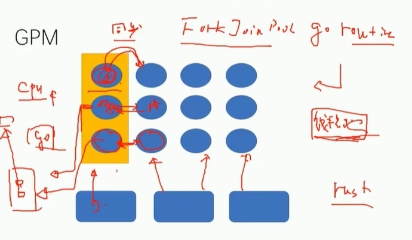

# 2.CAS的实现
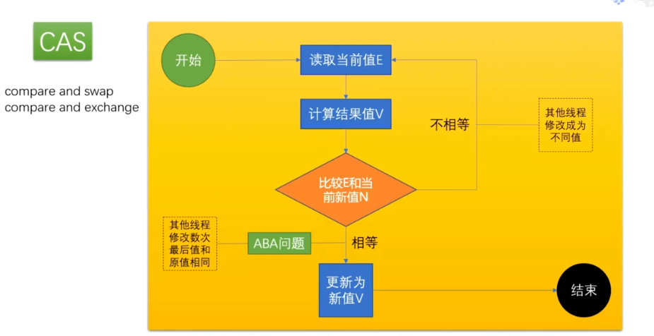
AtomicInteger就使用了CAS实现保证线程一致性

## 如何解决ABA问题？
加版本号或加布尔值（表示改没改）

## CAS底层实现（和Synchronized、volatile底层实现完全一样）
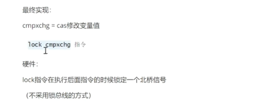
在hotsopt源码中linux下用汇编语言实现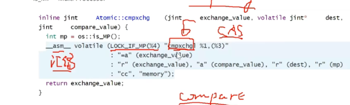

# 3.Synchronized
## 锁信息与markword
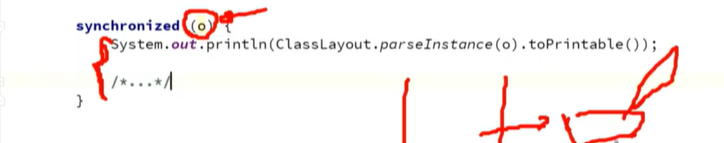
执行这段代码的时候锁定o对象而不是锁定代码
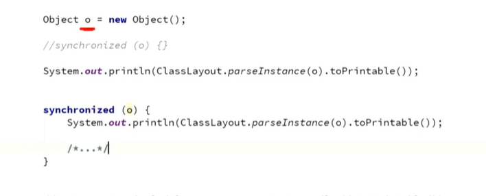
锁信息存储在对象的markword里（oject对象上锁前后markword不一样）

## synchronized升级过程
new - 偏向锁 - 轻量级锁（可称为无锁、自旋锁、自适应自旋）、重量级锁
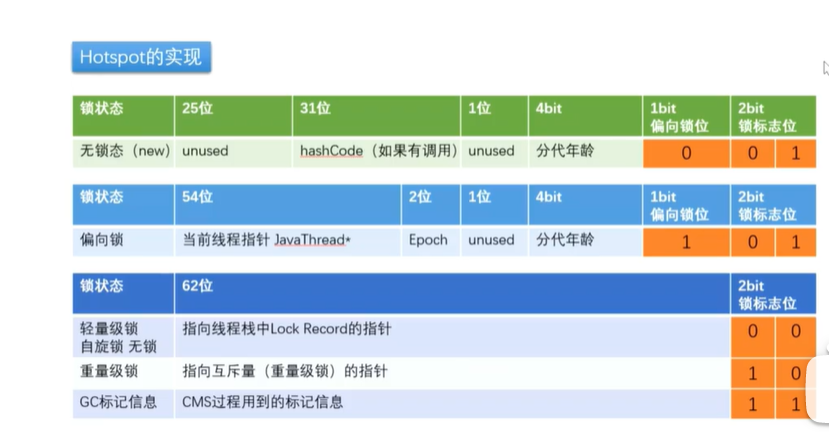
最开始的时候这个对象没有任何锁加上来，加上synchronized后，
这时候有一个线程来了，假设用最笨的方法从操作系统申请一把锁。现在的synchronized的优化过程是这样的，当线程来了后发现它是第一个要给这个对象上锁的，那么就不先给对象上重量级锁，而是给对象贴个标签表示它来过（偏向锁，即偏向第一个进来的线程）(不加重量级锁的原因：在竞争不是非常激烈的情况下，一个线程拥有一把锁后很快就干完事)。
当又来了个线程，它们两个要竞争，这时候撤销偏向锁，两个线程各自在自己的线程栈生成一个lockrecord，开始进入自旋锁，也叫无锁（两个线程抢着把lockrecord这个标签贴到对象上，另外一个线程自旋，自旋是消耗cpu的，所以需要下一步锁升级）
当用户竞争激烈（有一个线程旋转了十次），升级为重量级锁，向操作系统申请一把大锁，不管谁申请到后，其他人就进入锁的等待队列
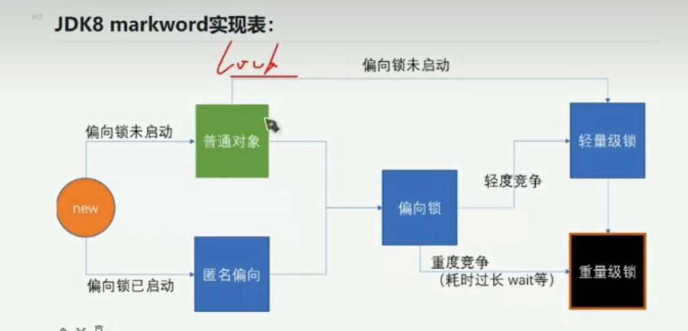

## 锁降级过程
GC的时候，这把锁不被其他任何线程锁定，这个锁可以降级

## 锁消除

## 锁粗化

## synchronized实现过程
1.java代码：synchronized
2.monitorenter moniterexit
3.JVM执行过程中自动升级
4.lock comxchg

# 4.volatile
线程可见性:
--MESI
--缓存一致性协议
可见性：一个线程对共享变量值的修改，能够及时地被其他线程看到，我们就说这个变量是可见的
假设内存里有个值running为true，线程对其访问时将它复制到线程本地内存，可以理解为复制到自己的cpu寄存器里面去，每次while(running)都要去内存里读

java里的堆内存是所有内存共享的内存，每个线程都有自己专属的内存区域（工作内存），主线程和T1线程都要去访问堆内存里的一个值时，它们会copy一份到自己的工作内存，T1线程while(running)什么时候去堆内存看running有没有改变不好控制

阻止指令重排序
-- DCL单例

## volatile如何解决指令重排序？
1.volatile关键字
2.ACC_VOLATILE
3.JVM的内存屏障
4.hotspot实现
bytecodeinterpreter.cpp

## 内存屏障
JVM的内存屏障
屏障两边的指令不可以重排！保障有序！
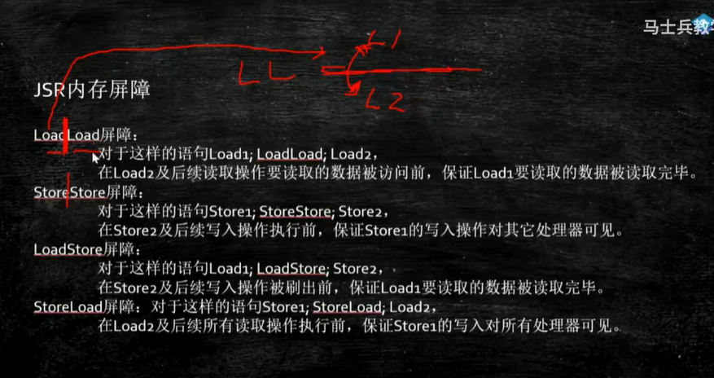
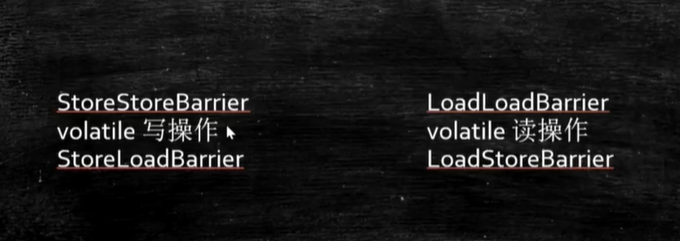

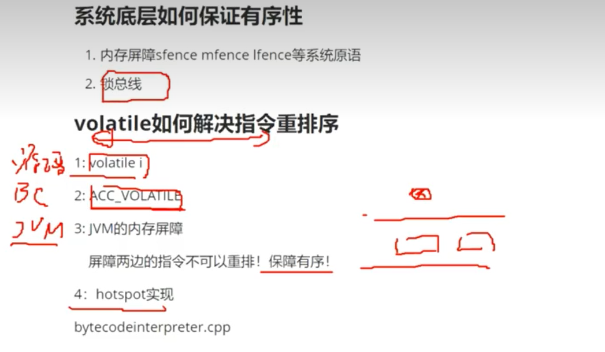

# 5.cache缓存
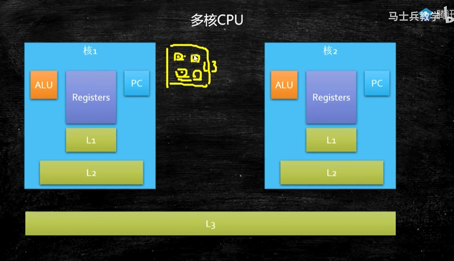

# 6.超线程
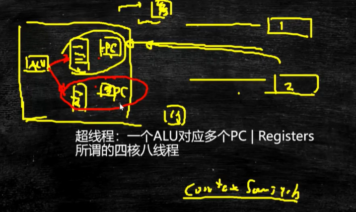

# 7.强软弱虚 Java中的四种引用类型
## 强引用
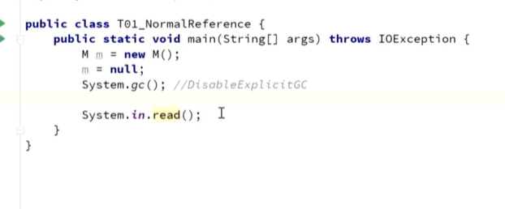
new出一个对象在堆里，虚拟机栈里的m指向new出来的M实例，强引用只有当没有任何引用指向这个对象时，才会被gc回收

## 软引用（SoftReference）
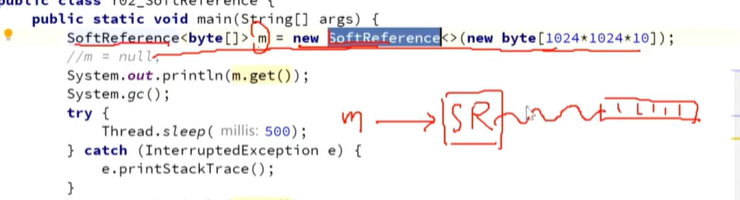
m执行new出来的SoftReference对象，这是强引用，SoftReference对象又指向一个byte数组（10Mb），这是软引用,调用m的get方法可等到这个数组
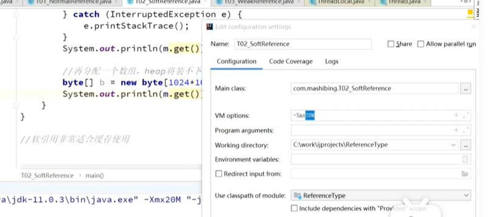
这时我们再分配一个数组(15Mb)，由于Xmm20M表示堆内存最大20M，所以分配不下，那么软引用对象（第一个byte数组）就被回收

## 弱引用（WeakReference）
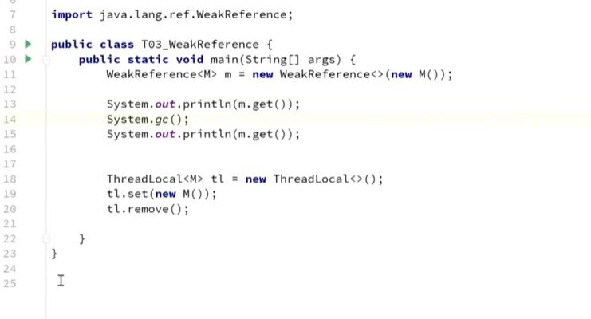
垃圾回收器一调用，弱引用对象就被回收
### ThreadLocal
逻辑理解：每个线程里有自己的threadlocal对象，ThreadLocal对象和线程绑定，只要该线程存在，threadlocal对象就存在
读源码看threadlocal对象是如何set对象的
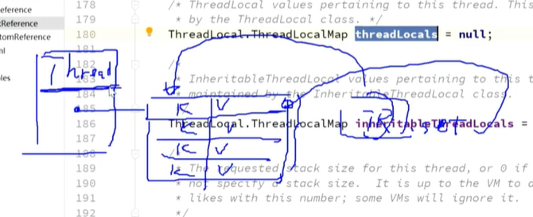
new出来的任何一个thread对象，里面有一个成员变量threadlocals指向一个map里面装的是key-value。如何往里面放东西：new一个threadlocal对象，调用它的set方法，将threadlocal作为key，set进来的对象作为value放到map里面。
源码流程：
实际上threadlocal对象的set最后去调用thread对象的threadlocals（map）的set方法，该方法会设一个key-value对进去，这个key-value被new成一个Entry(new Entry(key,value)),这个Entry从WeakReference继承，所以是一个WeakReference对象。调用父类构造方法时，就将k(即threadlocal对象)作为虚引用放进去（entry.get()弱引用指向threadlocal，成员变量value设为value）
由于虚引用仍会产生内存泄漏现象，所以必须调用threadlocal对象的remove方法

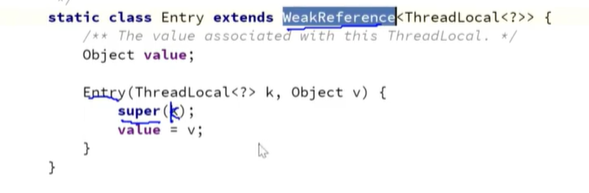
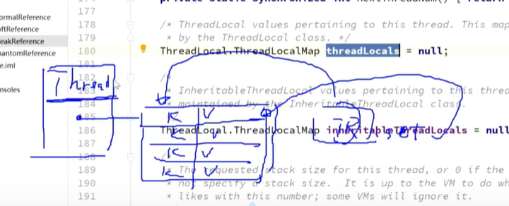
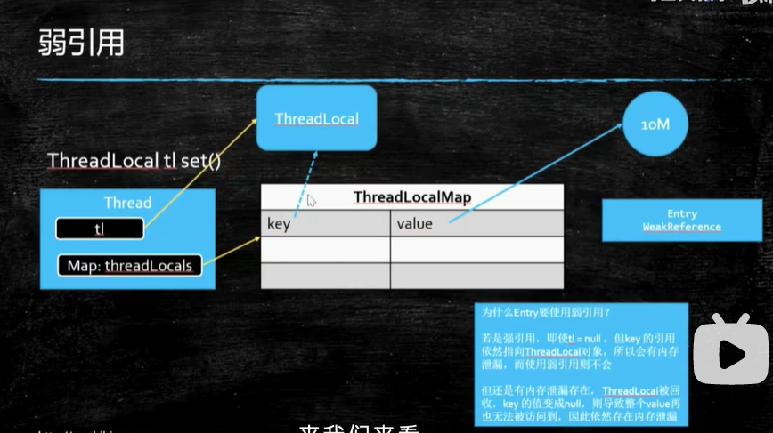
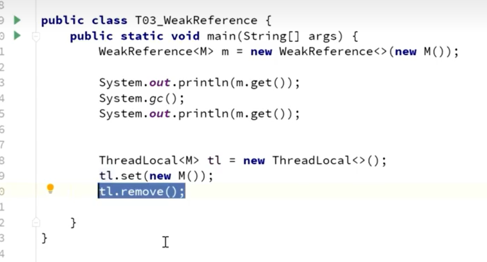

## 虚引用（PhantomReference）
get也get不到，也随时被回收
作用：管理堆外内存
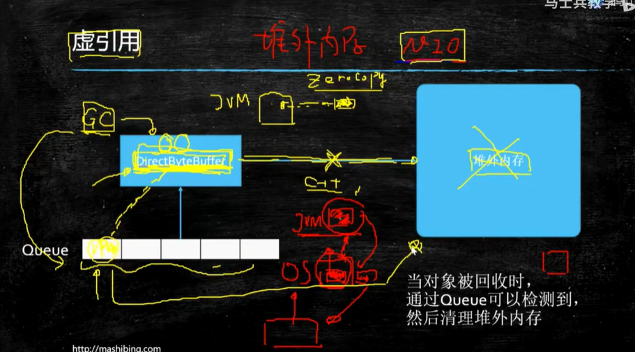
在GC里有一个垃圾线程专门监听有哪些被分配了堆外内存的DirectByteBuffer对象，jvm内部对该对象的引用没有了，那么这个对象指向的堆外内存也需要被删掉（C++层面）
对于这个垃圾回收器来说只要监测到队列里有了新的内容就说明某一个直接内存管理的对象被回收了，与此同时就将堆外内存进行对应的处理。

内存泄漏：
分配出的内存在没人用后没有得到释放

# 8.线程池
## 七大参数
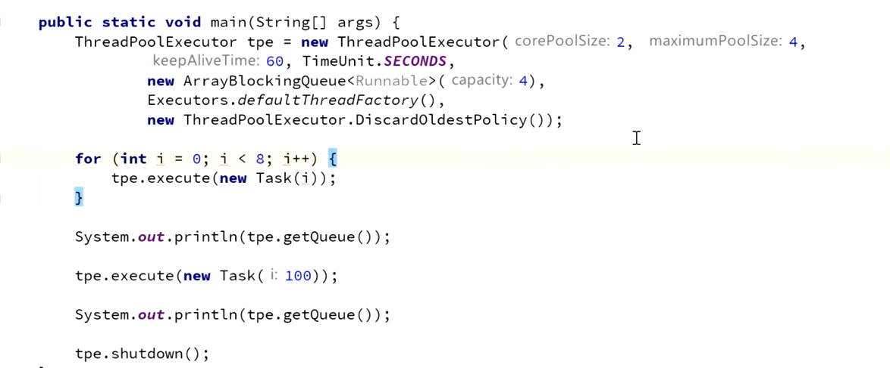
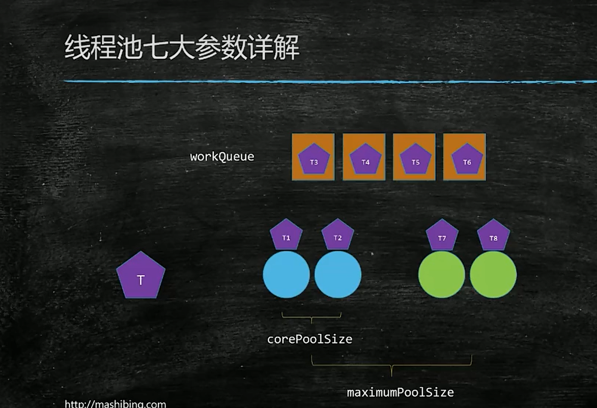
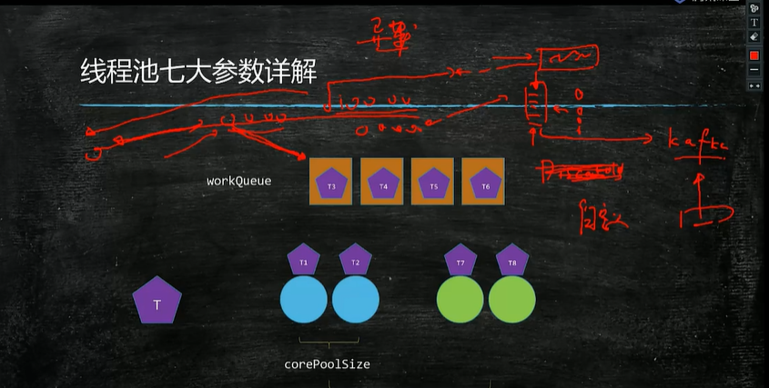
T1、T2来了，两个核心线程去执行，T3、T4、T5、T6来了，去workqueue队列排队，T7来了需要起一个线程去执行，T8来了再起一个线程去执行，当T9来的时候，任务队列已满，线程数量也达到最大值，执行拒绝策略
keepAliveTime: 假设被设置为60秒，那么当非核心线程空闲时间超过60秒，它将被关闭

拒绝策略：
Abort：抛异常
Discard：扔掉，不抛异常
DiscardOldest：扔掉排队时间最久的
CallerRuns:调用者处理任务（哪个线程调用了execute哪个线程去执行）

实验
    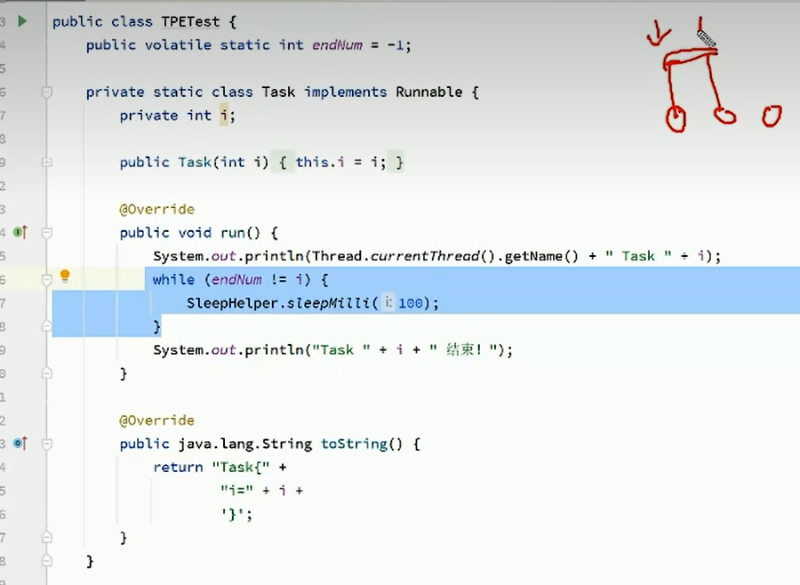
    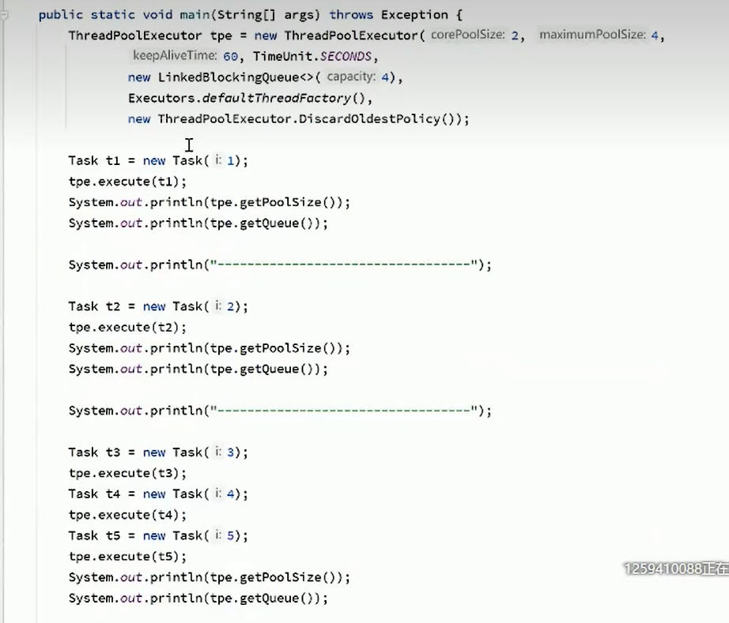

## 如何去设计线程池？

## executors
线程池的工厂，产生各种各样的线程池

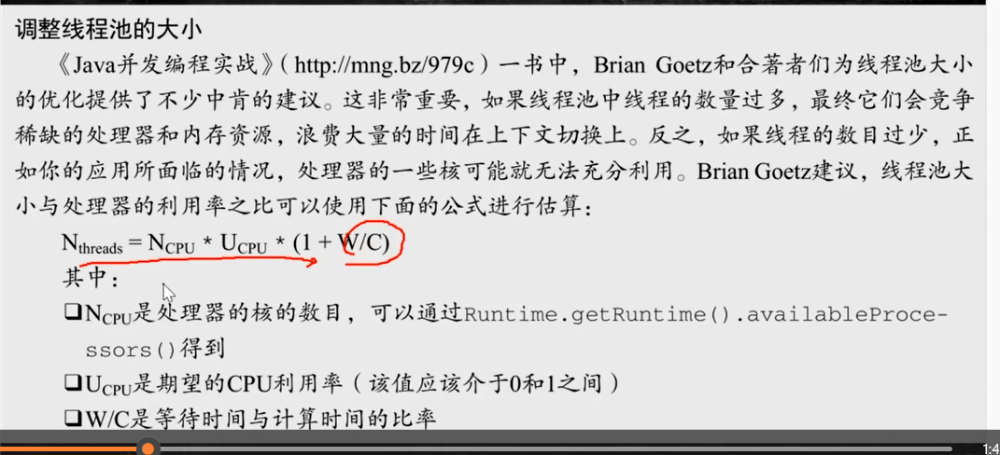

