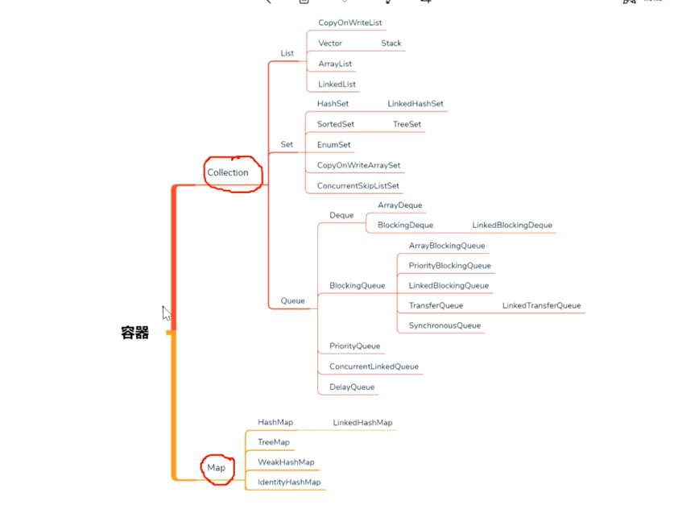
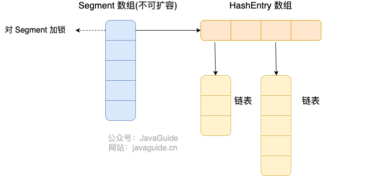
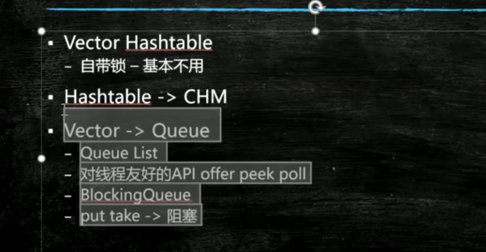

容器就是装一个个对象的东西
物理上的存储结构只有两种：连续存储的数组和非连续存储的链表
逻辑结构有很多：树既可以用数组实现，也可以用链表实现

Queue和Set、List最大的区别是前者是为了高并发做准备，后者主要用于存储

## Vector HashTable
自带锁   基本不用 

## HashMap、SynchronizedHashMap、ConcurrentHashMap选择
单线程 HashMap
多线程  代码执行时间比较长 SynchronizedHashMap
多线程  代码执行时间比较短 ConcurrentHashMap
本质上是synchronized和CAS的选择
Hashtable
    每个方法都加了sychronized
SynchronizedHashMap
    锁的粒度更细，但还是synchronized

ConcurrentHashMap

    1.7的时候是一个Segment数组，对Segment进行上锁(RetrantLock)，Segment数组中的元素是HashEntry数组（相当于一个HashMap,可以进行扩容）它的存储结构是Segment数组+HashEntry数+链表的形式
    默认是Segment大小是16，初始化后无法改变大小，可以把Segment大小理解为最大可支持并发数  
    1.8  存储结构是Node数组+链表/红黑树的形式，对Node进行加锁（Synchronized+CAS机制）。

## LinkedBlockingQueue

## 跳表实现ConcurrentSkipListMap

## 

## DelayQueue
按照在里面等待时间来排序

## BlockingQueue
[LinkedBlockingQueue与ArrayBlockingQueue](https://blog.csdn.net/javazejian/article/details/77410889)