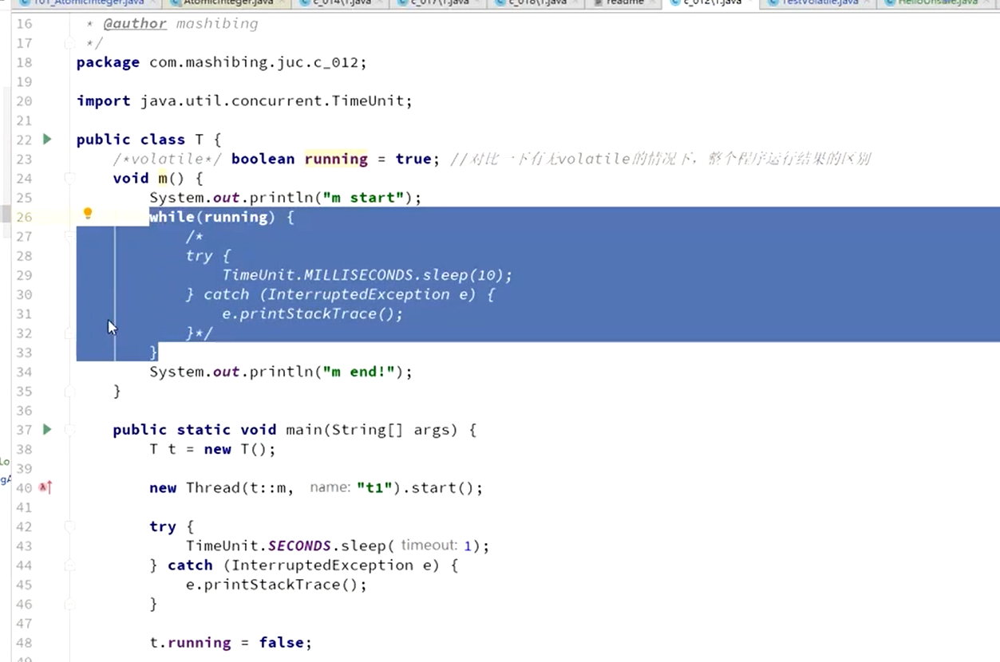

# 1.如何开启线程？
Thread
[Thread的run与start方法](https://zhuanlan.zhihu.com/p/349702786)
## notify notifyAll
[java中的notify和notifyAll有什么区别？](https://www.zhihu.com/question/37601861)
# 2.sleep，yield，join
sleep：睡一定时间再自动复活
yield: 进入等待队列等待系统调度
join：让另一个线程执行完再执行（保证线程顺序执行）
    方案1：在Main里 t1.join, t2.join t3.join
    方案2：在t3里调用t2.join,t2里调用t1.join

# 3.线程状态


# 4.synchronized关键字(只有不公平锁)
## 为什么说synchronized是不公平锁？
因为 Synchronized 获取锁的行为是不公平的，并非是按照申请对象锁的先后时间分配锁的，每次对象锁被释放时，每个线程都有机会获得对象锁，这样有利于提高执行性能，但是也会造成线程饥饿现象。

## 锁的概念


## 锁对象


不能锁String常量  Integer Long
## 锁信息
看markword前2位

# 5.锁可重入

一个方法可以调用另外一个同步方法，一个线程已经拥有某个对象的锁，再次申请的时候仍然会得到该对象的锁，也就是synchronized获得的锁是可重入的 。
这里是继承中有可能发生的情形，子类调用父类的同步方法。
为什么是必须是可重入锁？
假设一个父类的m方法是synchronized，它的子类对m方法进行重写时调用了super.m方法，若不可重入则导致死锁。

这里调用super.m()锁的仍然是子类的对象
子类中有一个parent的指针指向父对象

# 6.锁异常
程序在执行过程中，如果出现异常，默认情况锁会被释放。
所以，在并发处理的过程中，有异常要多加小心，不然可能会发生不一致的情况。


# 7.volatile关键字（不能保证原子性）



volatile并不能保证多个线程共同修改running变量时所带来的不一致问题，也就是说volatile不能代替synchronized，想解决就要给m方法加synchronized


# 8.锁的细化


# 9.锁对象发生改变
锁定某对象o，如果o的属性发生改变，不影响锁的使用，但是如果o变成另外一个对象，则锁定的对象发生改变，应该避免将锁定对象的引用变成另外的对象


怎么解决？
final Object o=new Object();


# AtomicInteger
AtomXXX类本身方法都是原子性的，但不能保证多个方法连续调用是原子性的

atomicInteger.incrementAndGet(){
    return unsafe.getAndAddInt()
}
unsafe类的getAndAddInt方法里用了weakCompareAndSetInt(cas方法，由CPU原语支持)

Unsafe类

# LongAdder


# ReentrantLock锁
    reentrantlock用于替代synchronized
    由于m1锁定this，只有m1执行完毕的时候，m2才能执行
    使用reentrantlock可以完成同样的功能
    需要注意的是，必须要手动释放锁
    使用syn锁定的话如果遇到异常，jvm会自动释放锁，但是lock必须手动释放锁

    使用reentrantlock可以进行“尝试锁定”tryLock，这样无法锁定，或者在指定时间内无法锁定，线程可以决定是否继续等待

    使用ReentrantLock还可以调用lockInterruptibly方法，可以对线程interrupt方法做出响应，在一个线程等待锁的过程中，可以被打断。当通过这个方法去获取锁时，如果其他线程正在等待获取锁，则这个线程能够响应中断，即中断线程的等待状态。也就使说，当两个线程同时通过lock.lockInterruptibly()想获取某个锁时，假若此时线程A获取到了锁，而线程B只有等待，那么对线程B调用threadB.interrupt()方法能够中断线程B的等待过程。

    用于实现公平锁
    private static ReentrantLock lock=new ReentrantLock(true);


# CountDownLatch

latch有100，countDown()倒计数
latch.await()的作用是等待latch为0程序才继续运行

# CyclicBarrier
```java
CyclicBarrier barrier = new CyclicBarrier(20,new Runnable()){
    @Override
    public void run() {System.out.println("满人，发车")}
}
// 满20个就调用runnable()接口

```
## 应用场景


# Phaser
按照不同阶段对线程进行执行


# ReadWriteLock
共享锁排它锁

# Semaphore
限流
## 应用场景
卖票，同时只有n个人可以买票


# Exchanger

第一个线程执行到exchanger.exchange()的时候阻塞，把值放到exchanger容器里面
第二个线程执行到exchanger.exchange()的时候把值放到exchanger容器里面两个线程一起运行

## 应用场景
两个人交换装备


# LockCondition
Condition本质是不同的等待队列

# AQS
Template Method
Callback Function
父类默认实现
子类具体实现


# 线程池
几个接口
## Executor、ExecutorService、ThreadPoolExecutor
### Executor
命令和运行分开如何理解？
###

Callable
callable相当与runnable，callable的call相当与runnable的run，不同的是callable的call方法有返回值

Future（未来的返回值）

