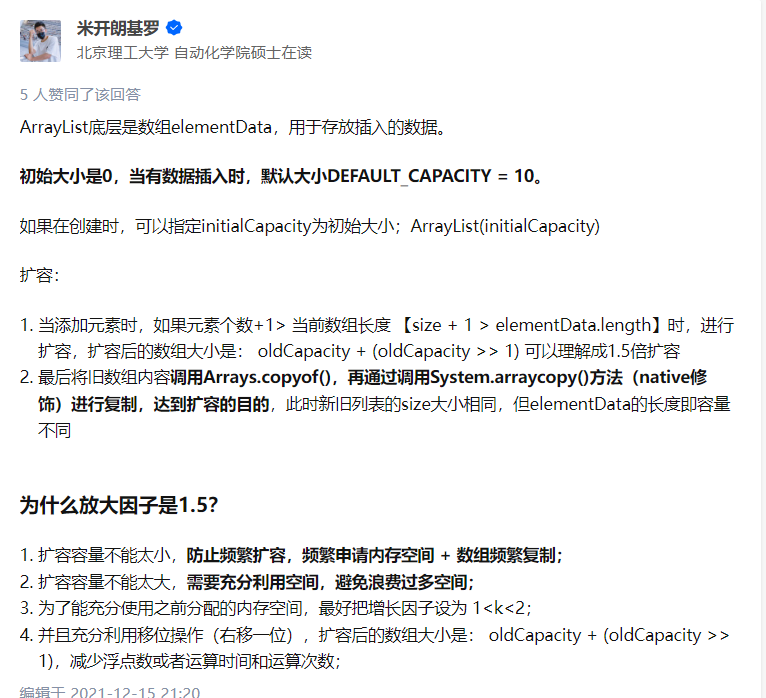

# 概览
两大接口
Collection 接口 存放单一元素   子接口：List Set Queue
Map接口   存放键值对

# 说说 List, Set, Queue, Map 四者的区别？
是否有序、是否重复
List：有序的、可重复的
Set：无序、不可重复的
Queue: 按特定的排队规则来确定先后顺序的List
Map：使用键值对存储，key是无序的不可重复的  value是无序的可重复的

List：
ArrayList：数组
Vector：数组
LinkedList：双向链表

Set：
HashSet（无序、唯一）：基于HashMap实现
LinkedHashSet：LinkedHashSet 是 HashSet 的子类，并且其内部是通过 LinkedHashMap 来实现的。
TreeSet（有序、唯一）：红黑树（自平衡的排序二叉树）

Queue：
PriorityQueue：数组来实现二叉堆
ArrayQueue： 数组+双指针

Map:
HashMap:数组+链表   JDK1.8 以后在解决哈希冲突时有了较大的变化，当链表长度大于阈值（默认为 8）（将链表转换成红黑树前会判断，如果当前数组的长度小于 64，那么会选择先进行数组扩容，而不是转换为红黑树）时，将链表转化为红黑树，以减少搜索时间
LinkedMap:
Hashtable:数组+链表
TreeMap:红黑树 

# Collection 子接口之 List
## Arraylist 和 Vector 的区别?
ArrayList 底层使用 Object[ ]存储  线程不安全
Vector  线程安全
## Arraylist 与 LinkedList 区别?
1.都不保证线程安全
2.ArrayList用Object数组，LinkedList使用的是双向链表
3.插入和删除
4.快速随机访问
LinkedList不支持 ArrayList支持
5.内存空间占用：
ArrayList需要在列表末尾预留容量
LinkedList需要存放直接后继和直接前驱

## ArrayList 扩容机制
1.无参构造初始为空，初次添加时分配10（初始minCapacity为1，再和DEFAULT_CAPACITY比较赋值10）
2.当minCapacity大于容器容量时，调用grow方法进行扩容
3.扩容时，int newCapacity = oldCapacity + (oldCapacity >> 1) 变为原来的1.5倍左右（oldCapacity为奇数时的情况）

# List, Set, Queue, Map 四者的区别？
 针对存储元素的特征来回答
 是否有序 是否可重复

 
