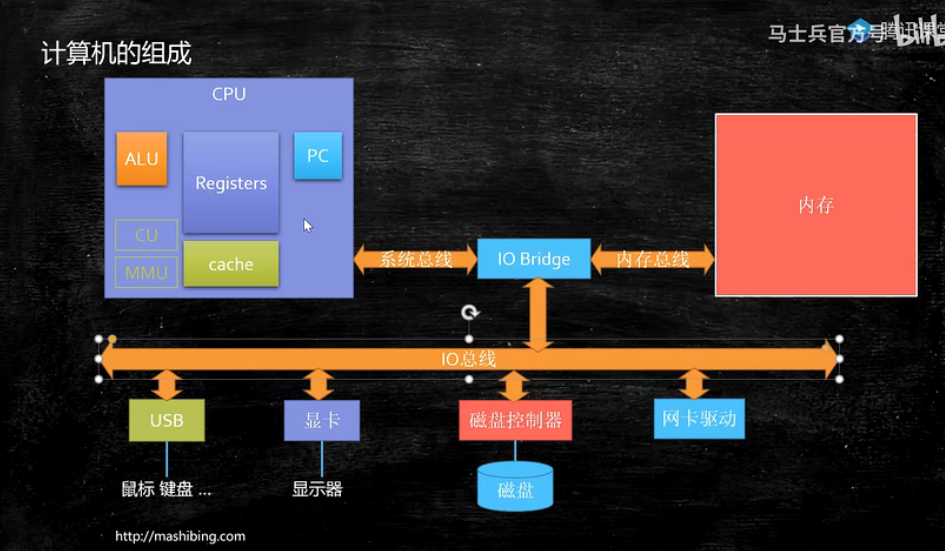
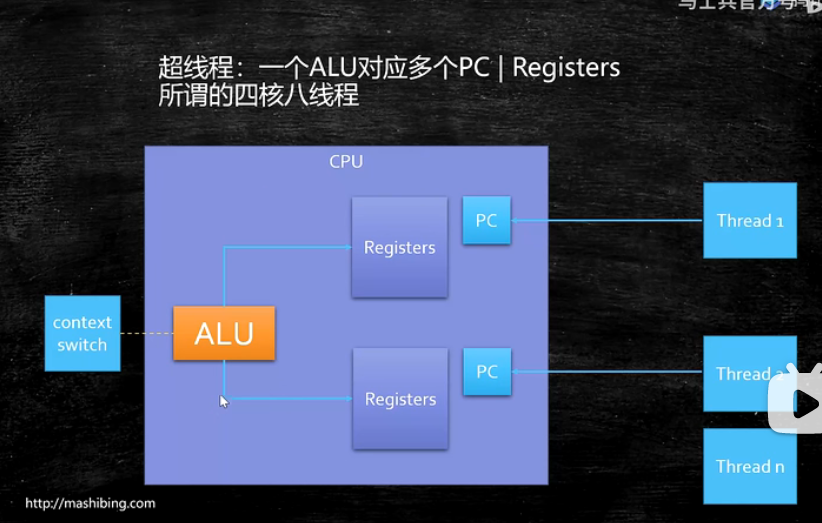
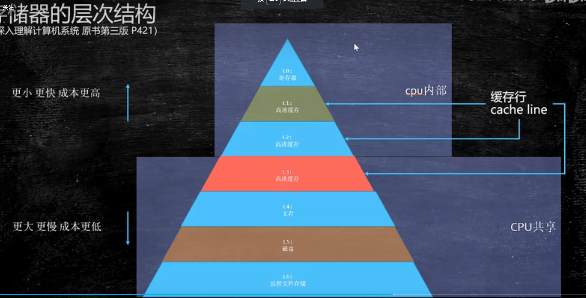
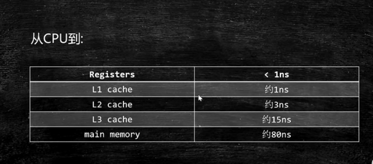
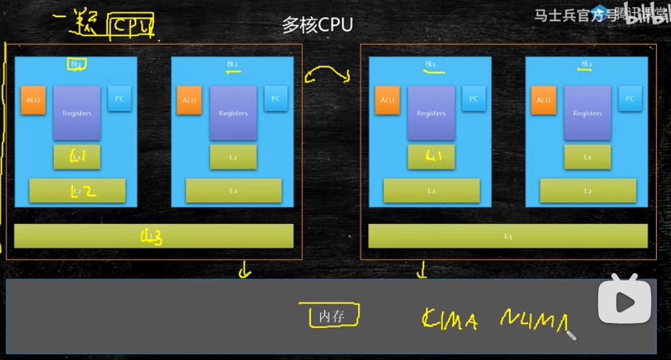
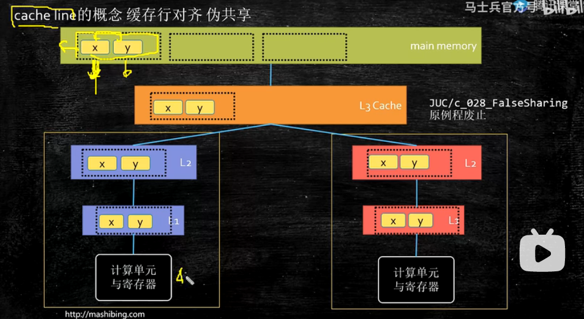
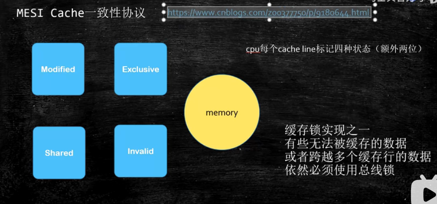

https://www.bilibili.com/video/BV1mY411F7FK?spm_id_from=333.337.search-card.all.click&vd_source=7116afddac4acaa2875e31b432e7f0ed
# CPU的基本组成

PC-->Program Counter 程序计数器（记录下一条指令的内存地址）加1或跳转  
Register-->暂时存储CPU计算需要用到的数据（现在的寄存器64位，一个可以存储64位的数据，各个寄存器都有各自的功能）        寄存器是存取速度最快的
ALU-->Arithmetic& Logic Unit 运算逻辑单元
    如何将内存里的2和3相加?
    首先MOVE将2移到某一个寄存器比如AX，把3移到另一个寄存器比如BX，然后指令寄存器读一条指令ADD，ALU一看是ADD，就固定地从AX里读一个数，再从BX里读一个数，把它们相加后输出给另一个寄存器DX，然后把DX里的值通过指令写到内存中的某一个位置

CU-->Control Unit 控制单元   对中断信号等进行控制
MMU-->Memory Management Unit 内存管理单元
cache-->

## 超线程
thread context switch 把上一个运行的线程在寄存器里的东西和指令全都存储好，把下一个再放进来（这个切换消耗CPU资源）
在超线程中，当有多个线程时，就不用再上一个线程清出去，把下一个线程再拿过来，而只用换一个寄存器组就好了。（单核两线程、4核多线程的概念）

## 存储器的层次结构
为什么需要缓存？
CPU速度太快，内存速度太慢

一个CPU（很多个核）共享一个L3，一个核共享L1和L2，多个CPU共享一个主存（有UMA,NUMA结构 垃圾回收器）

### 缓存
    按块读取（我们读数据并不是一位一位来读）
    程序局部性原理，可以提高效率（不管是从硬盘往内存读，还是从内存往缓存读）
    充分发挥总线 CPU针脚等一次性读取更多数据的能力
    cache line的概念  缓存行对齐 伪对齐

    读x读y的时候会把整块数据读进来，所以读x的时候，会把y也读进来。
    过程：
        想要读x,l1没有，去l2，l2没有，去l3,l3没有，去主存读取。读了后放到l3，再放到l2，最后放到l1，ALU和寄存器就可以拿来计算了
    根据工业实践，三级缓存最合适 
    思考：
    假设有两颗CPU（也可以理解为两个核），一颗CPU访问x，会把y也读到l1,另一颗cpu访问y，会把x也读到进来，如果说两颗cpu中的数据需要保持一致，
    比如cpu1对l1中的x进行了修改，另一颗cpu2需要将x也进行同样的修改，内部怎么做？

    intel采用的MESI Cache一致性协议（有时称为缓存锁）

    思考：
        有时候一个缓存行装不下又要保持缓存一致性怎么办？
            锁总线,访问一块内存的时候，把内存总线锁住（要访问内存的所有CPU都访问不了了），只有我访问完了其他cpu才可以去访问

缓存写策略：
cpu修改了缓存中的数据后，什么时候把修改传播到主存？
写回（Write Back）：当缓存块被替换时，这些被修改的缓存块，才会写回并覆盖内存中过时的数据
写直达（Write Through)：缓存中任何一个字节的修改，都会立刻传播到内存

缓存更新策略：
当某个CPU的缓存中执行写操作时，修改其中的某个值时，其他CPU保有该数据副本的缓存如何更新？
写更新/写广播：
    每次它的缓存写入新的值，该 CPU 都必须发起一次总线请求，通知其他 CPU 将它们的缓存值更新为刚写入的值，所以写更新会很占用总线带宽。
写无效：
    如果在一个 CPU 修改缓存时，将其他 CPU 中的缓存全部设置为无效，这种策略叫做写无效。这意味着，当其他 CPU 再次访问该缓存副本时，会发现这一部分缓存已经失效，此时 CPU 就会从内存中重新载入最新的数据。

写策略：
当要写入的数据不在缓存中，是否要将数据加载到内存中
    写分配
    写不分配

[既然CPU有缓存一致性协议（MESI），为什么JMM还需要volatile关键字？](https://www.zhihu.com/question/296949412/answer/760347883)

### 缓存行大小

### 缓存行代码
juc c_028 T03
加关键字在violate

缓存行对齐：对于有些特别敏感的数字，会存在线程高竞争的访问，为了不保证发生伪共享，可以用缓存行对齐的编程方式

JDK7中，很多采用long padding提高效率
JDK8中，加入了@Contended注解（实验）