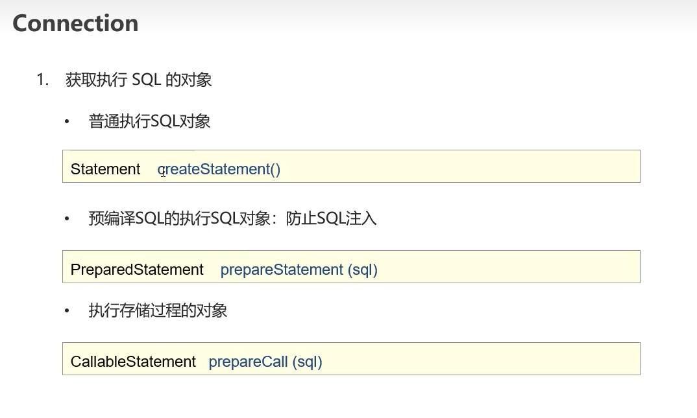

https://www.bilibili.com/video/BV1s3411K7jH?p=12&vd_source=7116afddac4acaa2875e31b432e7f0ed
# 快速入门

1.注册驱动
2.通过DriverManager拿到connection
3.通过connection创建statement
4.通过给statement的执行方法传参执行SQL
5.释放资源（statement和connection）

# JDBC API详解
## DriverManager
作用：
1.注册驱动
2.获取数据库连接

com.mysql.jdbc.Driver加载过程中会执行DriverManager.registerDriver(new Driver)注册驱动

## Connection
作用：
1.获取执行SQL的对象
2.管理事务

try catch

## Statement
作用：
1.执行SQL语句
2.

[DML、DDL、DQL](https://blog.csdn.net/m0_62931396/article/details/121776320)

## ResultSet

## PreparedStatement

### SQL注入案例
select * from user where username='xxx' and password='xxx' 
由于是拼接后执行SQL语句，那么可以实现
select * from user where  username='xxx' and password='xxx' or '1' = '1'

使用PreparedStatement设置参数的时候会对参数进行转义

### PreparedStatement原理

https://blog.csdn.net/alex_xfboy/article/details/83901351?spm=1001.2101.3001.6650.2&utm_medium=distribute.pc_relevant.none-task-blog-2%7Edefault%7ECTRLIST%7ERate-2-83901351-blog-52623450.pc_relevant_recovery_v2&depth_1-utm_source=distribute.pc_relevant.none-task-blog-2%7Edefault%7ECTRLIST%7ERate-2-83901351-blog-52623450.pc_relevant_recovery_v2&utm_relevant_index=3

[prepare statement只能参数化值](https://www.saoniuhuo.com/question/detail-2000233.html)
[Stopwatch使用](https://blog.csdn.net/m0_37899908/article/details/125341503)

useServerPrepStmts=true&cachePrepStmts=true

==没开useServerPrepStmts，不会预编译，同statement一样，开了会预编译，但是客户端mysql-connector-jar实现的缓存不开启则会导致preparedstament关闭后客户端对statement预编译id的缓存失效，下个相同SQL语句的preparedstament执行将仍需预编译==

# 数据库连接池

## 数据库连接池实现

### 定义配置文件
