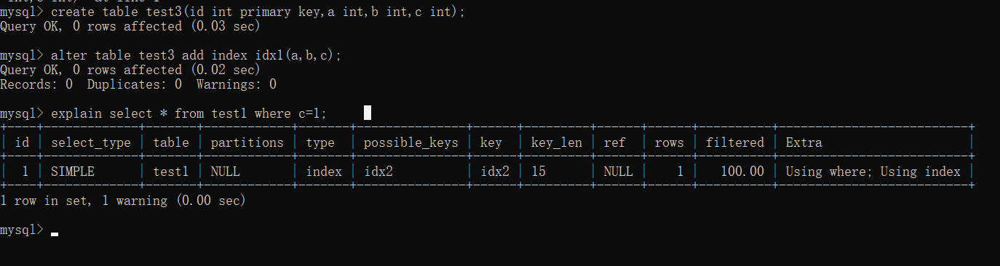

# mysql是如何查询数据的？
 https://baijiahao.baidu.com/s?id=1693718883799963534&wfr=spider&for=pc

# mysql是如何更新数据的？
https://www.modb.pro/db/49325

# 当所有字段都是索引列时，无论什么查询都会使用索引
```sql
create table test1 (id int primary key,a int,b int,c int);
alter table test1 add index idx1(a,b,c);
explain select * from test1 where c=1; 
```

using where：在索引表中过滤（出现时不代表就查了数据表）
using index:查找索引表不查找数据表

# 范围查询会导致索引失效
https://blog.csdn.net/imagineluopan/article/details/121097361

# 事务
[分布式事务](https://blog.csdn.net/DarzenWong/article/details/122432907)


# 实战
https://www.bilibili.com/video/BV15t4y1Y73N?p=13&spm_id_from=pageDriver&vd_source=7116afddac4acaa2875e31b432e7f0ed
## select
1.取出表的所有内容
select * from emp;

2.取出名字和月薪
select ename,sal from emp;

3.取出名字和年薪
select ename,sal*12 from emp;

4.年薪取别名
select ename,sal*12 annualsal from emp;
select ename,sal*12 `annual sal` from emp;
select ename,sal*12 as `annual sal` from emp;
字段名有空格必须要用``括起来

5.计算总收入（处理NULL值）
(a) 将null处理为0
select ename,sal*12+(case when comm is null then 0 else comm end) `total sal` from emp;
注意：null值参与数学计算仍然为null

6.distinct去掉重复值（给字段或组合去重）
(a)去掉deptno重复
select distinct deptno from emp;
(b)去掉重复组合
select distinct deptno,job from emp;
注意该语句不是只对deptno去重

7.where条件过滤
(a)取出deptno=10的记录
select * from emp where deptno=10;
(b)取出deptno不为10的记录
select * from emp where deptno!=10;
select * from emp where deptno<>10;
(c)取出薪水位于800到1500之间的记录（包含800和1500）
select * from emp where sal between 800 and 1500;
select * from emp where sal<=1500 and sal>=800;
(d)查询common不为null的数据
select * from emp where comm is not null;
(e)薪水是800或1500
select * from emp where sal in (800,1500);
select * from emp where sal = 800 or sal =1500;
(f)名字是SMITH或KING
select * from emp where ename in ('SMITH','KING');
select * from emp where ename='SMITH' or ename='KING';
(g)查询日期
select * from emp where hiredate>'1980-12-17';
(h)模糊查询
%匹配多个所有字符，_匹配单个所有字符
名字包含ALL
select * from emp where ename like'%ALL%';
名字最前面三个字母是ALL
select * from emp where ename like'ALL%';
名字最后面三个字母是ALL
select * from emp where ename like'%ALL';
名字第二个字母是L
select * from emp where ename like'_A%';
名字中包含%
select * from emp where ename like'%/%%';

8.排序
a.select * from dept order by deptno;(默认升序)
b.select * from dept order by deptno desc;
c.select * from dept where sal<> 800 order by deptno asc;
where和order混合使用时，先过滤再排序

11.group by
a.按照deptno进行分组计算emp表中的sal最大值
select max(sal) from emp group by deptno;
进一步同时查询每个部门sal最大的人
select ename,max(sal) from emp group by deptno;  这样不行，需要表连接
b.把deptno和job当作一个组合作为分组
select max(sal) from emp group by deptno,job;
c.求出最高薪资的人
select ename from emp where sal=(select max(sal) from dept);
d.求每个部门最高薪资
select deptno,max(sal) from emp group by deptno;
e.求每个部门薪水最高的人的名字
思路：求出每个部门最高薪资，通过join
select ename,emp.sal from emp join (select deptno,max(sal) from emp group by deptno) p on emp.sal=p.`max(sal)` and emp.deptno=p.deptno;
注意：``来识别字段，否则会报错


12.having对分组进行限制
a.按照部门编号进行分组，求分组之后每一个部门的平均薪水
select avg(sal) from emp group by deptno;
b.要求显示平均薪水大于2000的部门
select avg(sal) aa from emp group by deptno having aa>2000;

执行过程是怎样的？
为什么不能用where aa>2000？

13.总结：
select xx from 表名
where xx xxx 对数据进行过滤
group by 分组
having  对分组进行限制
order by 排序
取数据、过滤、分组、分组限制、排序

要求薪水大于1200的雇员按照部门编号进行分组，分组后的平均薪水大于1500，查询分组内的平均工资，按照工资的倒序进行排序
select avg(sal) 
    from emp 
    where sal>1200 
    group by deptno 
    having avg(sal)>1500 
    order by avg(sal) desc;

select max(sal) from emp where sal>1200 group by deptno having avg(sal)>2000 order by avg(sal) desc;
取得emp表，过滤出sal>1200的数据，对这些数据按照deptno进行分组，过滤出avg(sal)>2000的分组，并按照sal的平均值进行降序排序，从最后的表中获得每个分组的max(sal)。

## 子查询
一个select语句中嵌套另一个select语句(可以看做临时表)
(a) 求哪些人的工资比平均工资高
select ename from emp where sal>(select avg(sal) from emp);
(b) 按照部门进行分组之后，每个部门工资最高的人（可能有多个），要求显示他的名字、部门编号
select ename,emp.deptno from emp join (select max(sal) a,deptno from emp group by deptno) p on emp.deptno=p.deptno and emp.sal=p.a;

## 自连接
运用一条select语句，查询出一个人的名字和他所在部门经理的名字
select e.ename,m.ename mgr_name from emp e join emp m on e.mgr=m.empno;
如果要把没有经理的人也取出来怎么办
select e.ename,m.ename mgr_name from emp e left join emp m on e.mgr=m.empno;

## 表连接
[MySQL中inner join和cross join的区别](https://www.zhihu.com/question/34559578)
回答：是一样的
full outer join 和 cross join区别？
full outer join必须和on一样用，
12   56
34   78
cross join
1256
1278
3456
3478
full outer join on
12 null
12 78
34 null
null 78


92标准
用，和where
99标准
用join和on
on表示两个表的行可以连接成一行的条件
用using（不推荐用using，用的话必须保证字段名和类型一致）
1.查每个人的名字，所在部门名字，薪水等级
select e.ename,d.dname,s.grade from emp e join dept d join salgrade s on (e.sal between s.losal and s.hisal) and e.deptno =d.deptno;

## 题目练习
1.部门平均薪水的等级
select s.grade,p.deptno from salgrade s join (select avg(sal)avg_sal,deptno from emp group by deptno) p on (p.avg_sal between s.losal and s.hisal);
2.部门平均的薪水等级
select deptno,avg(grade) from (select e.deptno,s.grade from emp e join salgrade s on (e.sal between s.losal and s.hisal)) a group by deptno;
3.哪些人是经理
select distinct p.ename from (emp e join emp p on e.mgr=p.empno);
4.不用组函数求最高薪水
求得低于最高薪水的记录
5.平均薪水最高的部门编号与名称
select deptno,dname from dept where deptno=(select deptno from (select avg(sal) avg_sal,deptno from emp group by deptno) p where p.avg_sal=(select max(q.avg_sal) maxavgsal from (select avg(sal) avg_sal,deptno from emp group by deptno) q));
6.求平均薪水的等级最低的部门的部门名称

7.比普通员工的最高薪水还要高的经理人名称

## 面试题
有三个表S，C，SC
S(SNO,SNAME)(学号，姓名)
C(CNO,CNAME,CTEACHER)(课号，课名，教师)
SC(SNO,CNO,SCGRADE)(学号，课号，成绩)
1.找出所有没选过“黎明”老师的所有学生的名字
用join
select SNAME from S join SC on (S.SNO=SC.SNO) join C on (C.CNO=SC.CNO) where C.CTEACHER!='黎明';
2.列出2门以上（包括2门）不及格学生姓名及平均成绩
找到学生，再找平均成绩
select s.sname,a.avggrade from (select sno,avggrade from (select sno,avg(scgrade) avggrade,count(sno) counts from (select sno,scgrade from sc where scgrade<60) p group by sno) q where counts>=2) a join s on a.sno= s.sno;

select sname,sc_grade from s join(select sno,avg(scgrade) sc_grade from sc where scgrade<60 group by sno having count(*) >=2 ) t on (s.sno=t.sno);

3.既学过课程1又学过课程2的学生姓名
select sname from s join (select a.sno from sc a join sc b  on(a.cno=1 and b.cno=2 and a.sno=b.sno)) p on s.sno=p.sno;

select sname from s where sno in (select sno from sc where cno=1 and sno in (select sno from sc where cno=2));

## 分页
select ename,sal from emp limit 5;
select ename,sal from emp order by sal desc limit 5;
1.求薪水最高的第6到第10名雇员（重点掌握）
select ename,sal from emp order by sal desc limit 5,5;

2.比较效率
select * from emp where deptno=10 and ename like '%A%';
select * from emp where ename like '%A%' and deptno=10;
首先比数字比较快一些，数字不对，后面就不用比较了
理论上是第一个效率高，实际过程中数据库会对SQL语句进行优化


# 三大日志
redolog、undolog、binlog
在哪里？
有什么用？
工作机制？
存储形式？
## redo log
https://blog.csdn.net/u014225032/article/details/126146559
### 在哪里产生？
innodb存储引擎，有两部分，redo log buffer，redo log file
它们都是以块（512字节，和磁盘扇区大小一样）的方式进行保存，因此redo log的写入可以保证原子性
### 记录什么？
1.物理日志，记录的是页的物理修改操作
2.一行记录包含表空间号、数据页号、磁盘文件偏移量、更新值
### 如何记录？
1.顺序写

2.当发生数据改变时，就会产生redo log，在事务执行的过程中，边执行边写入redo log buffer，多线程多事务公用一个redo log buffer，不是随事务的提交顺序进行写入。

3.如何刷盘？
注意：写入page cache后会清空redo log buffer
3.1后台线程被动刷盘：
（1）每隔1秒，就会把redo log buffer中的内容写到page cache，然后调用fsync刷盘。
（2）redo log buffer占用空间即将达到innodb_log_buffer_size一半，也会主动刷盘。
3.2根据设置的策略在提交事务后主动刷盘：
0：不刷盘
1：写入page cache并调用fsync刷盘
2：只把redo log buffer写入page cache 


### 有什么用？
redo log是在事务提交后生成的，如果此时服务宕机，后期重启可以用redo日志恢复数据。
保证事务的持久性。

### 如何进行恢复的？


## binlog
### 在哪里产生？
mysql数据库服务层


###


## undo log
### 在哪里产生？
innodb存储引擎
### 记录什么？
逻辑日志，记录的是每行记录
### 怎么记录？
1.随机读写


### 有什么用？
实现事务回滚，保证原子性
与锁共同实现MVCC的功能，保证隔离性

# 数据库ACID
https://developer.aliyun.com/article/258340
## Atomicity：
原子性，一个事务（多条语句）要么都执行成功，要么都执行失败，由undo log保证

## 一致性：
事务开始和事务结束之后，数据库的完整性约束没有被破坏，也就说不能破坏关系数据的完整性以及业务逻辑上的一致性。

### 如何保证？
1.分布式mysql的一致性由binlog保证。
2.设置约束（唯一约束，外键约束，Check约束）


### 什么是数据库的完整性约束？
数据完整性：存储在数据库中的所有数据值均正确的状态。它是应防止数据库中存在不符合语义规定的数据和防止因错误信息的输入输出造成无效操作或错误信息而提出的。

数据完整性分为四类：

#### 实体完整性
实体完整性是对关系中的记录唯一性，也就是主键的约束。准确地说，实体完整性是指关系中的主属性值不能为Null且不能有相同值。定义表中的所有行能唯一的标识,一般用主键,唯一索引 unique关键字,及identity属性比如说我们的身份证号码,可以唯一标识一个人。

#### 域完整性
域完整性是对数据表中字段属性的约束，通常指数据的有效性,它包括字段的值域、字段的类型及字段的有效规则等约束，它是由确定关系结构时所定义的字段的属性决定的。限制数据类型,缺省值,规则,约束,是否可以为空,域完整性可以确保不会输入无效的值。
#### 参照完整性
参照完整性是对关系数据库中建立关联关系的数据表间数据参照引用的约束，也就是对外键的约束。准确地说，参照完整性是指关系中的外键必须是另一个关系的主键有效值，或者是NULL。参考完整性维护表间数据的有效性,完整性,通常通过建立外部键联系另一表的主键实现,还可以用触发器来维护参考完整性。
#### 用户定义的完整性
约束是表级的强制规定，有以下五中：not null，unique，primary key，foreign key，check 。

## 隔离性
在并发环境中，当不同的事务同时操纵相同的数据时，每个事务都有各自的完整数据空间。由并发事务所做的修改必须与任何其他并发事务所做的修改隔离。事务查看数据更新时，数据所处的状态要么是另一事务修改它之前的状态，要么是另一事务修改它之后的状态，事务不会查看到中间状态的数据。
### 事务之间的影响
#### 脏读：
事务2读到了事务1修改了但未提交的数据
#### 不可重复读：
事务2 [查询数据行A  事务1修改数据行A   查询数据行A]   
事务1对数据进行了修改，这时事务2会查到同一数据的不同数值
#### 幻读：
事务1 [查询所有数据 事务2插入新数据  查询所有数据]
事务1查询到新的数据行
#### 丢失修改：
两个写事务T1 T2同时对A=0进行递增操作，结果T2覆盖T1，导致最终结果是1 而不是2，事务被覆盖。

### SQL Server隔离级别
未提交读
已提交读：解决脏读
可重复读：解决脏读、不可重复度（丢失修改）
可串行化：解决脏读、不可重复度、丢失修改、幻读

通过加锁和MVCC来实现
SERIALIZABLE隔离级别通过加锁来实现，其他的隔离级别都是基于MVCC实现


## 持久性
事务完成后，该事务对数据库所作的更改持久的保存在数据库之中，并不会被回滚。

SQL Server通过redo log来保持持久性。事务对数据库的改变在写入到数据库之前，首先写入到事务日志之中。
