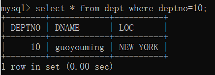
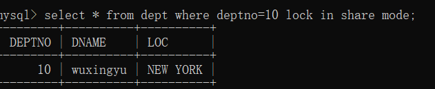
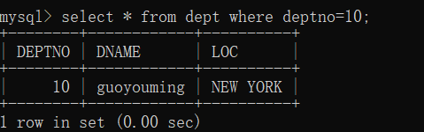
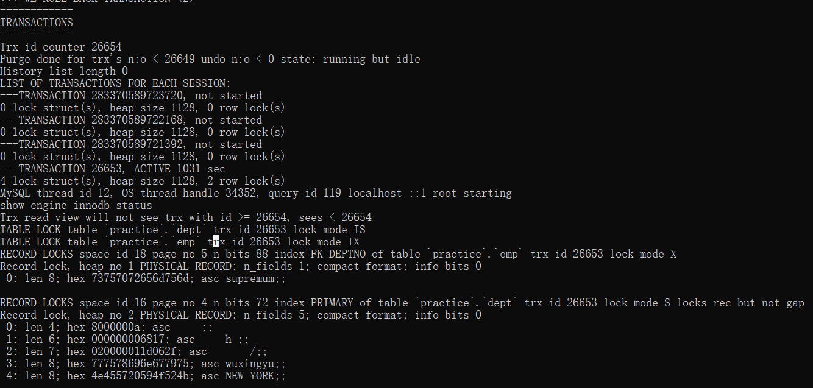
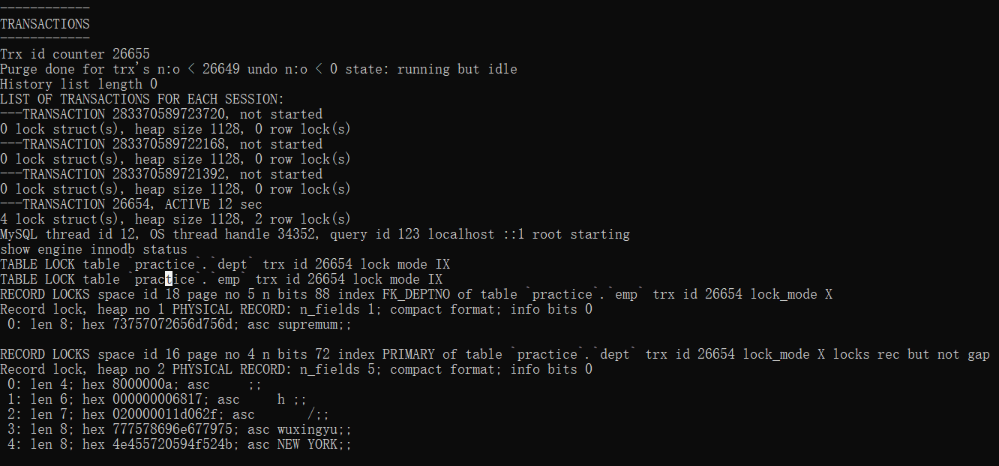
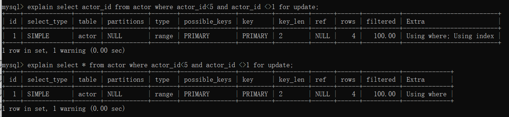
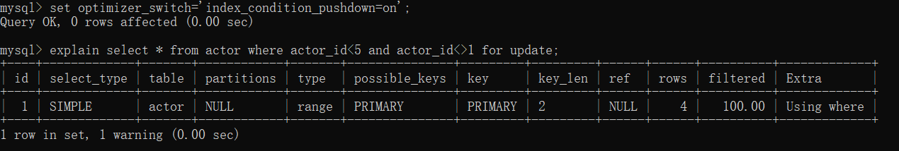
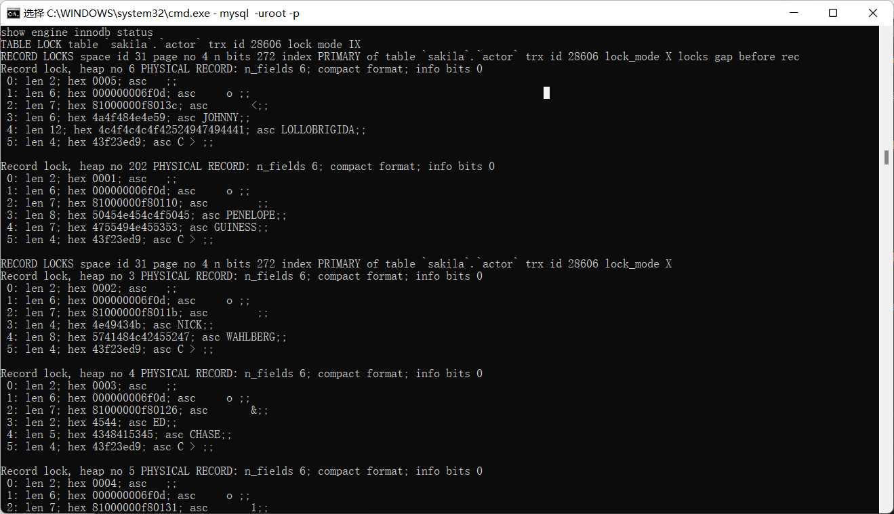
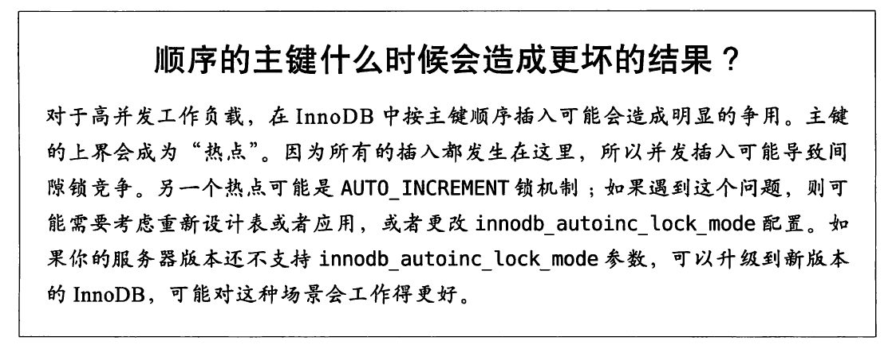

# mysql软件操作
## 一些配置
1.设置自动提交
https://blog.csdn.net/lizongti/article/details/103454351
https://blog.csdn.net/yxg520s/article/details/122425546
默认自动提交是开启的，每一条SQL语句都当作一个事务
set autocommit=0;  关闭自动提交，每一条语句都是在一个事务中，最后必须commit来手动提交事务


2.查看变量
show variables like "%autocommit%";

# 事务
## 如何查看具体的事务？
```SQL
show engine innodb status\G
```
看显示出来的TRANSACTIONS模块

如果要看完整的信息描述？
```SQL
set global innodb_status_output_locks=1;
show engine innodb status\G
```
## 如何执行事务？
begin；
commit/rollback;
注意：当会话在执行过程中结束也就意味着客户端和服务端的连接断开，那么mysql会执行rollback

## 如何正确使用事务？
由于锁需要在事务结束释放，所以需要尽量避免长事务


# 锁实战
## 死锁
### 案例
 事务1
 ```SQL
 select * from dept where deptno=10 for update;     // 给dept表加了行锁       
 ```

 事务2
 ```SQL
 select * from dept where deptno=20 for update;     // 给dept表加了行锁 
 ```

事务1
```SQL
select * from dept where deptno=20 for update;     // 想给deptno=20这一行加锁，等待事务2将锁释放 
```

事务2
```SQL
select * from dept where deptno=10 for update;   // 出现死锁 
```
## 锁的释放时机
### 锁一般在事务提交后释放
#### 1.等待写锁释放才可当前读
事务1
select * from dept where deptno=10;  // 普通读
事务2
update dept set dname=guoyouming where deptno=10;   //加写锁
事务1
select * from dept where deptno=10 for update;  // 等待事务2释放锁

#### 2.同一事务可对同一记录拥有多把锁，既有共享锁又有排他锁（for update是排他锁、lock in share mode是共享锁）
事务1
select * from dept where deptno=10 lock in share mode;  //加共享锁
事务2
select * from dept where deptno=10 lock in share mode;  // 加共享锁（可兼容）
事务1
select * from dept where deptno=10 for update;   //加排他锁（不兼容），需等待事务2释放锁 
事务2
commit;
事务1
显示输出

#### 3.当前读和普通读
事务1
select * from dept where deptno=10;   //普通读

事务2
update dept set dname='wuxingyu' where deptno=10;    // 加写锁更新
事务1
select * from dept where deptno=10 lock in share mode;   // 等待事务2释放锁
事务2
commit;
事务1

事务1
select * from dept where deptno=10;   // 普通读则依然是快照读


## 加锁方式
自动：增删改（加排他锁）
手动：select ... lock in share mode(加共享锁)    select ... for update


## 意向锁、排他锁、共享锁
由存储引起自己维护，用户无法手动操作意向锁
意向共享锁（IS锁）：表示事务准备给数据行加入共享锁，也就是说一个数据行加共享锁前必须先取得该表的IS锁
意向排他锁（IX锁），表示事务准备给数据行加入排他锁，说明事务在一个数据行加排他锁前必须先取得该表的IX锁


### 实战
### 发现lock in share mode在show engine看不到行锁信息
https://blog.csdn.net/weixin_34248849/article/details/89543962
## lock in share mode
delete from emp where deptno=134124312;         // 先这样才能在show engine显示
select * from dept where deptno=10 lock in share mode ;        // 加共享锁
show engine innodb status\G; 

可以看到table dept被加了意向共享锁IS，deptno=10的行记录被加了记录锁（S locks rec but not gap）

## for update(与update insert delete 情况相同)
delete from emp where deptno=134124312;         // 先这样才能在show engine显示
select * from dept where deptno=10 for update;        // 加排他锁

可以看到table dept被加了意向排他锁IX，deptno=10的行记录被加了记录锁（X locks rec but not gap）

## select 主键 from table xxx where 主键查询条件  和  select * from table xxx where 主键查询条件
1.他们的explain的extra不同

2.他们锁的数据行相同


## 是否开启索引下推对锁数据行的影响
开启索引下推


15加上了间隙锁但是在另一个session还是能查到id为1的当前读数据行
关闭索引下推show engine innodb status结果一样


## 记录锁、gap锁、next-key锁
https://www.jianshu.com/p/1146cdf81030/
对于唯一索引采取记录锁，
对于非唯一索引采取gap锁，RR隔离级别下也会开启next-key锁（记录锁+gap锁）
### 实战


## select name from t_user where name like'李%' and age=22 for update;
会锁非聚簇索引和聚簇索引
问题：非聚簇索引锁哪些？
会name like '李%'对应的叶子节点
实验验证：select name from t_user where name like'李%'  for update;


## 意向锁
### 为什么需要表级别的意向锁？
一个事务能够成功给一张表加上表锁的前提是：没有其它事务已经锁定了这张表的任意一行数据。
如果没有意向锁，则需要进行全表扫描检测；所有有了意向锁可以提高加表锁的效率。
 
## 表锁和行锁
当查询不走索引，那么将会锁表
// 事务1
select * from dept where dname='wuxingyu' for update;  // dname是非主键，加表锁
// 事务2
select * from dept where deptno=10 for update; //  无法加锁，需等待事务1释放锁

## 


# 索引
## 创建索引
https://blog.csdn.net/qiannz/article/details/125271012
### 建表时创建索引
create table xxx(id int(6) primary key);
create table xxx(id int(6),primary kye(id));
CREATE TABLE tableName(  
  id INT NOT NULL,   
  columnName  columnType,
  INDEX [indexName] (columnName(length))  
);
### 在某张表上创建索引
create index [index name] on xxx(id(length)); 
### 在某张表上增加索引
alter table xxx add index indexname(columnname);

## 如何高性能创建索引
### 查询的索引列不能是表达式的一部分，也不能是函数的参数
### 前缀索引和索引选择性
#### 什么是索引选择性？
不重复的索引值是指不重复的索引值和数据表的记录总数的比值
#### 场景
有时候需要索引很长的字符列，这会让索引变得大且慢。除了哈希索引，还能怎么办？使用前缀索引
#### 如何选择前缀索引的长度？
先通过使用count和group by来查看该字段的分布，
再逐步增加left(xxx,n)的n长度来使他们的分布接近
#### 缺点
无法使用前缀索引作order by和group by，也无法使用前缀索引做覆盖扫描。
#### 案例
存储网站的session id（很长的十六进制字符串），如果采用长度为8的前缀索引通常能够显著地提升性能


### 多列索引
#### 案例
1.给emp表增加mgr和sal索引列
2.explain select mgr,sal from emp where mgr=10 or sal=800\G;
3.在extra栏显示mysql使用了索引合并
索引合并的三个变种：or条件的联合、and条件的相交、组合前两种情况的联合及相交
虽然走了索引但是会消耗更多的CPU和内存资源，还可能会影响查询的并发性。
#### 策略
如果在explain中看到有索引合并，应该好好检查以下查询和表的结构，也可以通过optimizer_switch来关闭索引合并功能，也可以使用ignore index提示让优化器忽略掉某些索引

### 选择合适的索引列顺序
#### 为什么要？
提高查询效率，减少IO次数
#### 需要考虑什么？
使用该索引的查询，如何更好地满足排序和分组的需要
#### 如何做？
当不需要考虑排序和分组时，将选择性最高的列放在前面通常是最好的（有时也需要根据运行频率最高的查询来调整索引列的顺序）
select count(DISTINCT staff_id)/count(*) as staff_id_selectivity,
count(DISTINCT customer_id)/count(*) as customer_id_selectivity,
count(*)
from payment\G;

例外：
一个异常id匹配几乎所有行（系统账号是所有用户的好友，以便发送消息）
解决方法：
修改应用程序代码，区分这类特殊用户和组，禁止针对这类用户和组执行这个查询。

### 聚簇索引
#### 如何做？
1.尽可能按照主键顺序插入数据，并且尽可能地使用单调增加的聚簇键的值来插入新行。
2.如果把随机值载入到聚簇索引后，需要做一次optimize table来重建表并优化页的填充。
3.

### 覆盖索引
#### 如何做？
使mysql可以直接使用索引来获取列的数据

### 使用索引扫描来做排序
如果explain出来的type列的值为index，则说明mysql使用了索引扫描来做排序
#### 如何做？
1.只有当索引的列顺序和order by子句的顺序完全一致时，并且所有列的排序方向都一样时，mysql才能使用索引来对结果排序
2.如果查询需要关联多张表，则只有当order by子句引用的字段全部为第一个表时，才能使用索引做排序。
3.有一种情况order by子句可以不满足索引的最左前缀的要求，就是前导列为常量的时候。

#### 实战
1.下面这个例子理论上可以使用索引进行关联排序的，但由于优化器在优化时将film_actor表当作管来奶的第二张表，所以实际上无法使用索引。
explain select actor_id,title from film_actor inner join film using film_id order by actor_id\G


## 实战
### 1.需要存储大量的url，并需要根据url进行搜索查找
分析：
url一般很长，如果直接用url作索引，查询效率很低，用哈希索引效率会高很多，
但是还需要考虑哈希值的维护

实现：
1.创建表,增加哈希索引列
```SQL
CREATE TABLE pseudohash(
    id int unsigned not null aotu_increment,
    url varchar(255) not null,
    url_crc int unsigned not null default 0,
    primary key(id)
);
```
2.创建触发器以维护哈希索引
DELIMITER //

CREATE TRIGGER pseudohash_crc_ins before insert on pseudohash for each row begin
set new.url_crc=crc32(new.url);
end;
//

CREATE TRIGGER pseudohash_crc_upd before update on pseudohash for each row begin
set new.url_crc=crc32(new.url);
end;
//

DELIMITER ;

2.1 哈希函数的选择
crc32(str) 返回32位的整数
md5(str) 返回32个十六进制的数字组成的字符串
sha1(str)返回40个十六进制的数字组成的字符换

md5,sha1函数计算出来的哈希值比较长，设计目标是最大限度消除冲突。

2.2 如果数据表非常大，考虑实现自定义哈希函数
用MD5()函数返回值的一部分来作为自定义哈希函数
select CONV(RIGHT(MD5('www.baidu.com'),16),16,10) as hash64;

3.处理哈希冲突
当使用哈希索引进行查询的时候，必须在where子句中包含常量值
select id from url where url_crc=CRC32('http://www.mysql.com') and url='http://www.mysql.com';


# 表和数据操作
## 删除表
  ### delete
  delete from table_stu;
  支持过滤，可以回滚，记录日志，保留表结构
  ### truncate
  truncate table table_stu;
  不支持过滤。不可以回滚。不记录日志，保留表结构
  ### drop
  drop table table_stu;
  不支持过滤，不可以回滚，不记录日志，不保留表结构
  ### 过程分析

  ### 应用场景
## 创建表（列、约束、键，索引）
创建一个学生表，学生id自增主键，姓名非空，身份证号 唯一约束，年龄非空约束大于18岁，专业id 外键
创建一个专业表，专业id 主键 自增，专业名
```SQL
create table student(
    stu_id int(6) primary key auto_increment,
    stu_name varchar(10) not null,
    stu_identidycard varchar(20) unique not null,
    age int(3) check(age>18),
    professial_id int(6));
```
not null 放在哪里都可以

```SQL
 create table major(
    major_id int(6) primary key auto_increment,
    major_name varchar(10) not null
    );
```

```SQL
alter talbe student add constraint foreign key(professial_id) references major(major_id);
```

## 