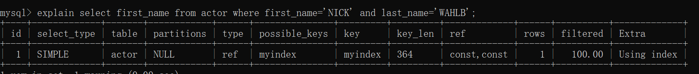
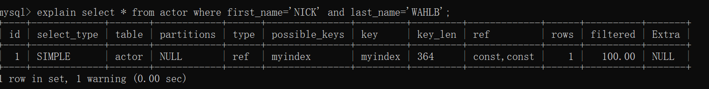
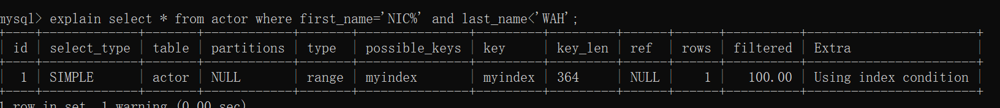
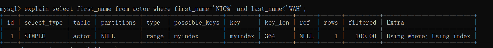

# 索引案例学习
场景：设计一个在线约会网站，用户信息表有很多列，包括国家、地区、城市、性别、眼睛颜色等等。网站必须支持上面这些特征的各种组合来搜索用户，还必须允许根据用户的最后在线时间、其他会员对用户的评分等对用户进行排序并对结果进行限制。

## 在哪些值上创建索引，组合索引顺序的选择？
一般会在选择性高的列上创建索引，如果有性别这种几乎每一个查询都会用到的sex列，那么可以考虑将其作为组合索引的前缀，因为哪怕查询不用到sex列也通过新增sex in ('m','f')来让MySQL选择该索引。

## 如果尽可能重用索引而不是建立大量的组合索引？
1.in技巧
2.选择性高、使用不频繁的列可以选择忽略它们，让mysql多扫描一些额外的行

## 尽可能将需要做范围查询的列放到索引的后面，以便优化器能够使用尽可能多的索引列

## 避免多个范围条件
1.in技巧
2.将选择性很低的列的范围查询放到where子句中

## 优化排序
1.针对排序来创建索引
```SQL
select <cols> from profile where sex='M' order by rating limit 10;
```
创建(sex,rating)索引
2.进一步地使用延迟关联来优化
```SQL
select <cols> from profile inner join(
    select <primary key cols> from profiles
    where x.sex='M' order by rating limit 100000,10 
)
as x using(<primary key cols>);
```
先找到排序后对应的主键，再通过join找到数据行

# 查询性能优化
## 慢查询基础优化数据访问
### MySQL是否在扫描额外的记录
1.
```SQL
explain select first_name from actor where first_name='NICK' and last_name='WAHLB';
```
索引覆盖

2
```SQL
explain select * from actor where first_name='NICK' and last_name='WAHLB';
```

使用了索引，并且回表
3
```SQL
explain select * from actor where first_name<'NICK' and last_name>'WAH';
```
优化器选择执行了全表扫描（认为效率比走索引更高）
4
```SQL
explain select * from actor where first_name='NIC%' and last_name<'WAH';
```

索引下推
当select的列包含非索引列时，本应将过滤交给服务器执行，现在直接由存储引擎过滤
5
```SQL
explain select first_name from actor where first_name='NIC%' and last_name<'WAH';
```

使用索引并在存储引擎过滤
