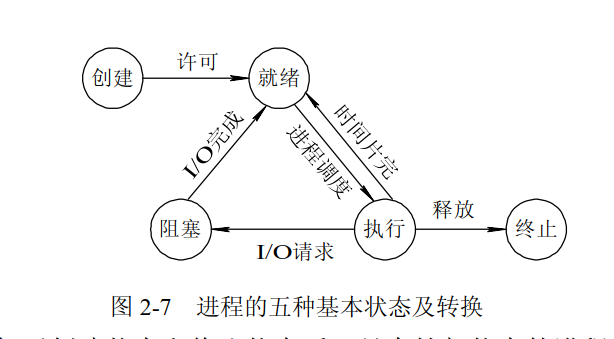
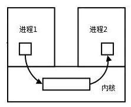

# 二、进程和线程
## 2.1 进程和线程的区别？
一个进程可以有多个线程。线程共享，进程独立
## 2.2 进程有哪几种状态？

创建状态：正在被创建，未达到就绪状态
就绪状态：获得了除了CPU外的一切资源
运行状态：获得了时间片
阻塞状态：等待阻塞进程的事件完成
结束状态：正常结束或者其他原因中断退出运行

运行->阻塞：如果进程请求它必须等待的某些事件，例如一个无法立即得到的资源（如I/O操作、申请缓存区失败），只有在获得等待的资源后才能继续进程的执行，则进入等待态（阻塞态）。

## 2.3进程间的通信方式
https://www.jianshu.com/p/c1015f5ffa74
### 2.3.1 进程间通信的概念
每个进程各自有不同的用户地址空间，任何一个进程的全局变量在另一个进程中都看不到，所以进程之间要交换数据必须通过内核，在内核中开辟一块缓冲区，进程1把数据从用户空间拷到内核缓冲区，进程2再从内核缓冲区把数据读走，内核提供的这种机制称为进程间通信（IPC，InterProcess Communication）

开辟、拷贝、读取

### 2.3.2 进程间通信的7种方式
#### 传统的Unix通信机制
1.管道/匿名管道：
·管道是==半双工==的，数据只能向一个方向流动；需要双方通信时，需要建立起两个管道。
·只能用于父子进程或者兄弟进程之间(具有亲缘关系的进程);  ？？？
·单独构成一种独立的文件系统：管道对于管道两端的进程而言，就是一个文件，但它不是普通的文件，它不属于某种文件系统，而是自立门户，单独构成一种文件系统，并且只存在与内存中。
·数据的读出和写入：一个进程向管道中写的内容被管道另一端的进程读出。写入的内容每次都添加在管道缓冲区的末尾，并且每次都是从缓冲区的头部读出数据

    管道的实质：
    ·循环队列：先进先出（一端写入，一端读出）  读和写的位置自动增长
    ·缓存区读空或者写满时，有一定的规则控制相应的读进程或者写进程进入等待队列，当空的缓冲区有新数据写入或者满的缓冲区有数据读出来时，就唤醒等待队列中的进程继续读写。

    管道的局限性
    ·只支持单向数据流；
    ·只能用于具有亲缘关系的进程之间；
    ·没有名字；
    ·管道的缓冲区是有限的（管道制存在于内存中，在管道创建时，为缓冲区分配一个页面大小）；
    ·管道所传送的是无格式字节流，这就要求管道的读出方和写入方必须事先约定好数据的格式，比如多少字节算作一个消息（或命令、或记录）等等；

2.有名管道（FIFO）
有名管道不同于匿名管道之处在于==它提供了一个路径名与之关联==，以有名管道的文件形式存在于文件系统中，这样，即使与有名管道的创建进程不存在亲缘关系的进程，只要可以访问该路径，就能够彼此通过有名管道相互通信。
有名管道的名字存在于文件系统中，内容存放在内存中。

匿名管道和有名管道总结：
（1）管道是特殊类型的文件，在满足先入先出的原则条件下可以进行读写，但不能进行定位读写。
（2）匿名管道是单向的，只能在有亲缘关系的进程间通信；有名管道以磁盘文件的方式存在，可以实现本机任意两个进程通信。
（3）无名管道阻塞问题：无名管道无需显示打开，创建时直接返回文件描述符，在读写时需要确定对方的存在，否则将退出。如果当前进程向无名管道的一端写数据，必须确定另一端有某一进程。如果写入无名管道的数据超过其最大值，写操作将阻塞，如果管道中没有数据，读操作将阻塞，如果管道发现另一端断开，将自动退出。
（4）有名管道阻塞问题：有名管道在打开时需要确实对方的存在，否则将阻塞。即以读方式打开某管道，在此之前必须一个进程以写方式打开管道，否则阻塞。此外，可以以读写（O_RDWR）模式打开有名管道，即当前进程读，当前进程写，不会阻塞。

3.信号（Signal）
·信号是Linux系统中用于进程间互相通信或者操作的一种机制，信号可以在==任何时候==发给某一进程，而无需知道该进程的状态
·如果该进程当前并未处于执行状态，则该信号就有内核保存起来，知道该进程回复执行并传递给它为止。
·如果一个信号被进程设置为阻塞，则该信号的传递被延迟，直到其阻塞被取消是才被传递给进程。

## 2.4 进程间的同步的方式
1.互斥量：比如Java中的synchronized关键字和各种Lock
2.信号量
3.事件

## 2.5 进程的调度算法
·先到先服务(FCFS)调度算法 : 从就绪队列中选择一个最先进入该队列的进程为之分配资源，使它立即执行并一直执行到完成或发生某事件而被阻塞放弃占用 CPU 时再重新调度。
·短作业优先(SJF)的调度算法 : 从就绪队列中选出一个估计运行时间最短的进程为之分配资源，使它立即执行并一直执行到完成或发生某事件而被阻塞放弃占用 CPU 时再重新调度。
·时间片轮转调度算法 : 时间片轮转调度是一种最古老，最简单，最公平且使用最广的算法，又称 RR(Round robin)调度。每个进程被分配一个时间段，称作它的时间片，即该进程允许运行的时间。
·多级反馈队列调度算法 ：前面介绍的几种进程调度的算法都有一定的局限性。如短进程优先的调度算法，仅照顾了短进程而忽略了长进程 。多级反馈队列调度算法既能使高优先级的作业得到响应又能使短作业（进程）迅速完成。，因而它是目前被公认的一种较好的进程调度算法，UNIX 操作系统采取的便是这种调度算法。
·优先级调度 ： 为每个流程分配优先级，首先执行具有最高优先级的进程，依此类推。具有相同优先级的进程以 FCFS 方式执行。可以根据内存要求，时间要求或任何其他资源要求来确定优先级

