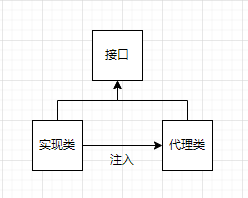
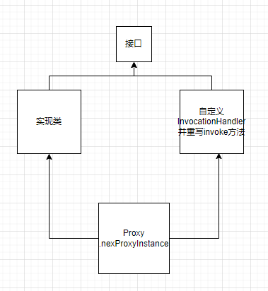

# 1.代理模式
我们使用代理对象来代替对真实对象(real object)的访问，这样就可以在不修改原目标对象的前提下，提供额外的功能操作，扩展目标对象的功能。

代理模式有静态代理和动态代理两种实现方式
# 2.静态代理
实现和应用层面：
不灵活：接口一旦新增加方法，目标对象和代理对象都要进行修改
麻烦：每个目标类都单独写一个代理类；当多个接口有同样的方法需要做切面的时候，
JVM层面：
静态代理在编译时就将接口、实现类、代理类这些都变成了一个个实际的class 文件。


[Java@override](http://c.biancheng.net/view/6993.html)
实现步骤


```java
public interface SmsService {
    String send(String message);
}
public class SmsServiceImpl implements SmsService {
    public String send(String message) {
        System.out.println("send message:" + message);
        return message;
    }
}
public class SmsProxy implements SmsService {

    private final SmsService smsService;

    public SmsProxy(SmsService smsService) {
        this.smsService = smsService;
    }

    @Override
    public String send(String message) {
        //调用方法之前，我们可以添加自己的操作
        System.out.println("before method send()");
        smsService.send(message);
        //调用方法之后，我们同样可以添加自己的操作
        System.out.println("after method send()");
        return null;
    }
}
public class Main {
    public static void main(String[] args) {
        SmsService smsService = new SmsServiceImpl();
        SmsProxy smsProxy = new SmsProxy(smsService);
        smsProxy.send("java");
    }
}
```


# 3.动态代理
JVM角度：
动态代理是在运行时动态生成类字节码，并加载到JVM中的。
说到动态代理，Spring AOP、RPC框架应该是两个不得不提的，它们的实现都依赖了动态代理。

核心：
1个接口：InvocationHandler    JDK动态代理类
1个类：Proxy                            
Proxy类中使用频率最高的方法：newProxyInstance(),用于生成一个代理对象的工厂类   

## JDK动态代理

使用步骤：
定义一个接口及其实现类；
自定义 InvocationHandler 并重写invoke方法，在 invoke 方法中我们会调用原生方法（被代理类的方法）并自定义一些处理逻辑；
通过 Proxy.newProxyInstance(ClassLoader loader,Class<?>[] interfaces,InvocationHandler h) 方法创建代理对象

当代理类调用方法的时候，实际调用的是InvocationHandler中的invoke方法

[Java动态代理--Proxy.newProxyInstance3](https://blog.csdn.net/luzhensmart/article/details/82914239)
```java
//1. 定义发送短信的接口
public interface SmsService {
    String send(String message);
}


//2. 实现发送短信的接口
public class SmsServiceImpl implements SmsService {
    public String send(String message) {
        System.out.println("send message:" + message);
        return message;
    }
}

//3. 定义一个JDK动态代理类
import java.lang.reflect.InvocationHandler;
import java.lang.reflect.InvocationTargetException;
import java.lang.reflect.Method;

/**
 * @author shuang.kou
 * @createTime 2020年05月11日 11:23:00
 */
public class DebugInvocationHandler implements InvocationHandler {
    /**
     * 代理类中的真实对象
     */
    private final Object target;

    public DebugInvocationHandler(Object target) {
        this.target = target;
    }


    public Object invoke(Object proxy, Method method, Object[] args) throws InvocationTargetException, IllegalAccessException {
        //调用方法之前，我们可以添加自己的操作
        System.out.println("before method " + method.getName());
        Object result = method.invoke(target, args);
        //调用方法之后，我们同样可以添加自己的操作
        System.out.println("after method " + method.getName());
        return result;
    }
}

// 4.获取代理对象的工厂类
public class JdkProxyFactory {
    public static Object getProxy(Object target) {
        return Proxy.newProxyInstance(
                target.getClass().getClassLoader(), // 目标类的类加载
                target.getClass().getInterfaces(),  // 代理需要实现的接口，可指定多个
                new DebugInvocationHandler(target)   // 代理对象对应的自定义 InvocationHandler
        );
    }
}
// 生成你，知道你，通过你


// 5.实际使用
```java
SmsService smsService = (SmsService) JdkProxyFactory.getProxy(new SmsServiceImpl());
smsService.send("java");
//  用代理对象的工厂类来得到实现类的实例的代理对象
```


## CGLIB动态代理机制
例如 Spring 中的 AOP 模块中：如果目标对象实现了接口，则默认采用 JDK 动态代理，否则采用 CGLIB 动态代理。
一个接口：MethodInterceptor 接口
一个类：Enhancer
你可以通过 Enhancer类来动态获取被代理类，当代理类调用方法的时候，实际调用的是 MethodInterceptor 中的 intercept 方法。
原理：对目标对象进行继承扩展，将横切逻辑的实现放到子类对父类行为的重写中


# JDK动态代理和CGLIB动态代理对比
JDK 动态代理只能代理实现了接口的类或者直接代理接口，而 CGLIB 可以代理未实现任何接口的类。 另外， CGLIB 动态代理是通过生成一个被代理类的子类来拦截被代理类的方法调用，因此不能代理声明为 final 类型的类和方法。就二者的效率来说，大部分情况都是 JDK 动态代理更优秀，随着 JDK 版本的升级，这个优势更加明显。


# 问题
1.何为动态生成类字节码，并加载到JVM中