https://lotabout.me/2015/write-a-C-interpreter-2/

# EOF怎么输入
在windows中是ctrl+z
在Linux中是ctrl+d

# getchar和putchar
getchar返回输入字符的ASCII码，中文会乱码
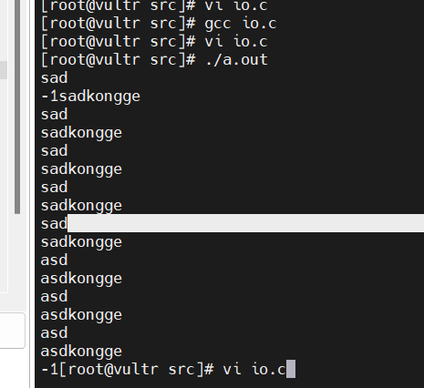

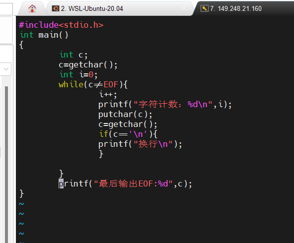

## 实验
[getchar函数()详解](https://blog.csdn.net/qq_15719613/article/details/120962669)
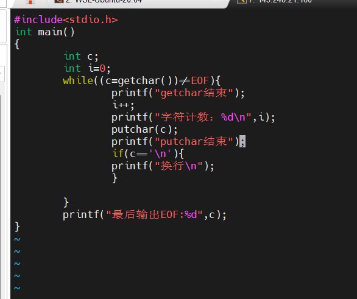
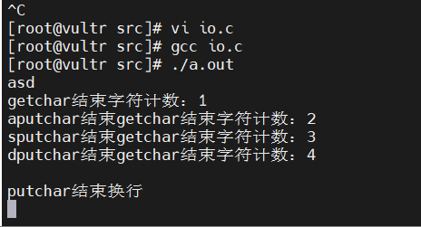


# 数组
[C语言中变量不初始化会怎么样？](https://blog.csdn.net/weixin_74195551/article/details/127328173)
[数组的使用](https://blog.csdn.net/hwx1546/article/details/123190222)
## 数组初始化设置
数字数组
声明同时赋值：没赋值的设0
只声明：设置随机数
声明后再赋值需要逐个赋值


## 字符数组
strlen()  计算字符串长度直到空结束符，但不包括空结束符
[C语言字符数组和字符串详解](http://c.biancheng.net/view/1832.html)
### 1.字符串结束标志：'\0'
#### 1.1 是什么？
ASCII码表中的第0个字符，nul，既不能显示，也没有控制功能，输出没有效果
#### 1.2 有什么用？
C语言处理字符串时，从前往后逐个扫描字符，一旦遇到'\0'就认为到达了字符串的末尾，结束处理。

#### 1.3 在字符串和字符数组中的应用
    1.""包围的字符串自动在末尾加'/0'
        如果char[n],n小于定义的字符串"xxx"长度，例，char[3]="ab",则内存长度sizeof为3，strlen为2,末尾会自动添加'\0'
        如果char[3]="abc",则内存长度sizeof为3,strlen也为3，末尾添加'\0';
    2.逐个字符给数组赋值不会自动添加'\0'
        例如 char str[]={'a','b','c'};
        但是 char str[4]={'a','b','c'}会自动添加'/0'
[如果数组末尾没有'\0'可能出现的问题](https://blog.csdn.net/m0_69951061/article/details/125406225)


### 2.字符数组的初始化
[windows和linux下置0](https://blog.csdn.net/tesla777/article/details/127689070)


### 3.创建数组的方式
#### 3.1声明时赋值
##### 3.1.1 声明长度
char str[30] = {"c.biancheng.net"};
char str[30] = "c.biancheng.net";  //这种形式更加简洁，实际开发中常用
##### 3.1.2 不声明长度
char str[] = {"c.biancheng.net"};
char str[] = "c.biancheng.net";  

#### 3.2 声明后赋值
```C
char str[7];
str = "abc123";  //错误
//正确
str[0] = 'a'; str[1] = 'b'; str[2] = 'c';
str[3] = '1'; str[4] = '2'; str[5] = '3';
```
必须逐个赋值


# 函数
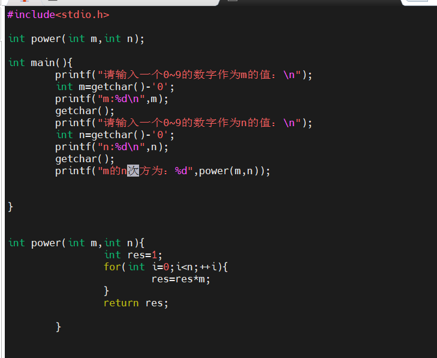

# '/'反斜杠

# case
[switch case语句不加break的后果](https://blog.csdn.net/qq_39478139/article/details/108446550)


[C语言中void*详解及应用](https://www.runoob.com/w3cnote/c-void-intro.html)

[声明和定义](https://blog.csdn.net/weixin_28876083/article/details/117009456)
声明包含定义


# 4 函数与程序结构
## 4.3  外部变量
外部变量定义在函数之外，因此可以在许多函数中使用。
在函数内部定义内部变量之后，会覆盖同样名字的外部变量。
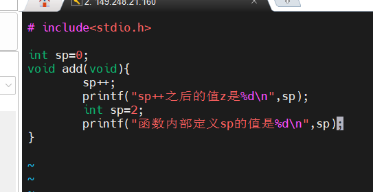
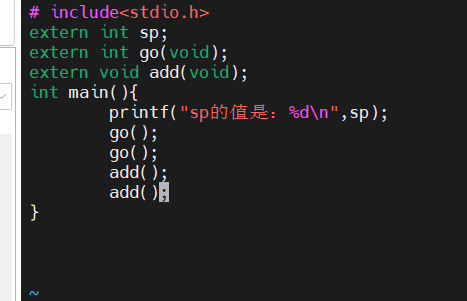
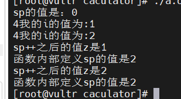


## 4.6  静态变量
### static修饰外部变量后，该变量不能被其他源文件声明
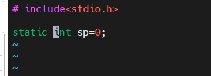
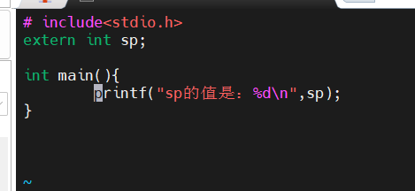
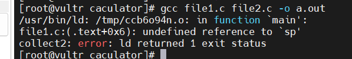

### static用于修饰函数，该函数不能被其他源文件声明
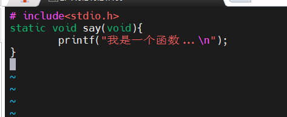
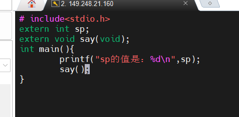
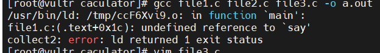

### static修饰内部变量，可使其一直占据存储空间，不随函数的被调用和退出而存在和消失
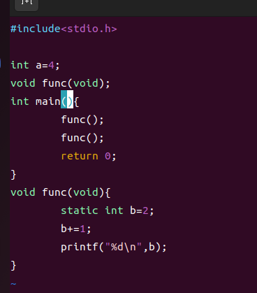
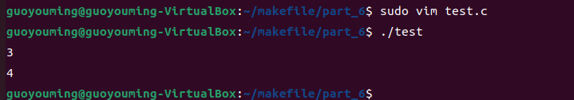


## 4.7  寄存器变量
register声明告诉编译器，它所声明的变量在程序中使用频率较高。其思想是，将register变量放在机器的寄存器中，这样可以使程序更小、执行速度更快。

## 4.9  初始化

## 4.11 C预处理器
### 4.11.1  #include命令
#### 做什么的？
    在编译期间把指定文件的内容包含进当前文件中，使得处理大量的#define指令以及声明更加方便。
#### 怎么查找的？
    1）#include"xxx"：在源文件所在的位置查找该文件，没找到则根据相应的规则查找。
    2）#include< xxx >：根据相应的规则查找
#### 头文件有什么内容？
    包含常见的#define语句和extern声明，或从头文件中访问库函数的函数原型声明，比如<stdio.h>    
#### 好处和坏处？
    1.好处：保证所有的源文件都具有相同的定义与变量声明。
    2.坏处：如果某个包含文件的内容发生了变化，那么所有依赖于该包含文件的源文件都必须重新编译。

### 4.11.2  #define命令
### 怎么用？
    #define 名字 替换文本
### 做什么的？
    后续所有出现名字记号的地方都将被替换为替换文本
        注意，对扩在引号中的字符串不起作用：
        # define YES 1
        printf("YES");  // 此处不会替换
### 带参数替换
    例子：
    # define forever for(;;)  // 无限循环
    # define max(A,B)  ((A)>(B)?(A):(B))
        x=max(p+q,r+s);
        x=((p+q)>(r+s)?(p+q):(r+s));
    # define dprint(expr) printf(#expr"=%g\n",expr)
        drpint(x/y);
        printf("x/y""%g\n",expr) ;

### 条件包含
#### 例1：
    #if !defined(HDR)
    # define HDR
    xxxxxx
    #endif

#### 例2：
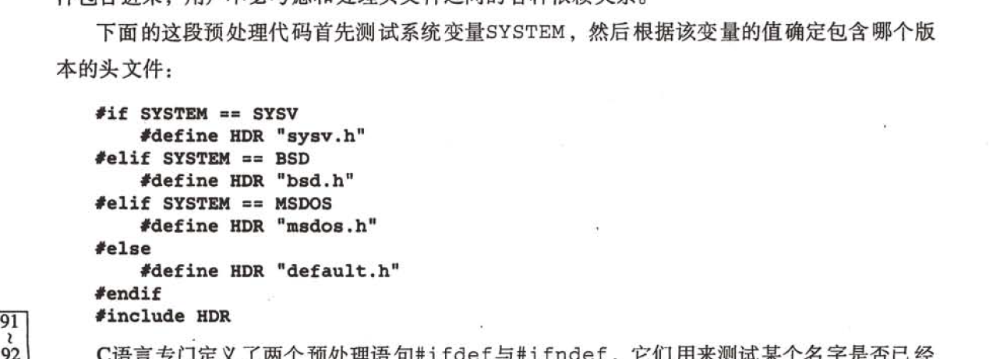

#### 例3：
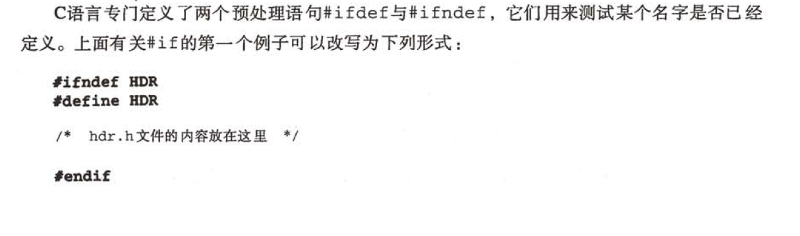

# 5 指针与数组
## 5.1  指针与地址
### 5.1.1   是什么？
    int *p;  //p是指向int类型的指针，p的值是内存地址
    指针是能够存放一个地址的一组存储单元（通常是两个或4个字节）

## 5.1.2    怎么用？
    *p    p指向的地址所存放的
    &a    取得变量a的地址
    int *p=&a;    // 将a的地址赋值给指针p
    int *p;       // p的值默认为0,p指向地址0
    注意：
        (*p)++  圆括号是必须的，因为类似于*和++这样的一元运算符遵循从右至左的结合顺序

## 5.2  指针与函数参数
写一个swap函数
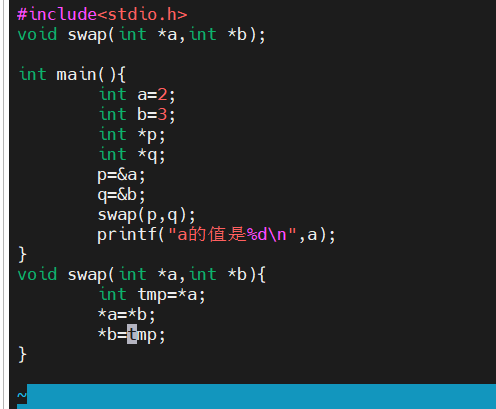

## 5.3  指针与数组
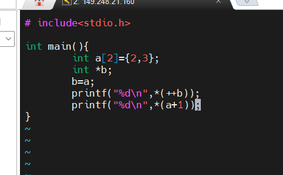
*(b+1)和b[1]等价
数组名不是变量，所以不能用a=b,a++这样的语句

## 5.6  指针数组以及指向指针的指针
### 5.6.1 是什么？
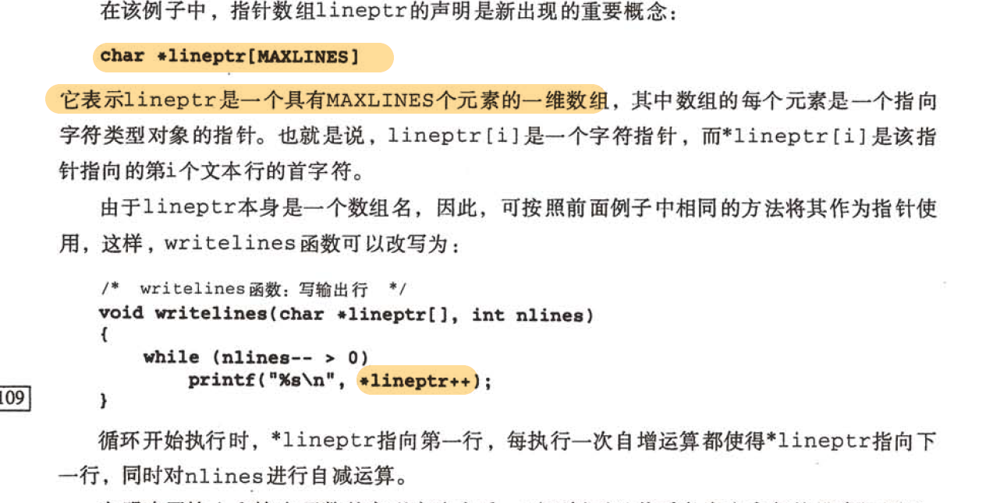
### 5.6.2 交换两个字符串demo
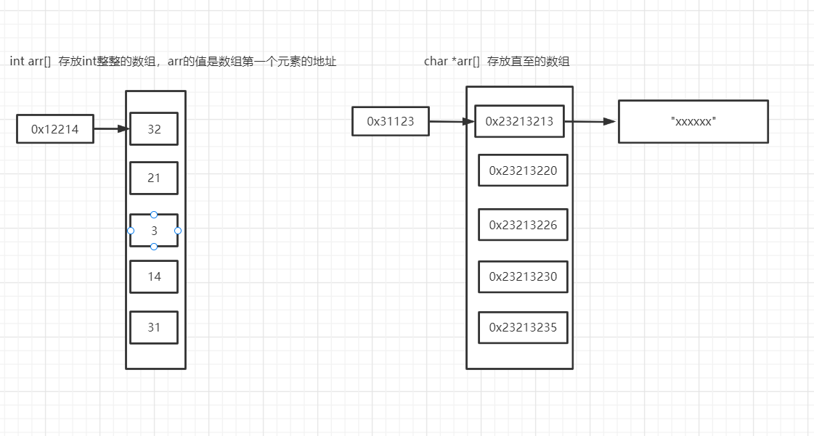
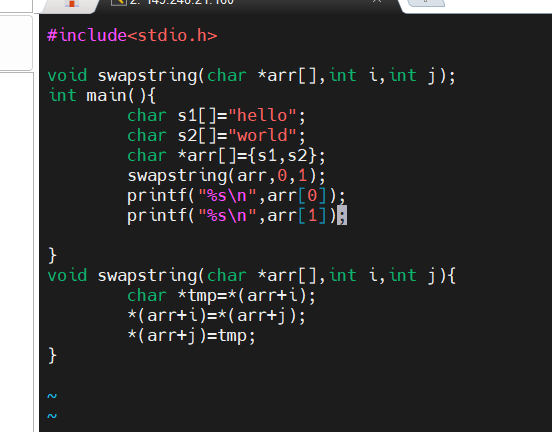


    