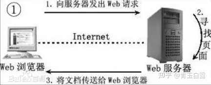

# 前言
修改、完整注释、添加功能的项目代码：
https://github.com/white0dew/WebServer
它是个什么项目？——Linux下C++轻量级Web服务器，助力初学者快速实践网络编程，搭建属于自己的服务器
- 使用 线程池 + 非阻塞socket + epoll(ET和LT均实现) + 事件处理(Reactor和模拟Proactor均实现) 的并发模型
- 使用状态机解析HTTP请求报文，支持解析GET和POST请求
- 访问服务器数据库实现web端用户注册、登录功能，可以请求服务器图片和视频文件
- 实现同步/异步日志系统，记录服务器运行状态
- 经Webbench压力测试可以实现上万的并发连接数据交换

# 什么是WebServer？
Web服务器一般指网站服务器，是指驻留于因特网上某种类型计算机的程序，可以处理浏览器等Web客户端的请求并返回相应响应——可以放置网站文件，让全世界浏览；可以放置数据文件，让全世界下载。目前最主流的三个Web服务器是Apache、 Nginx 、IIS。服务器与客户端的关系如下：

在本项目中，web请求主要是指HTTP协议，有关HTTP协议知识可以参考介绍，HTTP基于TCP/IP，进一步了解请百度。

# 什么是Socket？
客户端与主机之间是如何通信的？——Socket
socket起源于Unix，而Unix/Linux基本哲学之一就是“一切皆文件”，都可以用“打开open –> 读写write/read –> 关闭close”模式来操作。Socket就是该模式的一个实现，socket即是一种特殊的文件，一些socket函数就是对其进行的操作（读/写IO、打开、关闭），我们以下客户端获取服务端的时间的例子，来理解socket的使用过程：

# IO复用是什么？
IO复用指的是在单个进程中通过记录跟踪每一个Socket(I/O流)的状态来同时管理多个I/O流. 发明它的原因，是尽量多的提高服务器的吞吐能力，参考链接。
图中的逻辑单元，就是上例中“写入服务器时间”这一功能。要解决多客户端连接的问题，首先得有一个队列来对这个连接请求进行排序存放，而后需要通过并发多线程的手段对已连接的客户进行应答处理。
本项目是利用epollIO复用技术实现对监听socket（listenfd）和连接socket（客户请求连接之后的socket）的同时监听。注意I/O复用虽然可以同时监听多个文件描述符，但是它本身是阻塞的，所以为提高效率，这部分通过线程池来实现并发，为每个就绪的文件描述符分配一个逻辑单元（线程）来处理。

本项目是利用epollIO复用技术实现对监听socket（listenfd）和连接socket（客户请求连接之后的socket）的同时监听。注意I/O复用虽然可以同时监听多个文件描述符，但是它本身是阻塞的，所以为提高效率，这部分通过线程池来实现并发，为每个就绪的文件描述符分配一个逻辑单元（线程）来处理。

Unix有五种基本的IO模型：

阻塞式IO（守株待兔）
非阻塞式IO（没有就返回，直到有，其实是一种轮询（polling）操作）
IO复用（select、poll等，使系统阻塞在select或poll调用上，而不是真正的IO系统调用（如recvfrom），等待select返回可读才调用IO系统，其优势就在于可以等待多个描述符就位）
信号驱动式IO（sigio，即利用信号处理函数来通知数据已完备且不阻塞主进程）
异步IO（posix的aio_系列函数，与信号驱动的区别在于，信号驱动是内核告诉我们何时可以进行IO，而后者是内核通知何时IO操作已完成）
对于到来的IO事件（或是其他的信号/定时事件），又有两种事件处理模式：

Reactor模式：要求主线程（I/O处理单元）只负责监听文件描述符上是否有事件发生（可读、可写），若有，则立即通知工作线程，将socket可读可写事件放入请求队列，读写数据、接受新连接及处理客户请求均在工作线程中完成。(需要区别读和写事件)
Proactor模式：主线程和内核负责处理读写数据、接受新连接等I/O操作，工作线程仅负责业务逻辑（给予相应的返回url），如处理客户请求。
通常使用同步I/O模型（如epoll_wait）实现Reactor，使用异步I/O（如aio_read和aio_write）实现Proactor，但是异步IO并不成熟，本项目中使用同步IO模拟proactor模式。有关这一部分的进一步介绍请参考第四章、线程池。

PS：什么是同步I/O，什么是异步I/O呢？

同步（阻塞）I/O：等待IO操作完成，才能继续进行下一步操作。这种情况称为同步IO。
异步（非阻塞）I/O：当代码执行IO操作时，它只发出IO指令，并不等待IO结果，然后就去执行其他代码了。一段时间后，当IO返回结果时（内核已经完成数据拷贝），再通知CPU进行处理。（异步操作的潜台词就是你先做，我去忙其他的，你好了再叫我）
IO复用需要借助select/poll/epoll，本项目之所以采用epoll，参考问题（Why is epoll faster than select?）

对于select和poll来说，所有文件描述符都是在用户态被加入其文件描述符集合的，每次调用都需要将整个集合拷贝到内核态；epoll则将整个文件描述符集合维护在内核态，每次添加文件描述符的时候都需要执行一个系统调用。系统调用的开销是很大的，而且在有很多短期活跃连接的情况下，epoll可能会慢于select和poll由于这些大量的系统调用开销。
select使用线性表描述文件描述符集合，文件描述符有上限；poll使用链表来描述；epoll底层通过红黑树来描述，并且维护一个ready list，将事件表中已经就绪的事件添加到这里，在使用epoll_wait调用时，仅观察这个list中有没有数据即可。
select和poll的最大开销来自内核判断是否有文件描述符就绪这一过程：每次执行select或poll调用时，它们会采用遍历的方式，遍历整个文件描述符集合去判断各个文件描述符是否有活动；epoll则不需要去以这种方式检查，当有活动产生时，会自动触发epoll回调函数通知epoll文件描述符，然后内核将这些就绪的文件描述符放到之前提到的ready list中等待epoll_wait调用后被处理。
select和poll都只能工作在相对低效的LT模式下，而epoll同时支持LT和ET模式。
综上，当监测的fd数量较小，且各个fd都很活跃的情况下，建议使用select和poll；当监听的fd数量较多，且单位时间仅部分fd活跃的情况下，使用epoll会明显提升性能。
其中提到的LT与ET是什么意思？

LT是指电平触发（level trigger），当IO事件就绪时，内核会一直通知，直到该IO事件被处理；
ET是指边沿触发（Edge trigger），当IO事件就绪时，内核只会通知一次，如果在这次没有及时处理，该IO事件就丢失了。