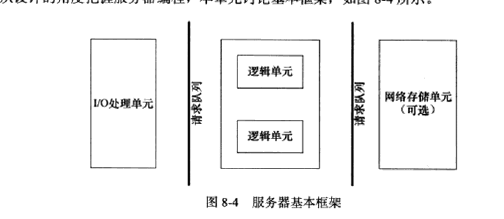
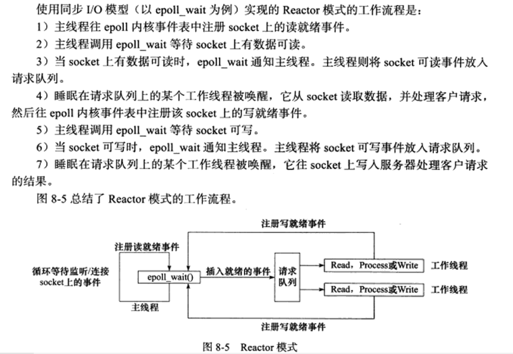
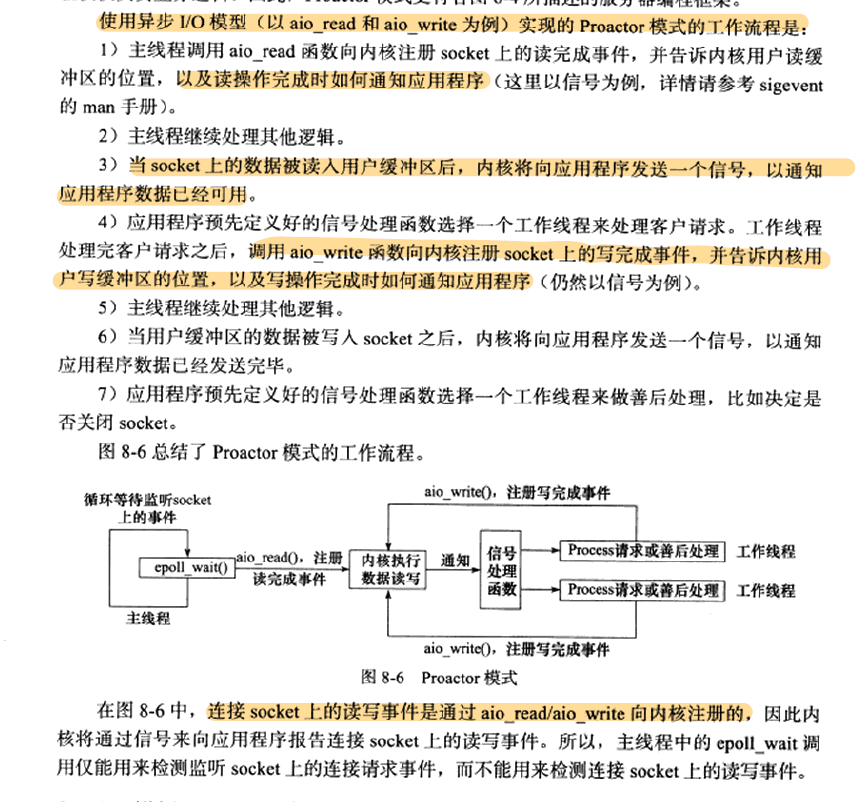
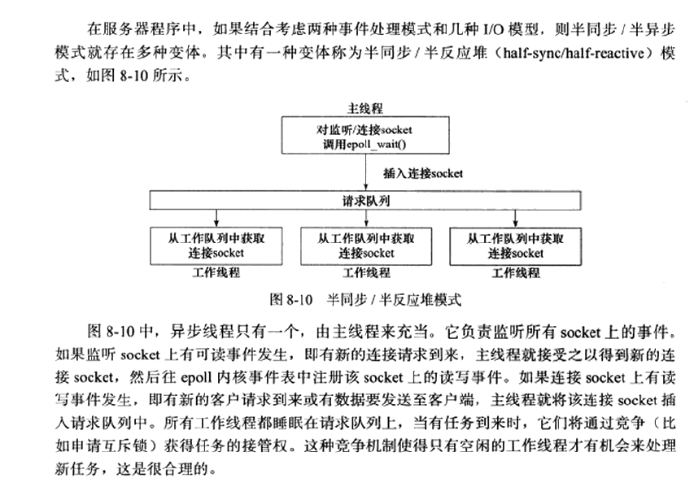
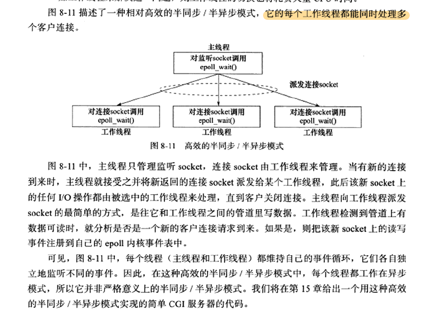
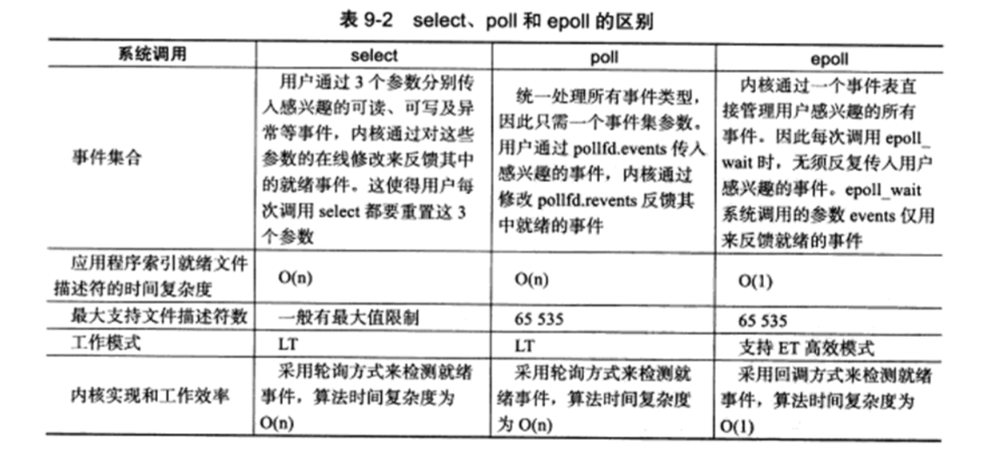

# 1.getopt函数
https://www.bilibili.com/read/cv16728940/
https://blog.csdn.net/afei__/article/details/81261879?spm=1001.2101.3001.6650.1&utm_medium=distribute.pc_relevant.none-task-blog-2%7Edefault%7ECTRLIST%7ERate-1-81261879-blog-106462986.pc_relevant_3mothn_strategy_recovery&depth_1-utm_source=distribute.pc_relevant.none-task-blog-2%7Edefault%7ECTRLIST%7ERate-1-81261879-blog-106462986.pc_relevant_3mothn_strategy_recovery&utm_relevant_index=1

# 2.什么是半同步半反应堆模式？
## I/O模型

### I/O处理单元是服务器管理客户连接的模块
- 等待并接受新的客户连接
- 接收客户数据
- 将服务器响应数据返回给客户端
### 一个逻辑单元是一个进程或一个线程
- 分析并处理客户数据
- 然后将结果传递给I/O处理单元或者直接发送给客户端（取决于事件处理模式）

### 网络存储单元可以是数据库、缓存和文件，甚至是一台独立的服务器

### 请求队列是各单元之间的通信方式的抽象。
I/O处理单元接收到客户请求时，需要以某种方式通知一个逻辑单元来处理该请求

### 同步I/O和异步I/O
同步I/O向应用程序通知的是I/O就绪事件，而异步I/O向应用程序通知的是I/O完成事件

## 事件处理模式
### Reactor模式
主线程（I/O处理单元）只负责监听文件描述符上是否有事件发生，有的话就立即将该事件通知工作线程（逻辑单元）
读写数据、处理客户请求均在工作线程完成

### Proactor模式
Proactor模式将所有I/O操作都交给主线程和内核来处理，工作线程仅仅负责业务逻辑

## 半同步/半异步模式
同步指程序完全按照代码序列的顺序执行
异步指程序的执行由系统事件来驱动
半同步/半异步模式中，同步线程用于处理客户逻辑，相当于逻辑单元；异步线程用于处理I/O事件，相当于I/O处理单元。异步线程监听到客户请求后，就将其封装成请求对象并插入请求队列中。请求队列将通知某个工作在同步模式的工作线程来读取并处理该请求对象。
### 半同步/半反应堆模式

采用的事件处理模式是Reactor模式：它要求工作线程自己从socket上读取客户请求和往socket写入服务器应答
### 相对高效的半同步/半反应堆模式

# 3.I/O函数
https://blog.csdn.net/zhizhengguan/article/details/120489243

## select、poll和epoll的区别
