# 9 指针
## 9.1  指针
### 9.1-4 指针与数组：为什么数组传进函数后的sizeof不对了
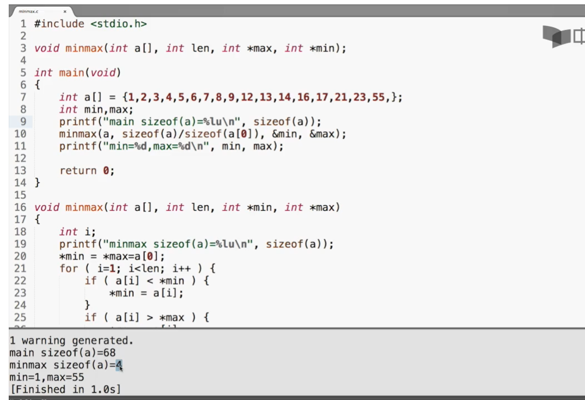
#### 数组变量时特殊的指针
- 数组变量本身表达地址，所以
    - int a[10];int *p=a;  //无需用&取地址
    - 但是数组的单元表达的是变量，需要用&取地址
    - a==&a[0]

- []运算符可以对数组做，也可以对指针做:
    - p[0] <==> a[0]

- *运算符可以对指针做，也可以对数组做：
    - *a=25;

- 数组变量是const的指针，所以不能被赋值
    - int a[] <==> int * const a=...

### 9.1-5 指针本身和所指的变量都可能const
- 指针是const
  - 表示一旦得到了某个变量的地址，不能再执行其他变量
    - int * const q= &i ; //q是const
    - *q=26; // OK
    - q++; //ERROR

- 所指是const
    - 表示不能通过这个指针去修改那个变量（并不能使那个变量成为const）
        - const int *p= & i;
        - *p=26; // ERROR! (*p)是const
        - i=26;  //OK
        - p=& j;  // OK

- 转换
  - 总是可以把一个非const的值转换成const的
        void f(const int* x);
        int a=15;
        f(&a);  //ok
        const int b=a;

        f(&b); //ok
        b=a+1;  //Error
    - 当要传递的参数的类型比地址大的时候，这是常用的手段；既能用比较少的字节数传递值给参数，又能避免函数对外面的变量的修改
  - const数组
    - const int a[]={1,2,3,4,5,6};
    - 数组变量已经是const的指针了，这里的const表明数组的每个单元都是const int
    - 所以必须通过初始化进行赋值
    - 应用：保护数组值 
      - 因为把数组传入函数时传递的是地址，所以那个地址内部可以修改数组的值
      - 为了保护数组不被函数破坏，可以设置参数为const
        -int sum(const int a[],int length);  

## 9.2 指针运算
### 0.2-2 动态内存分配
- malloc
    #include<stdlib.h>
    void* malloc(size_t size);
    - 向malloc申请的空间的大小是以字节为单位的
    - 返回的结果是void*，需要类型转换为自己需要的类型
      - (int*)malloc(n*sizeof(int))

- free
  - 把申请得来的空间还给“系统”
  - 只能还申请来的空间的首地址

- 常见问题
  - 申请了没free->长时间运行内存下降
    - 新手:忘了
    - 老手：找不到合适的free的时机
- free过了再free
- 地址变过了，直接去free

# 10 字符串
## 10.1字符串
### 10.1-2 字符串变量
- 指针还是数组？
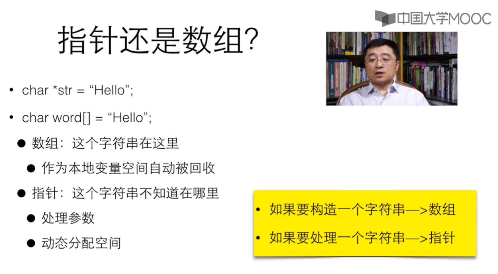

- char*是字符串？
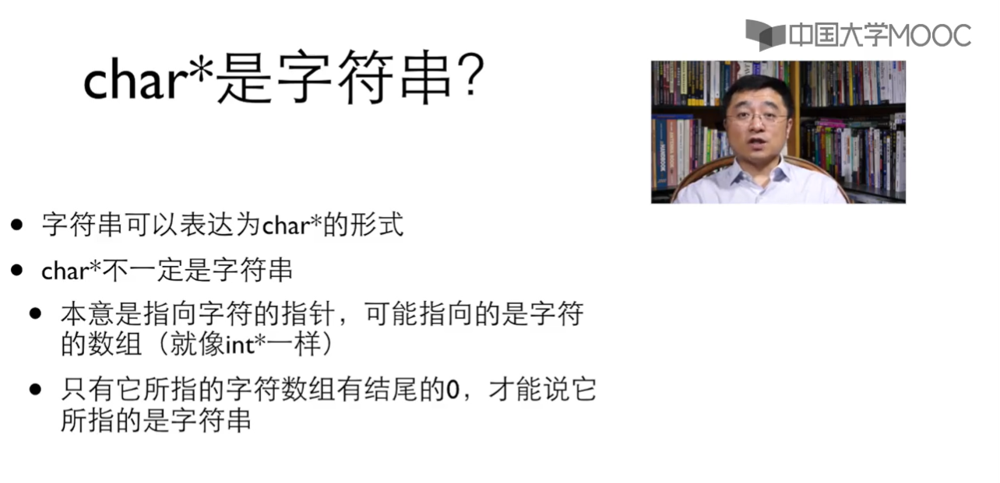

### 10.1-3  字符串输入输出
- 字符串赋值？
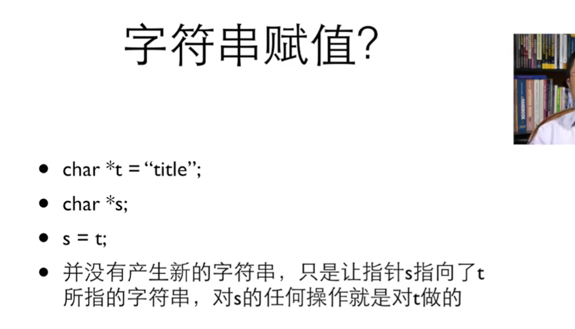

- 字符串输入输出
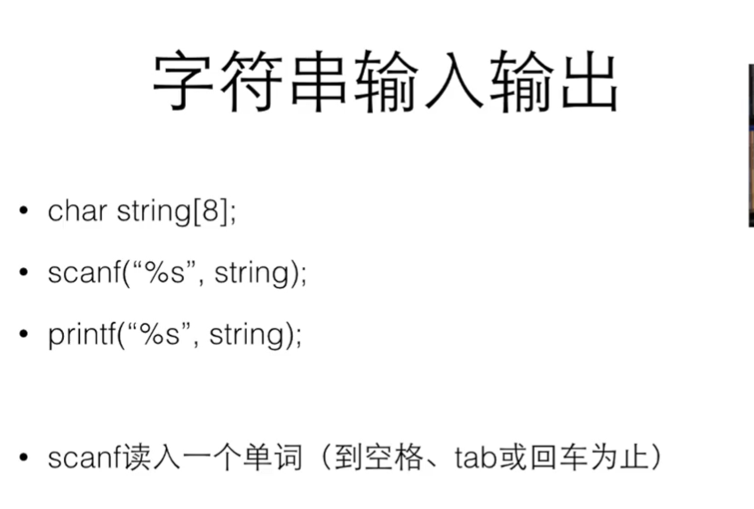
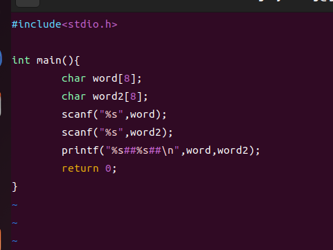
    - 对scanf("%s",word)理解：一个字符一个字符赋值，遇到终止符就加上'\0'

- 空字符串
    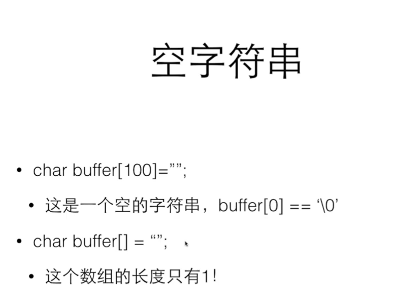

# 11   结构类型
## 11.2 结构
### 11.2-1 结构类型
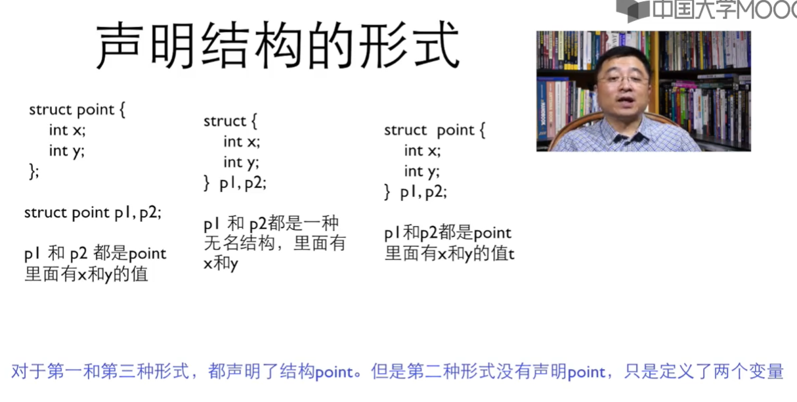
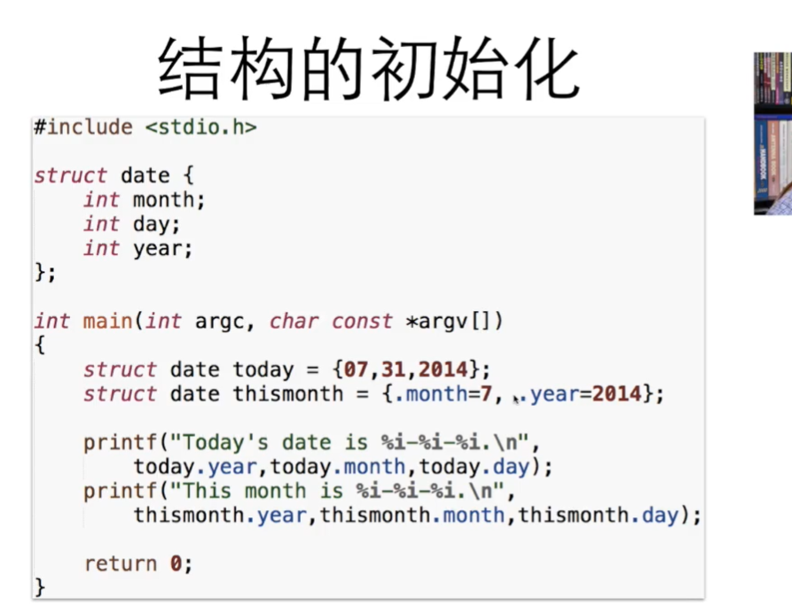
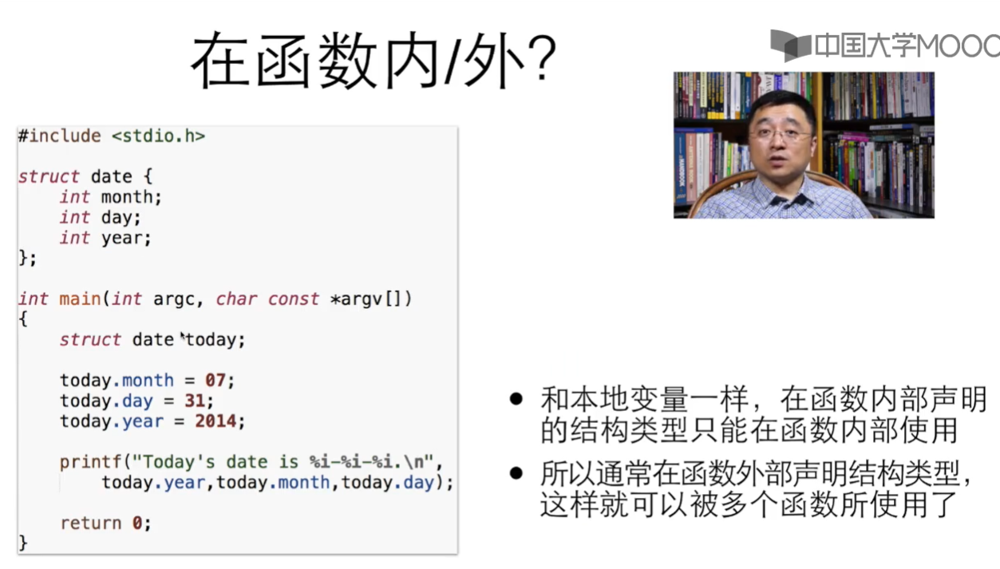
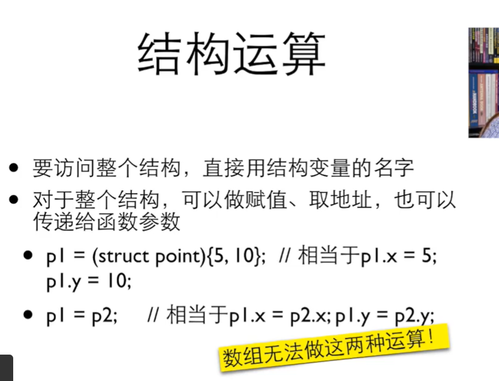
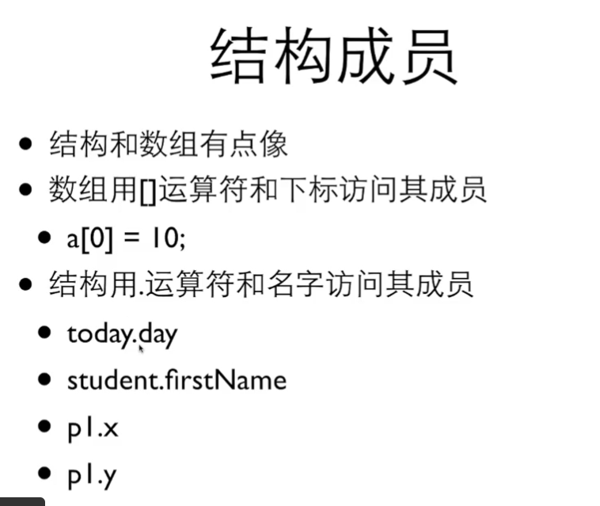
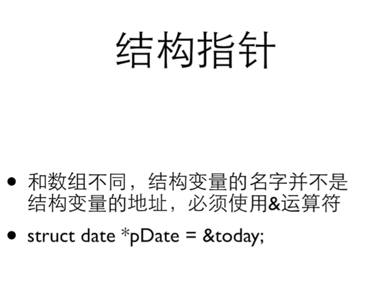

### 11.2-2结构与函数
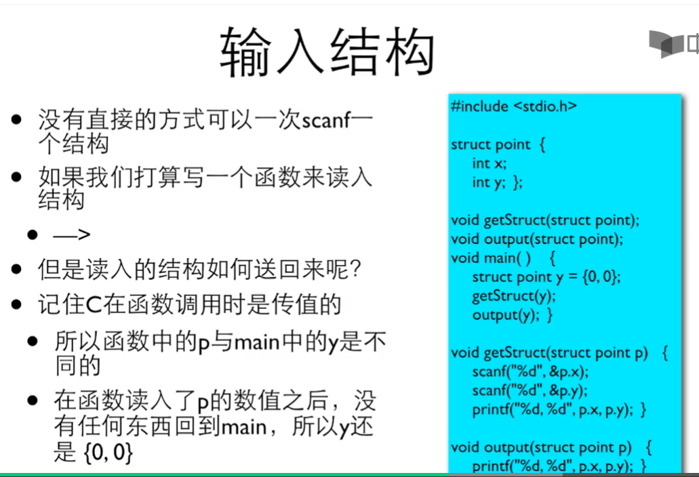
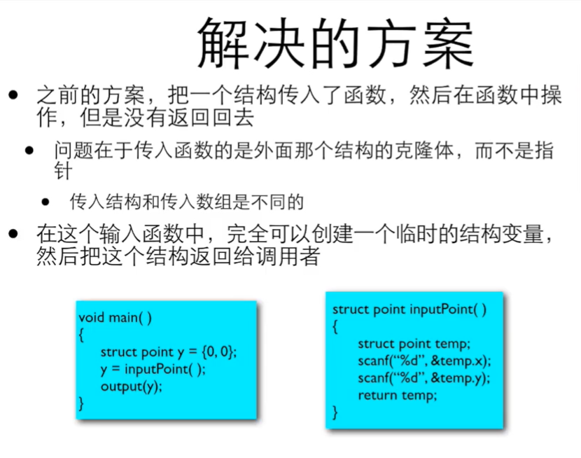
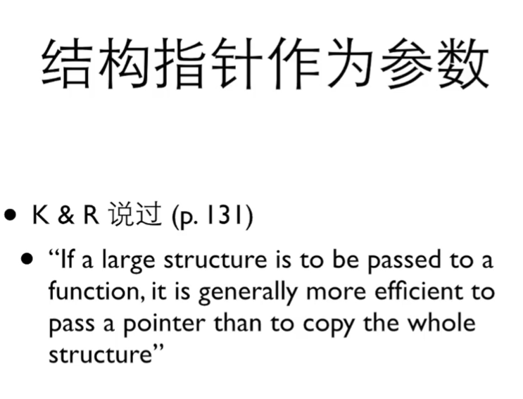
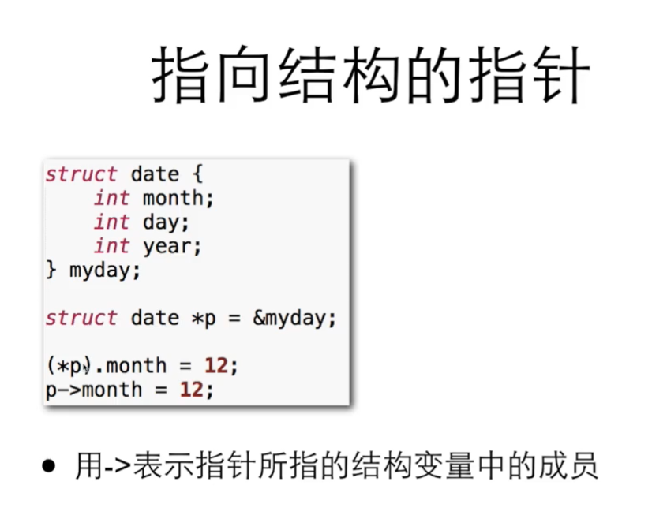

## 11.3 联合
### 11.3-1  类型定义
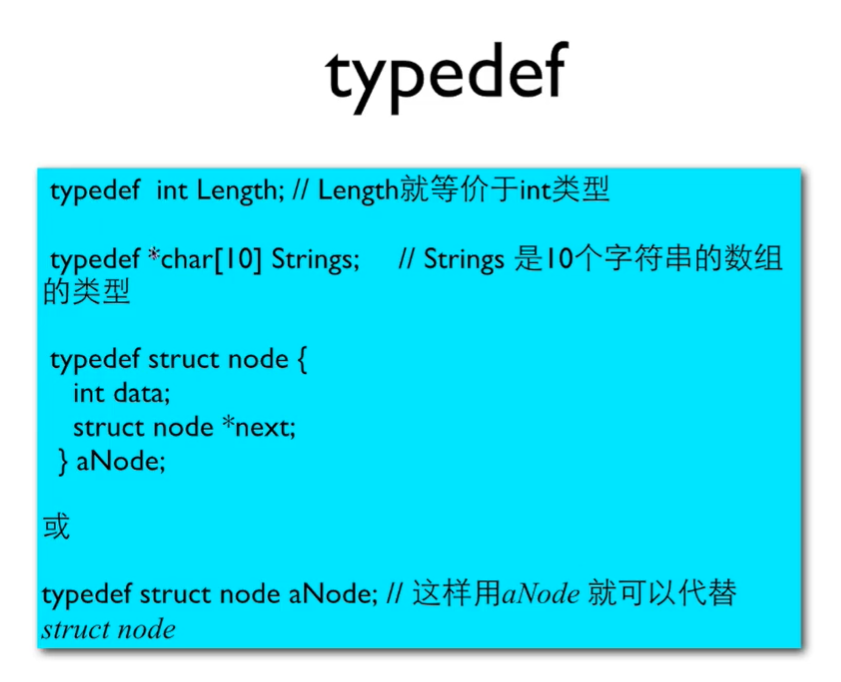

### 11.3-2 联合
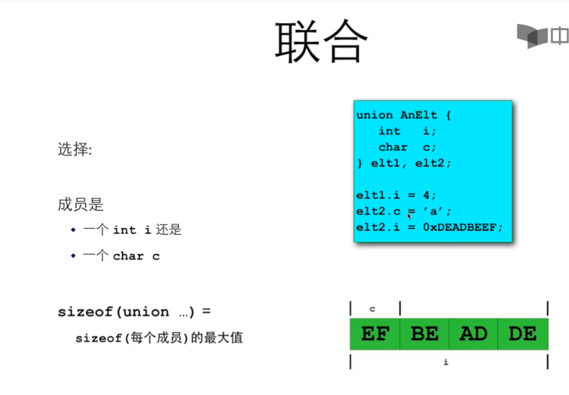
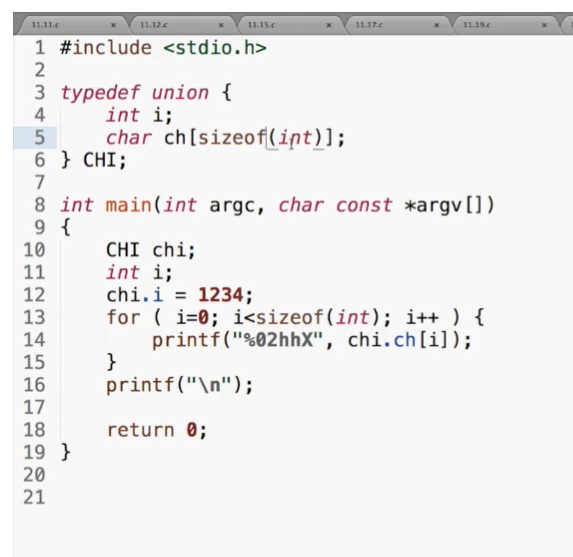

# 声明和定义

# 复杂声明

# 不同存储类型

# 声明作用域
## 私有变量或局部变量（自动变量）
函数中的每个局部变量只在函数被调用时存在，在函数执行完毕退出时消失，也叫做自动变量,如果自动变量没有赋值，则其中存放的是无效值。

## 外部变量
在所有函数中都可以通过变量名访问这种类型的变量
### 作用：函数间可以通过外部变量交换数据
### 生命周期：在程序执行期间一直存在，而不是在函数调用时产生、在函数执行完毕时消失。
### 使用：
- extern语句显式声明
- 外部变量的定义出现在使用它的函数之前，那么在那个函数中就没必要使用extern声明
- 如果程序包含在多个源文件，而某个变量在file1文件中定义、在file2和file3文件中使用，那么在文件file2与file3中就需要使用extern声明来建立该变量与定义之间的联系。
- 人们通常把变量和函数的extern声明放在一个单独的文件中(头文件)，并在每个源文件的开头使用#include语句把所有的头文件包含进来。后缀名为.h约定头文件名的扩展名。

# 初始化
默认情况下，外部变量和静态变量都被初始化为0，未经显式初始化的自动变量的值为未定义值（即无效值）

# C语言实现多态