# 2.Linux学习路线
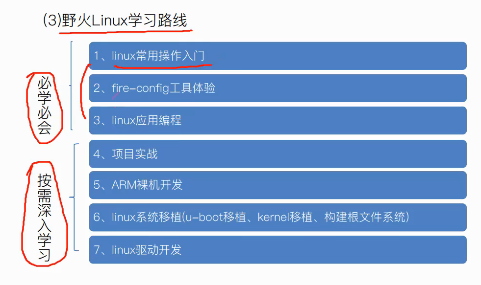

# 3. i.MX系列芯片
## i.MX系列处理器
### 如何了解和挑选芯片
登录官网，了解功能
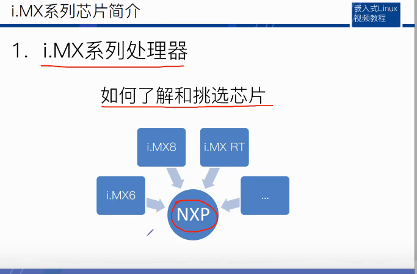
Products->Help me find an MPU MCU
#### 怎么选型？
##### 关键参数
    1.性能稳定
    2.资料齐全
    3.芯片内部资源
        根据产品具体需要什么功能判断芯片有没有提供该模块接口
    4.开发工具
        好的开发工具能节省开发时间
    5.供货周期
        设计产品时一定要预计产品的寿命，如果供货周期无法达到寿命要求则会造成损失
    6.性价比
        芯片性价比一定程度上决定产品性价比
    7.运行环境
        根据产品实际运行环境挑选芯片

## ARM体系架构
### 1.几个概念辨析
指令集？架构？处理器？内核？芯片
- 指令集是cpu硬件与软件之间的接口描述
   * RISC:8051\X86
   * CISC·ARM/MIPS/RISC-V
      * ARM：ARMV1~ARMV8
      * ARMV7：A\R\M 
      * MIPS：
      * RISC-V
- 架构：主要指某一个处理器所用的具体指令集。
- 处理器/内核：指令集是实物化。
- 芯片，多指soc，由内核+其他模块组成。
   * soc是一个统称，并不是具体的某个部件或者单元。英文全称是System on Chip，为系统级芯片，它是把CPU、GPU、RAM、通信基带、GPS模块等等整合在一起的系统化解决方案。

### 2.ARM授权方式
- 指令集/架构授权
- 内核授权
- 使用授权

### 3.Cortex A7内核简介
支持1~4核，常用于big.LITTLE架构
性能与功耗平衡
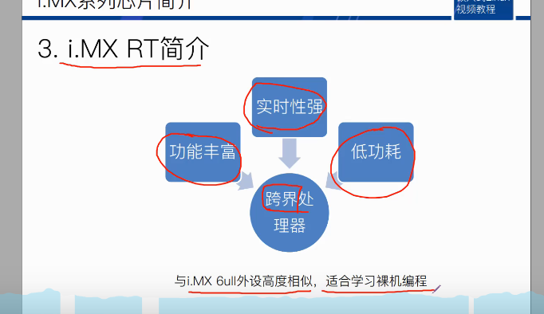

# 4.Linux系统简介
## 4.1 Windows与Linux区别
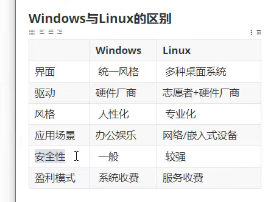

## 4.2 历史渊源
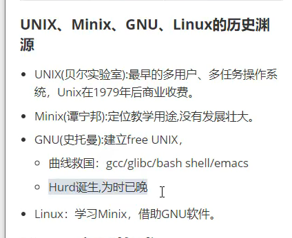

## 4.3 Linux主要构成
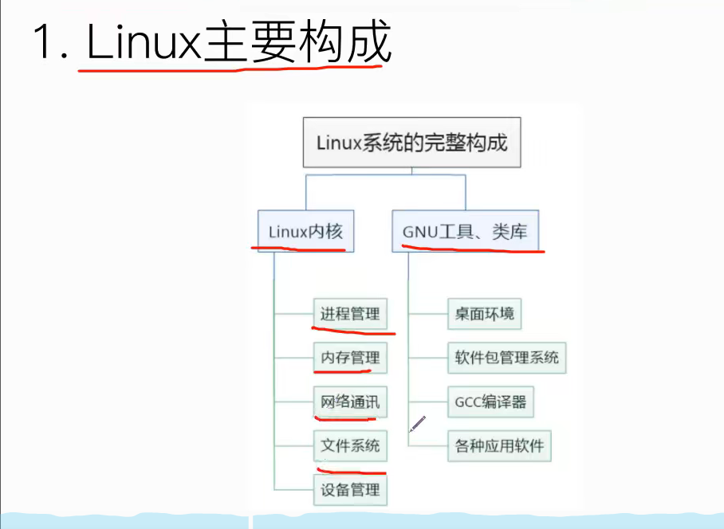

## 4.4 Linux发行版
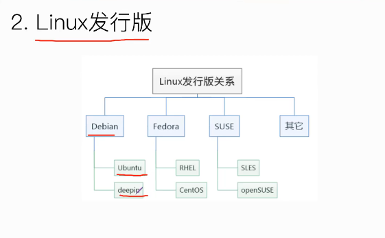

# 6.Linux文件目录
## 6.1  Linux目录认识
入口：根目录"/"
结构：树形

为什么Linux文件系统需要一个目录层次标准？
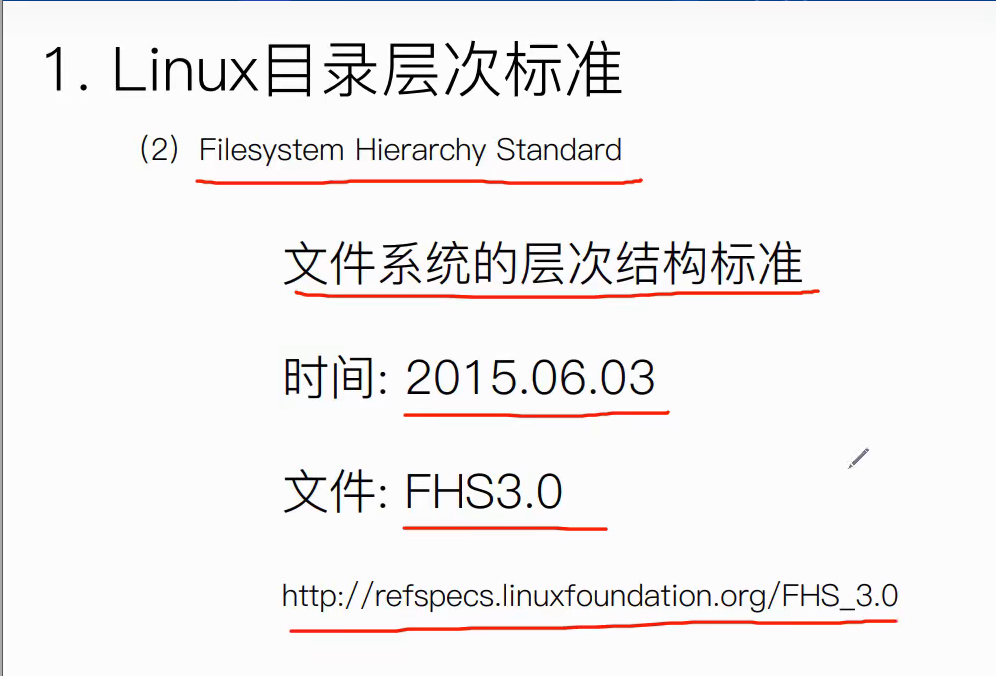

## 6.2  子目录介绍
- /bin
  * binary的缩写，也就说这里面存放着二进制命令文件
  * 实验：mv /bin/ls /bin-bak 转移ls文件后ls命令无法使用

- /boot
  * bootloader启动器
      *  vmlinuz    linux内核
      *  grub文件夹   里面存放启动程序，相当于嵌入式linux里面的uboot

- /cdrom
  * 挂在cd的镜像，逐渐被淘汰

- /dev
  * 设备缩写
  * 操作外设本质上就是通过操作dev目录下的设备文件来控制

- /etc
    * 存放系统和应用程序的配置文件（如以应用程序名字命名的文件夹）

- /home
    * 存放普通用户的主目录
    * 如果新建一个用户，那么home目录下也会新建一个主目录

- /lib
    * bin目录下应用程序的lib库
    * 主要针对32位系统

- /lib64
    * 主要针对64位系统

- /media
    * 多媒体设备通常挂载在该目录下
    * 实验：系统连接一个读卡器会在该目录的文件夹下新建文件夹

- /mnt
    * 挂在目录
  
- /opt
    * 全写是option
    * 通常用来测试软件

- /proc
    * procedure存放程序信息
    * 每一个数字命名的文件夹代表一个正在运行的程序的信息
    * 还有cpu信息、内存信息等等

- /root
    * 存放系统管理员的一些文件

- /run
    * 存放系统运行的一些信息

- /sbin
    * 同bin目录一样存放着二进制命令文件
    * 命令只有root用户可以执行

- /snap
    * ubuntu系统新型软件管理工具

- /srv
    * 存放网络服务相关信息

- /sys
    * 存放硬件操作的接口
    * 通过控制台终端对外设进行简单的控制，对外设信息作修改

- /tmp
    *  临时存储的内容（比如打游戏时产生的临时文件）

- /usr
    * 存放整个系统大部分的软件
  
- /var
    * variable简写，存放的易变类型的文件
    * 比如，crash软件运行的错误信息、log系统运行的错误信息

## 6.3 文件类型介绍
ls -l /   可以查看根目录下子目录的详细情况
- 普通文件
前缀是-,如swapfile
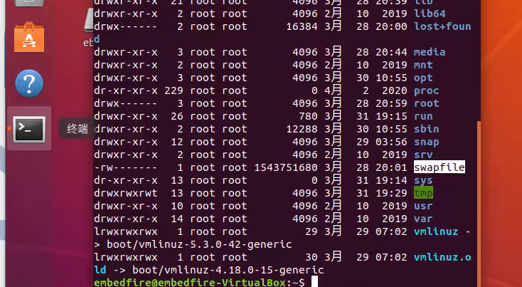
- 目录文件
前缀是d
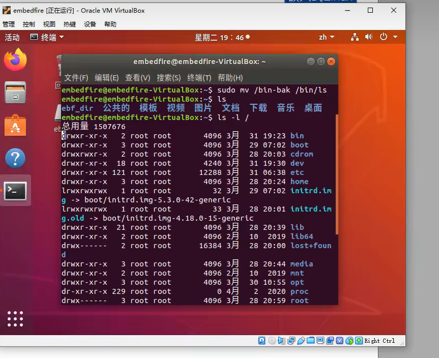
- 链接文件
前缀是l，箭头是指针的意思
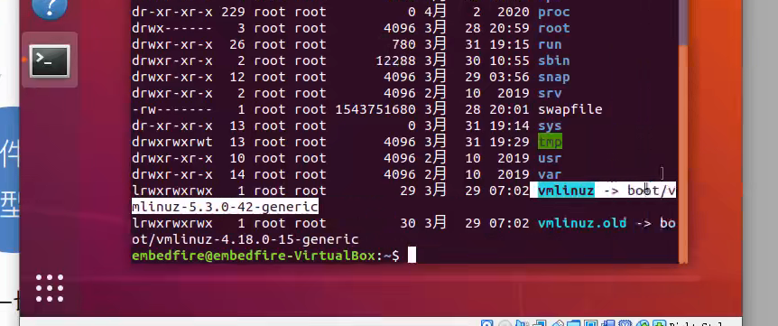
- 设备文件
    * 字符设备文件，前缀是c
    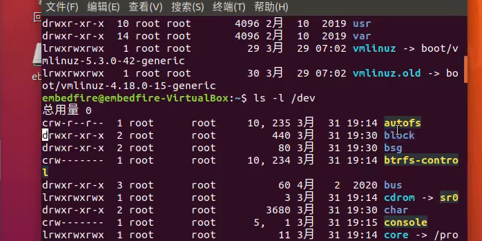
    * 块设备文件
    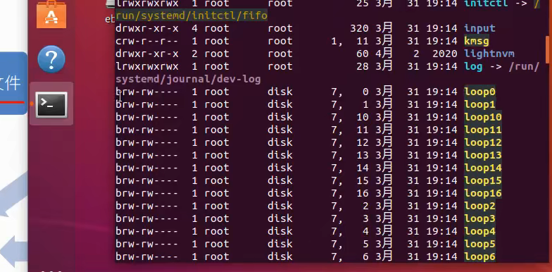
    
- 套接字文件
- 管道文件

## 6.4 文件类型的判断方法
ls -l

## 6.5 系统路径
- 绝对路径：由根目录(/)开始写起的文件名或目录名
- 相对路径：开头不是/就属于相对路径
  * .：代表当前目录
  * ..：代表上一层目录

# 7. 用户管理与文件权限
#### 用户：Linux系统的使用者
- 管理员(root)
- 系统用户
- 普通用户
  
#### 用户组：一对一、多对一、一对多、多对多

#### 思考：为什么需要对用户管理？
Linux系统是多用户多任务的操作系统

#### 两个概念:
uid:用户的标识
gid：群组的标识

## 7.1 三个核心文件
#### 在登录Linux时，系统做了什么？
- /etc/passwd  1.根据用户名在该文件找到对应的uid
    用户名：密码(x)：UID：GID：用户信息说明栏：用户目录：shell
    * 把UID改为0则，Linux会把该用户作为root用户并拥有相应权限
    * UID取值范围
      * 管理员：具有系统所有权限(0)
      * 系统用户：管理系统运行服务(1~999)
      * 普通用户：具有系统一部分权限(1000以上)
    * 创建用户时没有指定用户组，则会以用户名来创建新的用户组，创建时GID和UID一致
    * 使用该用户名登录时会默认登录在该绝对地址

- /etc/shadow   3.在该文件根据用户名找到对应加密的密码，验证密码
用户名：加密密码：最后一次修改时间：最小修改时间间隔：密码有效期：密码需要变更前的警告天数：密码过期后的宽限时间：账号失效时间：保留字段 
- /etc/group    2.在该文件找到对应gid，如果12都能找到则说明该用户在Linux系统是一个合法存在的用户
组名：群组密码：GID(x):此群组支持的账号名称

#### 通过gedit编辑器学习
sudo gedit /etc/passwd

## 7.2 文件权限
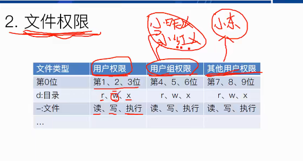

# 8. 使用Linux命令行
## 8.1 Shell是什么
- 对外接受用户输入的命令
- 对内通过系统调用传递给内核运行
- 呈现内核运行结果
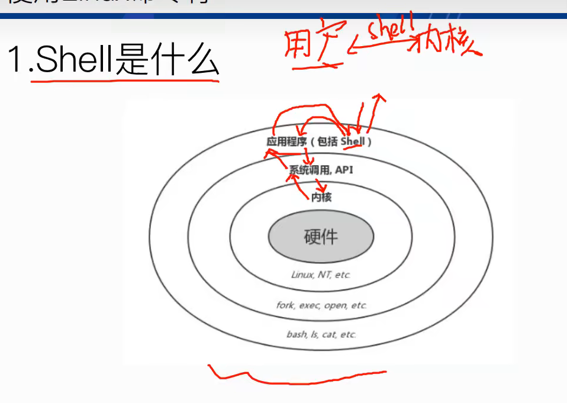
工作流程：
用户通过控制台终端输入各种各样的命令，命令进一步地被shell解析shell解析之后会去调用对应的应用程序，应用程序就可以通过各种系统调用和API接口去使用Linux内核的各种服务，Linux内核运行完程序也是通过系统调用API接口返回给应用程序，应用程序再把运行结果返回给shell，shell把结果显示给用户。
## 8.2 命令的格式与帮助
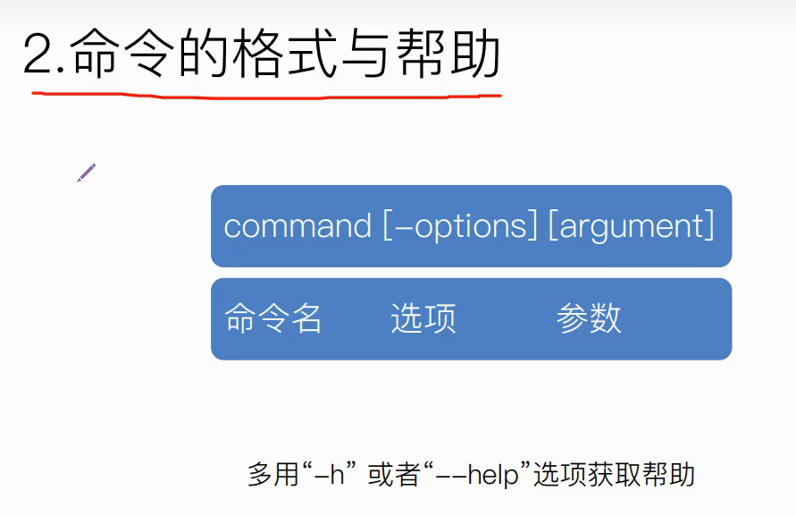
## 8.3 常用命令
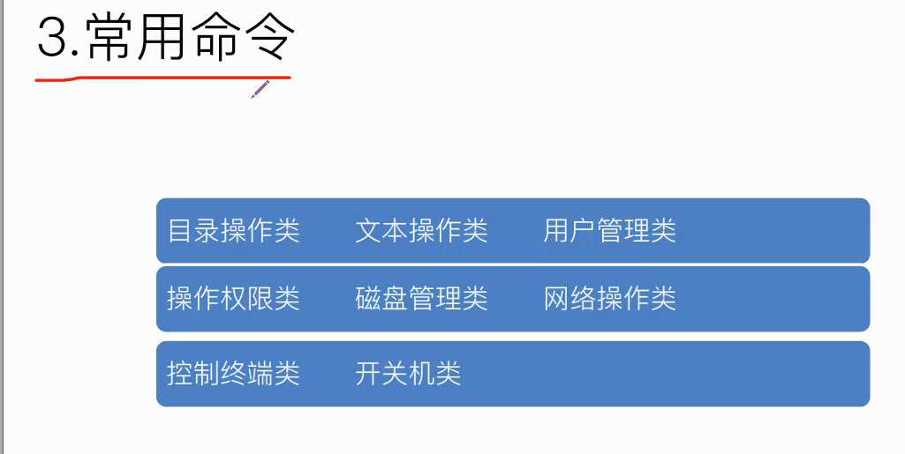
### 8.3.1 查询命令
man
man man
man printf
man 3 printf

### 8.3.2 目录操作类
- cd
    * cd . 
    * cd /
    * cd ..
    * cd ~
pwd:  查看当前工作路径
mkdir: 创建目录
rmdir: 删除目录
mv: 移动

### 8.3.3 文件操作类
- touch：创建文件
- cat：展示（打印）文件内容
- echo:   向控制台终端输出字符串
    * 被用来对字符串进行重定位，比如往文本内容追加字符串信息
      * echo aaa >> 123.txt  aaa字符串追加到文件末尾
      * echo aaa >  123.txt  删除文件内容再追加aaa字符串
- wc:打印行数、单词数、字符数   wc 123.txt
    * wc -l 123.txt
    * wc -w 123.txt
    * wc -c 123.txt

- rm:   移除文件
    * rm -r:递归地移除这个文件里面的所有目录和内容
    * rmdir: 删除空目录

- ln： 链接
    * ln 123.txt 456 创建一个123.txt的副本（硬链接，删除123.txt，仍可以打开）
    * ln -s 456 789 相当于创建一个指针(软链接，删除123.txt不可以打开)
  
- cp: 复制文件和目录
    * cp 123.txt test   复制文件
    * cp -r dir dir_bak 复制目录

- tar:将许多文件一起保存至一个单独的磁带或磁盘归档，并能从归档中单独还原所需文件

- find:从指定目录找到所需文件
    * find / -name "123.txt"

- grep:从文本中找到指定字符串
    * grep "linux" 123.txt
    * grep "linux" 123.txt -n 文本行号
  
### 8.3.4 用户管理类
- useradd/adduser: 创建用户
    * useradd:只创建基础的东西，密码和用户主目录等都没有创建
    * adduser:在执行命令期间提示创建密码，并自动创建主目录等
        * adduser xiaoming sudo 将小明加入sudo组 

- su:切换用户
    * su xiaoming

- usermod 修改用户信息
    * usermod -g 1001 xiaoming  修改小明的用户组gid

- deluser 删除用户
    * deluser xiaowu

- passwd 设置用户密码
    * passwd xiaowu

- groupadd/addgroup

- groupdel/delgroup

### 8.3.5 文件权限类
- chmod 修改用户权限
    * chmod 777 123.text  对所有用户可读可写可执行
- chown embedfire 123.txt   修改文件的拥有者
 
- chgrp embedfire 123.txt   修改文件用户组

### 8.3.6 磁盘管理类
- df: 查看文件系统使用情况
    * df -h  单位改为M、G这种方便阅读的

- du: 递归地查看
  
