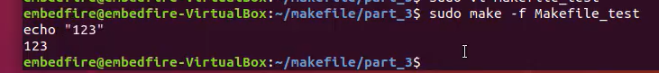
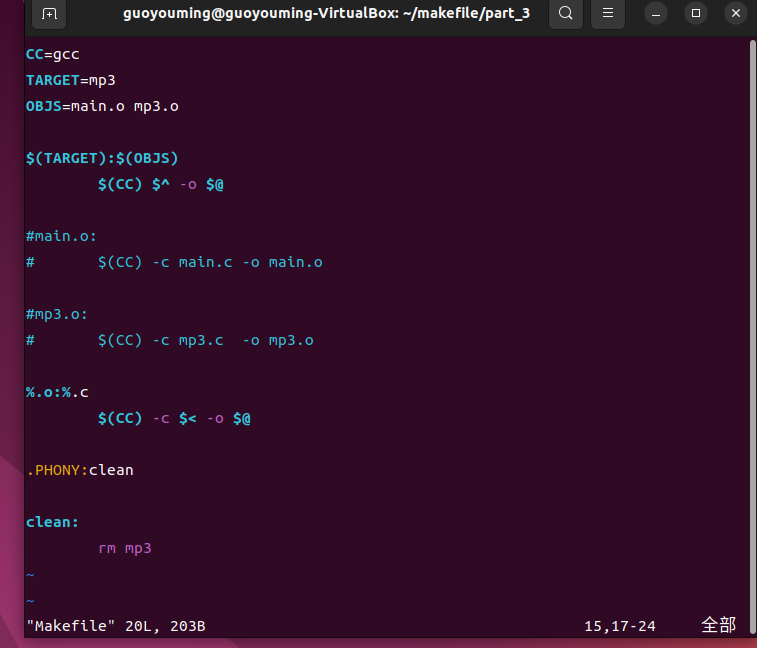

# 2.Linux学习路线


# 3. i.MX系列芯片
## i.MX系列处理器
### 如何了解和挑选芯片
登录官网，了解功能

Products->Help me find an MPU MCU
#### 怎么选型？
##### 关键参数
    1.性能稳定
    2.资料齐全
    3.芯片内部资源
        根据产品具体需要什么功能判断芯片有没有提供该模块接口
    4.开发工具
        好的开发工具能节省开发时间
    5.供货周期
        设计产品时一定要预计产品的寿命，如果供货周期无法达到寿命要求则会造成损失
    6.性价比
        芯片性价比一定程度上决定产品性价比
    7.运行环境
        根据产品实际运行环境挑选芯片

## ARM体系架构
### 1.几个概念辨析
指令集？架构？处理器？内核？芯片
- 指令集是cpu硬件与软件之间的接口描述
   * RISC:8051\X86
   * CISC·ARM/MIPS/RISC-V
      * ARM：ARMV1~ARMV8
      * ARMV7：A\R\M 
      * MIPS：
      * RISC-V
- 架构：主要指某一个处理器所用的具体指令集。
- 处理器/内核：指令集是实物化。
- 芯片，多指soc，由内核+其他模块组成。
   * soc是一个统称，并不是具体的某个部件或者单元。英文全称是System on Chip，为系统级芯片，它是把CPU、GPU、RAM、通信基带、GPS模块等等整合在一起的系统化解决方案。

### 2.ARM授权方式
- 指令集/架构授权
- 内核授权
- 使用授权

### 3.Cortex A7内核简介
支持1~4核，常用于big.LITTLE架构
性能与功耗平衡


# 4.Linux系统简介
## 4.1 Windows与Linux区别


## 4.2 历史渊源


## 4.3 Linux主要构成


## 4.4 Linux发行版


# 6.Linux文件目录
## 6.1  Linux目录认识
入口：根目录"/"
结构：树形

为什么Linux文件系统需要一个目录层次标准？


## 6.2  子目录介绍
- /bin
  * binary的缩写，也就说这里面存放着二进制命令文件
  * 实验：mv /bin/ls /bin-bak 转移ls文件后ls命令无法使用

- /boot
  * bootloader启动器
      *  vmlinuz    linux内核
      *  grub文件夹   里面存放启动程序，相当于嵌入式linux里面的uboot

- /cdrom
  * 挂在cd的镜像，逐渐被淘汰

- /dev
  * 设备缩写
  * 操作外设本质上就是通过操作dev目录下的设备文件来控制

- /etc
    * 存放系统和应用程序的配置文件（如以应用程序名字命名的文件夹）

- /home
    * 存放普通用户的主目录
    * 如果新建一个用户，那么home目录下也会新建一个主目录

- /lib
    * bin目录下应用程序的lib库
    * 主要针对32位系统

- /lib64
    * 主要针对64位系统

- /media
    * 多媒体设备通常挂载在该目录下
    * 实验：系统连接一个读卡器会在该目录的文件夹下新建文件夹


- /mnt
    * 挂在目录
  
- /opt
    * 全写是option
    * 通常用来测试软件

- /proc
    * procedure存放程序信息
    * 每一个数字命名的文件夹代表一个正在运行的程序的信息
    * 还有cpu信息、内存信息等等

- /root
    * 存放系统管理员的一些文件

- /run
    * 存放系统运行的一些信息

- /sbin
    * 同bin目录一样存放着二进制命令文件
    * 命令只有root用户可以执行

- /snap
    * ubuntu系统新型软件管理工具

- /srv
    * 存放网络服务相关信息

- /sys
    * 存放硬件操作的接口
    * 通过控制台终端对外设进行简单的控制，对外设信息作修改

- /tmp
    *  临时存储的内容（比如打游戏时产生的临时文件）

- /usr
    * 存放整个系统大部分的软件
  
- /var
    * variable简写，存放的易变类型的文件
    * 比如，crash软件运行的错误信息、log系统运行的错误信息

## 6.3 文件类型介绍
ls -l /   可以查看根目录下子目录的详细情况
- 普通文件
前缀是-,如swapfile

- 目录文件
前缀是d

- 链接文件
前缀是l，箭头是指针的意思

- 设备文件
    * 字符设备文件，前缀是c
    
    * 块设备文件
    
    
- 套接字文件
- 管道文件


## 6.4 文件类型的判断方法
ls -l

## 6.5 系统路径
- 绝对路径：由根目录(/)开始写起的文件名或目录名
- 相对路径：开头不是/就属于相对路径
  * .：代表当前目录
  * ..：代表上一层目录

# 7. 用户管理与文件权限
#### 用户：Linux系统的使用者
- 管理员(root)
- 系统用户
- 普通用户
  
#### 用户组：一对一、多对一、一对多、多对多

#### 思考：为什么需要对用户管理？
Linux系统是多用户多任务的操作系统

#### 两个概念:
uid:用户的标识
gid：群组的标识

## 7.1 三个核心文件
#### 在登录Linux时，系统做了什么？
- /etc/passwd  1.根据用户名在该文件找到对应的uid
    用户名：密码(x)：UID：GID：用户信息说明栏：用户目录：shell
    * 把UID改为0则，Linux会把该用户作为root用户并拥有相应权限
    * UID取值范围
      * 管理员：具有系统所有权限(0)
      * 系统用户：管理系统运行服务(1~999)
      * 普通用户：具有系统一部分权限(1000以上)
    * 创建用户时没有指定用户组，则会以用户名来创建新的用户组，创建时GID和UID一致
    * 使用该用户名登录时会默认登录在该绝对地址

- /etc/shadow   3.在该文件根据用户名找到对应加密的密码，验证密码
用户名：加密密码：最后一次修改时间：最小修改时间间隔：密码有效期：密码需要变更前的警告天数：密码过期后的宽限时间：账号失效时间：保留字段 
- /etc/group    2.在该文件找到对应gid，如果12都能找到则说明该用户在Linux系统是一个合法存在的用户
组名：群组密码：GID(x):此群组支持的账号名称


#### 通过gedit编辑器学习
sudo gedit /etc/passwd


## 7.2 文件权限


# 8. 使用Linux命令行
## 8.1 Shell是什么
- 对外接受用户输入的命令
- 对内通过系统调用传递给内核运行
- 呈现内核运行结果

工作流程：
用户通过控制台终端输入各种各样的命令，命令进一步地被shell解析shell解析之后会去调用对应的应用程序，应用程序就可以通过各种系统调用和API接口去使用Linux内核的各种服务，Linux内核运行完程序也是通过系统调用API接口返回给应用程序，应用程序再把运行结果返回给shell，shell把结果显示给用户。
## 8.2 命令的格式与帮助

## 8.3 常用命令

### 8.3.1 查询命令
man
man man
man printf
man 3 printf

### 8.3.2 目录操作类
- cd
    * cd . 
    * cd /
    * cd ..
    * cd ~
pwd:  查看当前工作路径
mkdir: 创建目录
rmdir: 删除目录
mv: 移动

### 8.3.3 文件操作类
- touch：创建文件
- cat：展示（打印）文件内容
- echo:   向控制台终端输出字符串
    * 被用来对字符串进行重定位，比如往文本内容追加字符串信息
      * echo aaa >> 123.txt  aaa字符串追加到文件末尾
      * echo aaa >  123.txt  删除文件内容再追加aaa字符串
- wc:打印行数、单词数、字符数   wc 123.txt
    * wc -l 123.txt
    * wc -w 123.txt
    * wc -c 123.txt

- rm:   移除文件
    * rm -r:递归地移除这个文件里面的所有目录和内容
    * rmdir: 删除空目录

- ln： 链接
    * ln 123.txt 456 创建一个123.txt的副本（硬链接，删除123.txt，仍可以打开）
    * ln -s 456 789 相当于创建一个指针(软链接，删除123.txt不可以打开)
  
- cp: 复制文件和目录
    * cp 123.txt test   复制文件
    * cp -r dir dir_bak 复制目录

- tar:将许多文件一起保存至一个单独的磁带或磁盘归档，并能从归档中单独还原所需文件

- find:从指定目录找到所需文件
    * find / -name "123.txt"

- grep:从文本中找到指定字符串
    * grep "linux" 123.txt
    * grep "linux" 123.txt -n 文本行号
  
### 8.3.4 用户管理类
- useradd/adduser: 创建用户
    * useradd:只创建基础的东西，密码和用户主目录等都没有创建
    * adduser:在执行命令期间提示创建密码，并自动创建主目录等
        * adduser xiaoming sudo 将小明加入sudo组 

- su:切换用户
    * su xiaoming

- usermod 修改用户信息
    * usermod -g 1001 xiaoming  修改小明的用户组gid

- deluser 删除用户
    * deluser xiaowu

- passwd 设置用户密码
    * passwd xiaowu

- groupadd/addgroup

- groupdel/delgroup

### 8.3.5 文件权限类
- chmod 修改用户权限
    * chmod 777 123.text  对所有用户可读可写可执行
- chown embedfire 123.txt   修改文件的拥有者
 
- chgrp embedfire 123.txt   修改文件用户组

### 8.3.6 磁盘管理类
- df: 查看文件系统使用情况
    * df -h  单位改为M、G这种方便阅读的

- du: 递归地查看当前目录下每个文件的磁盘使用情况
    * du -h
    * du -sh/-s   仅查看当前目录的磁盘占用情况

- mount: 用于把一些硬件设备或网络设备挂载到系统的指定目录下去，挂载完后我们就可以通过指定硬件设备或者网络设备读取里面内容

- umount


### 8.3.7   网络操作类
- ifconfig 打印系统里面所有已经激活的网络端口信息
    * ifconfig 网卡名字 192.168.1.213 更改对应网卡端口号
    * ifconfig 网卡名字 down 关闭该网卡
    * ifconfig 网卡名字 up 打开该网卡
- ping 查看网络链接是否是通的


### 8.3.8   控制终端类
- clear

### 8.3.9   开关机命令
-reboot
-poweroff 

### 8.4 小技巧
#### 8.4.1  命令/路径自动补全
- tab
- tabtab

#### 8.4.2  重复执行技巧
!!执行上次执行的命令
sudo !! 拼接执行 

# 9.使用编辑器
## 9.1 gedit编辑器
简单易懂，依赖图形界面
## 9.2 vi/vim编辑器
### 9.2.1 vi与vim的区别：
- vim是v的升级版本,兼容vi
- vi按u只能撤销上次命令，而vim可以运行于unix，windows，mac等多操作平台
- vim可以用不同的颜色来高亮代码
- 可通过vimrc文件配置更加高级的功能

### 9.2.2 vi/vim使用
#### 安装
sudo apt install vim
#### vi/vim的三种模式
- 一般模式（默认模式）
- 插入模式（编辑模式）
- 命令行模式
#### 模式切换


#### 插入模式快捷键


#### 一般模式快捷键


#### 命令行模式快捷键


# 10    Shell脚本编程
## 10.1 Shell脚本简介
### 10.1.1 Shell脚本是什么？
- shell命令按一定语法组成的文件
  
### 10.1.2 Shell脚本有什么用？
（windows下）批处理文件/整合命令
- 软件启动
- 性能监控
- 日志分析
...

### 10.1.3  Shell命令的本质
用type命令来判断内置命令或外部命令
- 内置命令
    在shell启动时候就已经加载到到系统中去了，不用再从硬盘中加载出来运行
- 外部命令
    * shell在启动时设置了一个path环境变量，记录了外部命令对应应用程序所在目录
    * 可以通过echo $PATH命令来打印环境变量
- shell命令执行流程
    先去找内置命令，找不到再去path目录下找外部命令

- 自定义Shell命令
    - 写一个main.c输出"hello,world!"
    - gcc main.c -o hello
    - 将hello文件放在path的一个环境变量目录中
    - 在shell终端输入hello即可执行hello程序

### 10.1.4 Shell脚本语言和C语言一样吗？
- 编译型语言
- 解释型语言

### 10.1.5 常用的Shell解释器有哪些？
cat /etc/shells
Linux系统中shell解释器的位置都存在这个文件里

### 10.1.6  第一个Shell脚本
- vi hello.sh
    - #!/bin/bash
    - echo "hello,world!"

### 10.1.7  shell启动方式
- 当程序执行
   - ./hello.sh
- 指定解释器运行
    - /bin/bash hello.sh 
- source和.
    - source hello.sh
    - . hello.sh

## 10.2 Shell脚本语法讲解
### 10.2.1定义变量
- variable=value
- variable='value'
- variable="value"

variable=123
variable=123 456 (x)
variable='123 32'
variable="213 412"


### 10.2.2  使用变量
- $variable
- ${variable}

### 10.2.3将命令的结果赋值给变量
- variable=`command`
- variable=$(command)

### 10.2.4  删除变量
- unset xxx


### 10.2.5  特殊变量
| 变量 | 含义 |
| ---  | ---  |
| $0  | 当前脚本的文件名 |
| $n(n>=1) | 传递给脚本或函数的参数，n是一个数字，表示第几个参数，例如，第一个参数是$1，第二个参数是\$2 |
| $# | 传递给脚本或函数的参数个数 |
| $* | 传递给脚本或函数的所有参数 |
| $@ | 传递给脚本或函数的所有参数,当被双引号""包含时，$@与$*稍有不同|
| $? |  上个命令的退出状态或者获取函数返回的值   |
| $$ |  当前shell进程ID，对于shell脚本，就是这些脚本所在的进程ID |


### 10.2.6   字符串拼接
并排放
"${var}aa"

### 10.2.7 读取从键盘输入的数据
read a

### 10.2.8 退出当前进程
exit

### 10.2.9 对整数进行数学运算
(())

### 10.2.10 逻辑与/或
```
command1 && command2
``` 
```
command1 || command2
```

### 10.2.11 检测某个条件是否成立
test expression和[ expression ]


test \$a -eq \$b && echo "a==b"

### 10.2.12 


- for i in \$*
  - 所有参数作为一个列表
- for i in \"$*\"
  - 所有参数作为一个字符串 

# 11 Linux环境变量
## 11.1 为什么需要环境变量
Linux是一个多用户多任务的操作系统,每个系统需要的运行环境是不一样的，只有通过对Linux系统不同的用户设置不同的环境变量来满足不同用户的需求

## 11.2 全局变量VS环境变量
- 直接定义
    - 只能在当前进程访问，其他进程和当前进程的子进程都是不能访问的
- export
    - 导出的变量可以在子进程中访问，但是在其他进程仍然不能被访问，如何解决呢？用shell配置文件


## 11.3 Shell配置文件
在Shell进程每次启动的时候，都会执行shell配置文件里面的代码来初始化
与Bash Shell有关的配置文件主要有
1./etc/profile （所有用户登录都会执行）
2.~/.bash_profile
3.~/.bash_login
4.~/.profile         （当前用户登录时才会执行）
5.~/.bashrc
6./etc/bashrc
7./etc/bash.bashrc
8./etc/profile.d/*.sh

## 11.4 Shell执行顺序
/etc/profiles->\~/.profile(\~/.bash_profile、\~/.bash_login 不同的Linux发行版本profile有不同的名字)

## 11.5 修改配置文件
全部用户、全部进程共享：/etc/bash.bashrc
一个用户、全部进程共享：~/.bashrc

## 11.6 shell启动方式对变量的影响
子shell进程中使用/bin/bash和./
变量只能在子shell进程中使用

当前进程中执行:source和.


# 12 构建deb软件安装包
## 12.1 Linux软件包

### 12.1.1 了解Linux软件包的组成
|**文件类型**|**保存目录**|
|---|---|
|普通程序|/usr/bin|
|root权限程序|/usr/sbin|
|程序配置文件|/etc|
|日志文件|/var/log|
|文档文件|/usr/share/doc|

### 12.1.2 Linux软件包
- 源码包：
    优点：
    * 开源免费
    * 自由裁剪功能
    * 修改源代码
    缺点：
    * 安装步骤繁琐
    * 编译时间长
    * 新手无法解决编译问题
  
- 二进制包
    优点：
    * 简单易用
    * 安装速度快
    缺点：
    * 无法阅读修改源码
    * 无法裁剪功能
    * 依赖性强
### 12.1.3 二进制包分类
#### deb包
**概念**
Debian、Ubuntu、Deepin等Linux发行版的软件安装包/

**deb包文件结构分析**
- DEBIAN目录：
    * control文件：
        * Package：软件名称
        * Version：版本
        * Section：软件类别
        * Priority：对系统的重要性
        * Architecture：支持的硬件平台
        * Maintainer: 软件包的维护者
        * Description：对软件的描述
    * preinst文件：安装之前执行的shell脚本
    * postinst文件：安装之后执行的shell脚本
    * prerm文件：卸载之前执行的shell脚本
    * postrm文件：卸载之后执行的shell脚本
    * copyright文件：版权声明
    * changlog文件：修改记录
- 软件具体安装目录：
    视实际需求


#### rpm包
**概念**
RedHat、Fedora、Centos等Linux发行版的软件安装包。

### 12.1.4 dpkg工具
**概念**
底层的包管理工具，主要用于对已下载到本地和已经安装的deb包进行管理

**常用命令**
- 安装软件：dpkg -i xxxx.deb
- 查看安装目录：dpkg -L xxxx
- 显示版本：dpkg -l xxxx
- 详细信息：dpkg -s xxxx
- 罗列内容：dpkg -c xxxx.deb
- 卸载软件：dpkg -r xxxx


# 13 git简介和项目资料获取
## 13.1 安装git
Ubuntu:
sudo apt install git -y

# 14 gcc与Helloworld
## gcc由来
GNU组织、
## GCC编译工具链
- gcc编译器(预处理、编译)
- binutils工具集(汇编、链接)
## 运行第一个Helloworld
- PC端Ubuntu
- 开发板端debian

# 15    ARM-GCC与交叉编译
## ARM-GCC是什么？它与GCC有什么关系？
编译工具链和目标程序运行相同的架构平台，就叫本地编译
编译工具链和目标程序运行在不同的架构平台，叫做交叉编译
ARM-GCC是针对arm平台的一款编译器，它是GCC编译工具链的一个分支

## ARG-GCC进一步分类有哪些？
第二项：linux none
第三项：gnu：glibc    eabi:应用二进制标准接口  hf:支持硬浮点平台

## 如何安装ARM-GCC？
apt install gcc

## ubuntu安装arm-gcc
apt install gcc-arm-linux-gnueabihf

## Linaro公司

## 两个案例：
在ARM架构上运行x86_64架构的程序
在ARM架构上运行交叉编译的程序

# 16.   Linux系统和HelloWorld
## 三个问题
- 了解Hello World程序的执行过程有什么不同？
- 裸机开发的helloworld程序怎么执行的？
- Linux系统下的Helloworld程序是怎么执行的？

## 四个案例
gcc 预处理c文件
gcc 编译c文件
gcc 编译汇编
gcc 链接可重定位文件


# 17   Makefile
## 17.1 Makefile简介
### Makefile是什么？
gcc hello.c -o hello
gcc aa.c bb.c ... -o 
### make工具和makefile
make工具：找出修改过的文件，根据依赖关系，找出受影响的相关文件，最后按照规则单独编译这些文件。

Makefile文件：记录依赖关系和编译规则

## 17.2 Makefile三要素
### 三要素是什么？
目标、依赖、命令

### 怎么描述三要素的关系？
目标：依赖的文件或是其他目标
<tab> 命令1
<tab>命令2
...

### 实验
1.创建文件

2.执行make命令

3.创建targetb文件后无法输出
4.指定伪目标
.PHONY:

#### 直接执行某个目标
- make targetname


## 17.3 Makefile的变量、模式规则
- 系统变量


- 自定义变量
    * 延迟赋值   =
    
    
    * 立即赋值  :=
    
    
    * 空赋值    ?=
    
    
    * 追加赋值  +=
    
    

- 自动化变量
    * 第一个依赖文件 $<
    * 全部依赖文件   $^
    * 目标      $@
    

- 模式匹配
    * %匹配任意多个非空字符
    * shell：*通配符
    
    

- 默认规则
   * .o文件默认使用.c文件来进行编译
    

## 17.4 Makefile的条件分支
### 条件分支
```makefile
ifeq ()
...
else
...
endif
```

## 17.5 Makefile的常用函数
找Makefile官方手册

- pastsubst:
    模式替换
    
- notdir:
    删去目录名
  
- wildcard:
    查找文件
    
    %是make的语法，而echo中打印的*.c是shell的命令
- foreach:
    遍历文件夹并查找文件
    

## 17.6 Makefile解决头文件依赖
- 1.写一个头文件，并把头文件添加到编译器的头文件路径
    * gcc -l+"头文件"
  
- 2.实时检查头文件的更新情况，一旦头文件发生变化，应该要重新编译所有相关文件。


# 18. C语言面向对象基础
## 面向过程
- 把问题分解成一系列的步骤
- 在函数里面一步步实现步骤
- 根据需求调用函数

## 面向对象
- 把构成问题的事务分解成各个对象
- 调用对象里面的方法属性解决问题
面向对象的


# 19.   一切皆对象
## Linux内核
屏蔽硬件区别，把所有的硬件设备抽象成文件，提供统一的接口给用户使用

## 虚拟文件系统
抽象层，对文件的访问实际上是对抽象层的访问。
- 抽象对象：封装了底层读写细节，使用C语言的多态来实现具体文件系统的接口
  
## 原理


## 普通文件系统：
- ext4
- fat32
- ubifs

## 特殊文件系统：
- 进程文件系统：procfs,挂载在/proc，存放进程相关信息，任务管理器
- 设备文件系统：devfs，挂载在/dev，存放硬件操作接口。

# 20.   文件描述符和打开模式
## 20.1 系统IO编程(调用Linux系统开放的系统调用接口)
- open
- write
- read
- lseek
- close

伪代码：
int fd;
fd=open(filename,flags,mode);
lseek(fd,offset,whence);
write(fd,buf,write_len);
read(fd,buf,read_len);
close(fd);
### 20.1.1 文件描述符
特殊的索引
实际上就是进程中file_struct结构体成员fd_array的数组下标

### 20.1.2 文件打开模式
主模式：
- O_RDONLY:只读模式
- O_WRONLY:只写模式
- O_RDWR:读写模式

副模式：
- O_CREATE:当文件不存在，需要去创建文件
- O_APPEND:追加模式
- O_DIRECT:直接IO模式
- O_SYNC:同步模式
- O_NOBLOCK:非阻塞模式

### 20.1.3 open_close函数
#### open函数
头文件：
```
#include<sys/types.h>
#include<sys/stat.h>
#include<fcntl.h>
```
函数原型：
- 当文件存在时
```
int open(const char* pathname,int flags)
```
- 当文件不存在时
```
int open(const char* pathname,int flags,int perms)
```
返回值
成功：文件描述符
失败:-1

#### close函数
头文件：
```
#include<unistd.h>
```
函数原型：
```
int close(int fd)
```
返回值
成功：0
失败：-1

#### open_close实验
- main函数
  
- Makefile

- 直接运行


- 创建文件后运行

    - 为什么文件描述符是3？
        - 在Linux系统中，应用程序开始运行的时候就默认打开了0、1、2这三个文件描述符，分别是标准输入、标准输出、标准出错

- 副模式
  
    第三个参解析：0表示八进制，666表示权限

### 20.1.4 read_write函数
#### read函数
- 头文件
```
#include<unistd.h>
```
- 函数原型
```
ssize_t read(int fd,void *buff,size_t count)
```

- 返回值
   * 成功：
       * count:成功读取
       * 0-count:
           * 剩余文件长度
           * 读取期间被异步信号打断
    * 失败：
      * -1:读取错误

#### write函数
- 头文件
  同read函数
- 函数原型
```
ssize_t write(int fd,void *buff,size_t count)
```
- 返回值
  - 成功：
    - count:成功写入全部字节
    - 0-count:写入期间被异步信号打断
  - 失败：
    - -1：读取错误

#### 复制普通文件实验
- 1.打开要复制的文件
- 2.创建新的文件
- 3.把源文件内容读到缓冲区，把缓冲区内容写入新文件
- 4.循环执行第三步，直到成功读取的字节数量为0，退出循环。
- 5.关闭打开的文件

### 20.1.5 lseek和sync函数
#### lseek函数
- 功能
设置文件读写位置
- 头文件
```
#include<unistd.h>
```
- 函数原型
    ```
    off_t lseek(int fd,off_t offset,int whence)
    ```
  - 若whence为SEEK_SET,基准点为文件开头
  - 若whence为SEEK_CUR,基准点为当前位置
  - 若whence为SEEK_END,基准点为文件末尾

- 返回值
  - 成功:文件偏移位置值
  - 失败：-1

- 实验


中间是Linux内核的空格标识符

#### sync函数

- 强制把修改过的页缓存区数据写入磁盘
- 头文件
    ``
    include<unistd.h>
    ``
- 函数原型  
    ```
    void sync(void)
    ```
- 返回值：无

## 20.2 标准IO编程(使用glibc库中的库函数)
C标准库实现了一个IO缓存区
### 常见标准IO函数
- fopen
- fclose
- fread
- fwrite
- fseek
- fflush


### 文件IO五大模式
- 阻塞模式
- 非阻塞模式
- IO多路复用
- 异步IO
- 信号驱动


# 21. 进程
## 21.1 进程的由来

### 程序
静态文件
### 进程
运行着的实体
### 查看进程之间的关系
pstree
### 操作系统如何区分进程
PID：进程的身份证

## 21.2 创建一个进程
[Linux系统fork函数详解](https://blog.csdn.net/tianjindong0804/article/details/120930586)
### fork函数
#### 头文件:
    ```
        #include<unistd.h>
    ```
#### 函数原型：
    ```
        pid_t fork(void);
    ```
#### 返回值：
成功：0或其它整数
失败：-1
### fork函数特性
- 执行fork函数之后，fork函数会返回两次
- 在旧进程中返回时，返回值为新进程的pid
- 在新进程返回时，返回值为0

## 21.3 exec函数族
执行指定路径下的程序
应用：子进程偷梁换柱

常用后缀：
```
l:代表以列表形式传参
v:代表以矢量数组形式传参
p:代表使用环境变量Path来寻找指定执行文件
e:代表用户提供自定义的环境变量
```

头文件：
```
#include<unistd.h>
```

函数原型：
```
int execl(const char *path,const char* arg,...)
int execlp(const char *file,const char *arg,...)
int execv(const char *path,char *const argv[])
int execve(const char *path,char *const argv[],char *const envp[])
```

返回值：
- 成功：不返回
- 失败：-1

## 21.4 进程的退出
### 正常退出：
- 从main函数return
- 调用exit()函数终止
- 调用_exit()函数终止

### exit和_exit退出函数
[Linux的exit和_exit](https://blog.csdn.net/gogo0707/article/details/124483014)
[exit()函数及其基础实验](http://t.zoukankan.com/dyllove98-p-3129981.html)
头文件：
```
#include<unistd.h>
#include<stdlib.h>
```
原型：
```
void _exit(int status);     //直接退出
void exit(int status);      //清空IO缓冲区再退出
```
一般用status=0表示正常退出

返回值：
不返回


## 21.5 等待子进程的终结
### wait函数
头文件
```
#include<sys/wait.h>
```
函数原型：
```
pid_t wait(int *status)    //记录子进程退出值  
```

返回值：
- 成功：退出的子进程的pid
- 失败：-1

### 处理子进程退出状态值的宏
- WIFEXITED(status):如果子进程正常退出，则该宏为真
- WEXITSTATUS(status):如果子进程正常退出，则该宏获取子进程的退出值

### 实验

exit(int status)中的status 通过wait传递

## 21.6 进程的生老病死


## 21.7 进程组、会话、终端
### 进程组
作用：对相同类型的进程进行管理

### 进程组的诞生
- 在shell里面直接执行一个应用程序，对于大部分进程来说，自己就是进程组的首进程，进程组只有一个进程
- 如果进程调用了fork函数，那么父子进程同属一个进程组，父进程为首进程
- 在shell中通过管道执行连接起来的应用程序，两个程序同属一个进程组，第一个程序为进程组的首进程

进程组id: pgid,由首进程pid决定

ps axjf

### 会话
作用：管理进程组
- 调用setsid函数，新建一个会话，应用程序作为会话的第一个进程，称为会话首进程
- 用户在终端正确登录之后，启动shell时Linux系统会创建一个新的会话，shell进程作为会话首进程

会话id：会话首进程id，SID

### 前台进程组
shell进程启动时，默认是前台进程组的首进程。
前台进程组的首进程会占用会话所关联的终端来运行，shell启动其他应用程序时，其他程序成为首进程

### 后台进程组
后台进程组中的程序是不会占用终端

在shell进程里启动程序时，加上&符号可以指定程序运行在后台进程里面

实验：sleep 3

ctrl+z

jobs：查看有哪些后台进程组
fg+job id可以把后台进程组切换为前台进程组

### 终端
- 物理终端
  - 串口终端
  - lcd终端
- 伪终端
  - ssh远程连接产生的终端
  - 桌面系统启动的终端
- 虚拟终端
    Linux内核自带的，crtl+alt+f0~f6

## 21.8 守护进程
会话用来管理前后台进程组
会话一般关联着一个终端


## 21.9 ps命令详解


## 21.10 僵尸进程和托孤进程
进程的正常退出步骤：
- 子进程调用exit()函数退出
- 父进程调用wait()函数为子进程处理其他事情

### 僵尸进程
子进程退出后，父进程没有调用wait函数处理身后事，子进程变成僵尸进程

### 托孤进程
父进程比子进程先退出，子进程变为孤儿进程，Linux系统会把子进程托孤给1号进程（init进程）

## 21.11 什么是进程间通信(ipc)
### 进程间通信
- 数据传输
- 资源共享
- 事件通知
- 进程控制

### Linux系统下的ipc
- 早期unix系统ipc
  - 管道
  - 信号
  - fifo
- system-v ipc（贝尔实验室）
  - system-v 消息队列
  - system-v 信号量
  - system-v 共享内存
- socket ipc（BSD）
- posix ipc(IEEE)
  - posix 消息队列
  - posix 信号量
  - posix 共享内存

## 21.12 无名管道
### pipe函数
头文件：
```
#include<unistd.h>
```
函数原型：
```
int pipe(int pipefd[2]);
```

返回值：
成功：0
失败：-1

### 特点
- 特殊文件（没有名字），无法使用open，但是可以使用close
- 只能通过子进程继承文件描述符的形式来使用
- write和read操作可能会阻塞进程
- 所有文件描述符被关闭之后，无名管道被销毁

### 使用步骤
- 父进程pipe无名管道
- fork子进程
- close无用端口
- write/read读写端口
- close读写端口

## 21.13 有名管道
### mkfifo函数
头文件
```
#include<sys/types.h>
#include<sys/state.h>
```

函数原型：
```
int mkfifo(const char *filename,mode_t mode)
```

返回值：
- 成功：0
- 失败：-1

### 特点：
- 有文件名，可以用open函数打开
- 任意进程间数据传输
- write和read操作可能会阻塞进程
- write具有"原子性"

### 使用步骤：
- 第一个进程mkfifo有名管道
- open有名管道，write/read数据
- close有名管道
- 第二个进程open有名管道,read/write数据
- close有名管道

