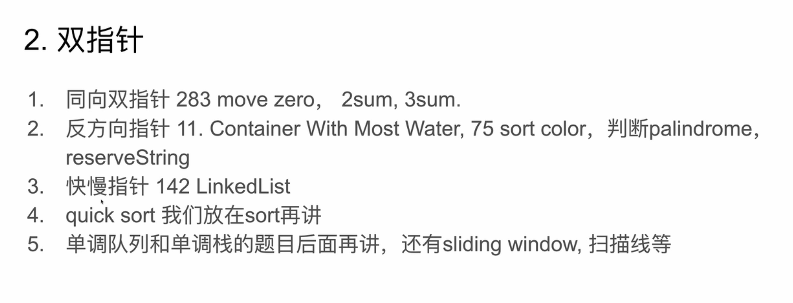

# 1.二分查找

[start，end]
```java
int start=0;
int end=0;
while(start<=end){
    mid=start+(end-start)/2;
    if(nums[mid]<target){
        start=mid+1;
    }
    else if(nums[mid]>target){
        end=mid-1;
    }
    else{
        return mid;
    }
}
```
## 找最坏版本
## 410


# 2.双指针

## 16.3数之和
## 340