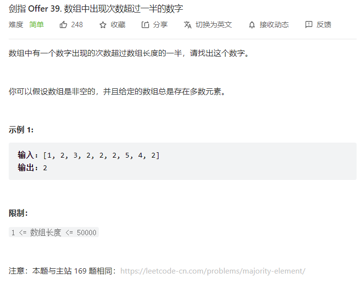
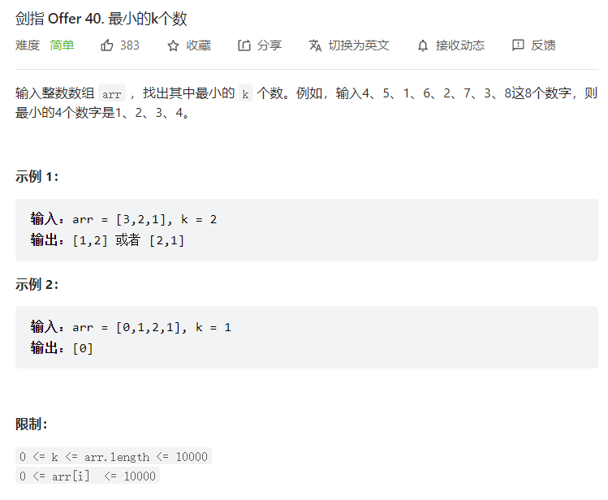

# 44.数字序列中某一位的数字

```java
class Solution {
    public int findNthDigit(int n) {
        long start=1;  //位数范围的start
        long end;     //位数范围的end
        int i=1;  //整数的位数
        while(true){
            end=(int)(i*9*Math.pow(10,i-1))+start-1;  //Math开头大写，方法参数的数据类型都为double，返回值也为double
            if (n>=start && n<=end){
                break;
            }
            else{
                start=end+1;
                i++;
            }
        }
        long nn=n;
        int kth=(int)(n-start);
        int shang=kth/i;
        int yu=kth%i;
        // 得到第n位数所在的整数
        int number=(int)(Math.pow(10,i-1))+shang;
        // 第n位对应的数字即为整数number的倒数第n_位
        int n_=i-yu;
        // 用末位取余法得到res
        int res=0;
        for(int j=0;j<n_;j++){
            res=number%10;
            number/=10;
        }
        return res;
    }
}
```
## 思路：
    1.k位数在题目中的字符序列中有各自的位数范围，根据数学规律找到n在哪个范围内[start,end]
    2.找到第n位所在的整数
    3.找到第n位对应的数字
## 问题：
    1.如果 start和end用int类型，那么当n=1000000000，执行代码时它们会溢出。
    2.如何取得整数的每一位？
    3.一个数的次方


# 56 - I.数组中数字出现的次数


## 思路：
    1.简化为除1个数字之外，其他数字都出现了两次的问题，发现对数组中所有数异或运算后结果为那个只出现了1次的数字。
    2.根据该规律将题目中的数组拆分为两个子数组，每个子数组包含一个只出现了一次的数组
      如何进行拆分呢？
      假设只出现了1次数字为a,b，那么找到a,b的二进制数哪一位不同就可以依次进行分组计算异或。


# 45.把数组排成最小的数


算法流程：
1.int数组转化为String数组
2.自定义compare方法比较两个字符串前后顺序
3.对String数组使用快速排序方法

## 问题：
1.int类型怎么转换为String？
2.string.compareTo()方法的使用
3.字符串数组怎么连接成一个字符串？


## 代码：
```java
class Solution {
    public String minNumber(int[] nums) {
        String[] numbers=new String[nums.length];
        StringBuilder minnum=new StringBuilder();
        for (int i=0;i<nums.length;i++){
            numbers[i]=String.valueOf(nums[i]);
        }
        quickSort(numbers,0,nums.length-1);
        for(String x:numbers){
            minnum.append(x);
        }
        return minnum.toString();
    }
    void quickSort(String[] nums,int low,int high){
        if (low>=high){
            return;
        }
        int i=low;
        int j=high;
        String tmp=null;
        while(i<j){
            while(compare(nums[low],nums[j])<=0&i<j){
                j--;
            }
            while(compare(nums[low],nums[i])>=0&i<j){
                i++;
            }
            tmp=nums[i];
            nums[i]=nums[j];
            nums[j]=tmp;
        }
        tmp=nums[low];
        nums[low]=nums[j];
        nums[j]=tmp;
        quickSort(nums,low,j-1);
        quickSort(nums,j+1,high);
    }
    int compare(String m,String n){
        String mn=m+n;
        String nm=n+m;
        return mn.compareTo(nm);
    }

}

```


# 56 - II.数组中数字出现的数字 II

## 思路：
### 哈希表
    1.创建一个空的哈希表
    2.如果不存在该键，则值为1，否则值+1
    3.遍历哈希表，找到值为1的键（有比遍历更好的方法吗）

### 位运算 自动状态机


# 46.把数组翻译成字符串

## 1.深度优先搜索
### 思路：
1）在for循环中递归
2）满足终止条件时用count计数


### 代码：
```java
class Solution {
    int count=0;
    public int translateNum(int num) {
        String number = String.valueOf(num);
        backtracking(0,number);
        return count;
    }
    void backtracking(int k,String number){
        String subnumber;
        if (k>=number.length()-1){
            count+=1;
            return;
        }
        for(int i=k+1;i<=k+2;i++){
            subnumber=number.substring(k,i);
            if (Integer.valueOf(subnumber)>=0 && Integer.valueOf(subnumber)<=25){
                backtracking(i,number);
            }
            if (subnumber.equals("0"))  break;
        }
    }
}
```


## 2.动态规划
### 代码：
```java
class Solution {
    public int translateNum(int num) {
        String number = String.valueOf(num);
        if (number.length()==1){
            return 1;
        }
        int[] dp=new int[number.length()+1];
        int tmp;
        dp[0]=1;
        dp[1]=1;
        for(int i=2;i<=number.length();i++){
            if (number.substring(i-2,i-1).equals("0")){
                dp[i]=dp[i-1];
                continue;
            }
            tmp=Integer.valueOf(number.substring(i-2,i));
            if(tmp>=0 && tmp <=25){
                dp[i]=dp[i-2]+dp[i-1];
            }
            else{
                dp[i]=dp[i-1];
            }
        }
        return dp[number.length()];
    }   
}
```

### 思路：
到第i个数字的翻译方法数与到第i-1个和第i-2个的有关，寻找它们之间的联系

## 问题：
1.解题中对int num的处理：
转换为String，利用string.substring方法取数，利用string.equals()方法与0和25作比较。
2.当第i-1个数为0时，无法与第i个数连接翻译。


# 47.礼物的最大价值


## 动态规划
### 代码
```java
class Solution {
    public int maxValue(int[][] grid) {
        int m=grid.length;
        int n=grid[0].length;
        int i=0;
        int j=0;
        //初始化dp[][]数组
        int[][] dp=new int[m][n];
        dp[0][0]=grid[0][0];
        for(j=1;j<n;j++){
            dp[0][j]=dp[0][j-1]+grid[0][j];
        }
        for(i=1;i<m;i++){
            dp[i][0]=dp[i-1][0]+grid[i][0];
        }
        for(i=1;i<m;i++){
            for(j=1;j<n;j++){
                dp[i][j]=Math.max(dp[i-1][j],dp[i][j-1])+grid[i][j];
            }
        }
        return dp[m-1][n-1];
        
    }
}
```


### 思路：
dp[i][j]=Math.max(dp[i-1][j],dp[i][j-1])+grid[i][j];


## 深度搜索
### 代码
```java
class Solution {
    int val=0;
    int m=0;
    int n=0;
    ArrayList<Integer> Value=new ArrayList<>();
    public int maxValue(int[][] grid) {
        m=grid.length-1;
        n=grid[0].length-1;
        backtracking(0,0,grid);
        return Collections.max(Value);
    }
    void backtracking(int i,int j,int[][] grid){
        if(j>n || i>m) return;
        if(i==m && j==n){
            val+=grid[m][n];
            Value.add(val);
            val-=grid[m][n];
            return;
        }
        val+=grid[i][j];
        backtracking(i+1,j,grid);
        backtracking(i,j+1,grid);
        val-=grid[i][j];
    }
}   
```


# 42.连续子数组的最大和

## 动态规划
### 思路
1.==dp[i]表示以nums[i]为结尾子数组和的最大值==
2.if(dp[i-1]>0) dp[i]=dp[i-1]+nums[i],否则dp[i]=nums[i]

### 代码
```java
class Solution {
    public int maxSubArray(int[] nums) {
        int[] dp=new int[nums.length];
        int res=nums[0];
        dp[0]=nums[0];
        for(int i=1;i<nums.length;i++){
            if(dp[i-1]>0){
                dp[i]=dp[i-1]+nums[i];
            }
            else{
                dp[i]=nums[i];
            }
            res=Math.max(res,dp[i]);
        }
        return res;
    }
}
```


# 29.顺时针打印矩阵
## 撞墙法
### 代码
```java
class Solution {
    public int[] spiralOrder(int[][] matrix) {
        if (matrix.length==0){
            return new int[]{};
        }
        int[] res=new int[matrix.length*matrix[0].length];
        int count=0;
        boolean[][] arrived=new boolean[matrix.length][matrix[0].length];
        int i=0;
        int j=0;
        while(count<res.length){
            while(j<matrix[0].length && arrived[i][j]==false){
                res[count]=matrix[i][j];
                arrived[i][j]=true;
                j++;
                count++;
            }
            j--;
            i++;
            while(i<matrix.length && arrived[i][j]==false){
                res[count]=matrix[i][j];
                arrived[i][j]=true;
                i++;
                count++;
            }
            i--;
            j--;
            while(j>=0 && arrived[i][j]==false){
                res[count]=matrix[i][j];
                arrived[i][j]=true;
                j--;
                count++;
            }
            j++;
            i--;
            while(i>=0 && arrived[i][j]==false){
                res[count]=matrix[i][j];
                arrived[i][j]=true;
                i--;
                count++;
            }
            i++;
            j++;
        }
        return res;
    }
}
```

### 思路
1.用一个数组记录是否到达过
2.判断是否越界

### 问题
1.任何情况应先判断i,j是否越界。


# 22.链表中倒数第k个节点

## 遍历链表得到节点总数
### 代码
```java
/**
 * Definition for singly-linked list.
 * public class ListNode {
 *     int val;
 *     ListNode next;
 *     ListNode(int x) { val = x; }
 * }
 */
class Solution {
    public ListNode getKthFromEnd(ListNode head, int k) {
        int count=0;
        ListNode cur = head;
        while(cur!= null){
            count+=1;
            cur=cur.next;
        }
        int m=count-k;
        cur=head;
        while(m>0){
            m--;
            cur=cur.next;
        }
        return cur;
    }
}
```


# 25.合并两个排序的链表

## 双指针法
### 代码
```java
/**
 * Definition for singly-linked list.
 * public class ListNode {
 *     int val;
 *     ListNode next;
 *     ListNode(int x) { val = x; }
 * }
 */
class Solution {
    public ListNode mergeTwoLists(ListNode l1, ListNode l2) {
        ListNode l1cur=l1;
        ListNode l2cur=l2;
        ListNode cur=new ListNode();
        ListNode head=cur;
        while(l1cur!=null || l2cur!=null){
            if (l1cur==null){
                cur.next=l2cur;
                cur=cur.next;
                l2cur=l2cur.next;
            }
            else if(l2cur==null){
                cur.next=l1cur;
                cur=cur.next;
                l1cur=l1cur.next;
            }
            else{
                if(l1cur.val<l2cur.val){
                    cur.next=l1cur;
                    cur=cur.next;
                    l1cur=l1cur.next;
                }
                else{
                    cur.next=l2cur;
                    cur=cur.next;
                    l2cur=l2cur.next;
                }
            }
        }
        return head.next;
    }
}
```

### 注意
1.head的设置以便于找到目标节点


# 27.二叉树的镜像
## 中序遍历
### 代码
```java
/**
 * Definition for a binary tree node.
 * public class TreeNode {
 *     int val;
 *     TreeNode left;
 *     TreeNode right;
 *     TreeNode(int x) { val = x; }
 * }
 */
class Solution {
    public TreeNode mirrorTree(TreeNode root) {
       mirro(root);
       return root;
    }
    void mirro(TreeNode root){
        if (root==null){
            return;
        }
        TreeNode tmp=root.left;
        root.left=root.right;
        root.right=tmp;
        mirro(root.left);
        mirro(root.right);
    }
}
```

# ==28.对称的二叉树==

## 递归求解
### 代码
```java
/**
 * Definition for a binary tree node.
 * public class TreeNode {
 *     int val;
 *     TreeNode left;
 *     TreeNode right;
 *     TreeNode(int x) { val = x; }
 * }
 */
class Solution {
    public boolean isSymmetric(TreeNode root) {
        if (root==null){
            return true;
        }
        return symmetric(root.left,root.right);
    }
    boolean symmetric(TreeNode node1,TreeNode node2){
        if(node1==null && node2==null){
            return true;
        }
        else if(node1==null || node2==null){
            return false;
        }
        else if(node1.val!=node2.val){
            return false;
        }
        return symmetric(node1.left,node2.right)&&symmetric(node1.right,node2.left);
    }
}
```


### 思路：
递归对两个节点进行比较


# 32.从上到下打印二叉树 II

[ArrayList 动态二维数组 （创建 增加 删除 定点读取修改）](https://blog.csdn.net/Lin_QC/article/details/93484948?spm=1035.2023.3001.6557&utm_medium=distribute.pc_relevant_bbs_down_v2.none-task-blog-2~default~OPENSEARCH~Rate-3.pc_relevant_bbs_down_v2_default&depth_1-utm_source=distribute.pc_relevant_bbs_down_v2.none-task-blog-2~default~OPENSEARCH~Rate-3.pc_relevant_bbs_down_v2_default)

## BFS
### 代码
```java
/**
 * Definition for a binary tree node.
 * public class TreeNode {
 *     int val;
 *     TreeNode left;
 *     TreeNode right;
 *     TreeNode(int x) { val = x; }
 * }
 */
class Solution {
    public List<List<Integer>> levelOrder(TreeNode root) {
        List<List<Integer>> res=new ArrayList<>();
        Queue<TreeNode> BFS=new LinkedList<>();
        if (root==null){
            return res;
        }
        BFS.offer(root);
        TreeNode node;
        while(BFS.peek()!=null){
            List<Integer> tmp=new ArrayList<>();
            int length=BFS.size();
            for(int i=0;i<length;i++){
                node=BFS.poll();
                tmp.add(node.val);
                if(node.left!=null){
                    BFS.offer(node.left);
                }
                if(node.right!=null){
                    BFS.offer(node.right);
                }
            }
            res.add(tmp);
        }
        return res;

    }
}
```


## 问题
1.List接口。
2.需要借助队列实现广度优先遍历，JAVA中队列的用法。
```java
//初始化
Queue<String> queue = new LinkedList<String>();
//添加元素
queue.offer("a");
queue.offer("b");
queue.offer("c");
//返回第一个元素，并在队列中删除
queue.poll();
//返回第一个元素（在队列为空时抛出一个异常）
queue.element();
//返回第一个元素（在队列为空时返回null）
queue.peek();
```


# 32.从上到下打印二叉树III


## 层序遍历+双端队列
### 思路：
1.BFS队列做层序遍历（每一层的节点顺序为从左至右）
2.res动态数组存储结果
3.在每一层中，用tmp双端队列存储结果
    需要从左到右打印时，把数值加到tmp尾部
    需要从右到左打印时，把数值加到tmp头部


### 代码
```java
/**
 * Definition for a binary tree node.
 * public class TreeNode {
 *     int val;
 *     TreeNode left;
 *     TreeNode right;
 *     TreeNode(int x) { val = x; }
 * }
 */
class Solution {
    public List<List<Integer>> levelOrder(TreeNode root) {
        Queue<TreeNode> BFS=new LinkedList<>();
        List<List<Integer>> res=new ArrayList<>();
        if (root==null){
            return res;
        }
        BFS.offer(root);
        int i=0;
        TreeNode node=new TreeNode();
        while(BFS.peek()!=null){
            LinkedList<Integer> tmp=new LinkedList<>();
            i++;
            int length=BFS.size();
            for (int j=0;j<length;j++){
                node=BFS.poll();
                if(i%2==0){
                    tmp.addFirst(node.val);
                }
                else{
                    tmp.addLast(node.val);
                }
                if (node.left!=null){
                    BFS.offer(node.left);
                }
                if (node.right!=null){
                    BFS.offer(node.right);
                }
            }
            res.add(tmp);
        }
        return res;
    }
}
```
### 问题：
1.怎么创建双端队列？
```java
LinkedList<Integer> tmp=new LinkedList<>();
```


# 32-I.从上到下打印二叉树


## BFS
### 思路：
1.先用动态数组存储结果，然后用循环将动态数组的结果存到int数组。


### 代码：
```java
/**
 * Definition for a binary tree node.
 * public class TreeNode {
 *     int val;
 *     TreeNode left;
 *     TreeNode right;
 *     TreeNode(int x) { val = x; }
 * }
 */
class Solution {
    public int[] levelOrder(TreeNode root) {
        ArrayList<Integer> res=new ArrayList<>();
        Queue<TreeNode> BFS=new LinkedList<>();
        TreeNode node=new TreeNode();
        if (root==null){
            return new int[]{};
        }
        BFS.offer(root);
        while(BFS.peek()!=null){
            int length=BFS.size();
            for(int i=0;i<length;i++){
                node=BFS.poll();
                res.add(node.val);
                if(node.left!=null){
                    BFS.offer(node.left);
                }
                if(node.right!=null){
                    BFS.offer(node.right);
                }
            }
        }
        int[] ress=new int[res.size()];
        for(int j=0;j<res.size();j++){
            ress[j]=res.get(j);
        }
        return ress;
    }
}
```


## 问题
1.ArrayList怎么转换为字符串数组？
```java
ArrayList lst = new ArrayList ();
lst.add ("aa");
lst.add ("bb");
//方法1:
Object []obj = null;
obj = lst.toArray();
//方法2:
String []str = new String [lst.size()];
lst.toArray(str);
```

2.ArrayList怎么转换为int[]数组？
```Java
ArrayList lst=new ArrayList();
lst.add(1);
lst.add(2);
lst.add(3);
int[] arr=new int[lst.size()];
for(int i=0;i<lst.size();i++){
    arr[i]=lst.get(i);
}
```


# 39.数组中出现次数超过一半的数字


## 字典存储+遍历查找
### 代码：
```java
class Solution {
    public int majorityElement(int[] nums) {
        HashMap<Integer,Integer> Sites=new HashMap<>();
        for(Integer x:nums){
            Sites.putIfAbsent(x,0);
            Sites.put(x,Sites.get(x)+1);
        }
        for(Integer y:Sites.keySet()){
            if(Sites.get(y)>(nums.length/2)){
                return y.intValue();
            }
        }
        return 0;
    }
}
```

### 问题：
官方解答中的优化


# 40.最小的k个数


## 排序
### 代码：
```java
class Solution {
    public int[] getLeastNumbers(int[] arr, int k) {
        Arrays.sort(arr);
        int[] res=new int[k];
        for(int i=0;i<k;i++){
            res[i]=arr[i];
        }
        return res;
    }
}
```

### 问题：
1.是否可以截取数组中某一段？

## ==快排的变形==


# 52.两个链表的第一个公共节点
## 哈希表
### 代码：
```java
public class Solution {
    public ListNode getIntersectionNode(ListNode headA, ListNode headB) {
        Set<ListNode> visited = new HashSet<ListNode>();
        ListNode temp = headA;
        while (temp != null) {
            visited.add(temp);
            temp = temp.next;
        }
        temp = headB;
        while (temp != null) {
            if (visited.contains(temp)) {
                return temp;
            }
            temp = temp.next;
        }
        return null;
    }
}
```

# 48.最长不含重复字符的子字符串

## 动态规划+线性遍历
### 代码：
```java
class Solution {
    public int lengthOfLongestSubstring(String s) {
        if (s.length()<=1){
            return s.length();
        }
        int res=1;
        char[] sarray=s.toCharArray();
        int[] dp=new int[sarray.length];
        dp[0]=1;
        for(int i=1;i<s.length();i++){
            dp[i]=dp[i-1]+1;
            for(int j=i-1;j>=i-dp[i-1];j--){
                if(sarray[j]==sarray[i]){
                    dp[i]= i-j;
                    break;
                }

            }
            res=Math.max(res,dp[i]);
        }
        return res;
    }
}
```


### 思路：
1.dp[i]表示以s[i]结尾的最长子字符串长度，该长度dp[i-1]决定

### 优化：
1.用string.charAt()进行判断，这样就可以不用数组


# 33.二叉搜索树的后序遍历序列
## 递归分治
### 思路：
1.利用二叉搜索树性质：若它的左子树不空，则左子树上所有结点的值均小于它的根节点的值；若它的右子树不空，则右子树上所有结点的值均大于它的根节点的值。
2.后序遍历的性质：数组中的最后一个数是根节点的值
3.递归分治： 
    判断根节点所在的树：
        循环终止条件
        划分区域
        判断根节点的左子树
        判断根节点的右子树
        返回判断结果

### 代码：
```java
class Solution {
    public boolean verifyPostorder(int[] postorder) {
        return verify(postorder,0,postorder.length-1);
    }
    boolean verify(int[] arr,int start,int end){
        if (end-start<=0){
            return true;
        }
        int i=end;
        int j=i-1;
        while(j>=start && arr[j]>=arr[i]){
            j--;
        }
        int rightStart=j+1;
        for(;j>=start;j--){
            if(arr[j]>arr[i]){
                return false;
            }
        }
        int leftStart=start;
        int leftEnd=rightStart-1;
        int rightEnd=end-1;
        return verify(arr,leftStart,leftEnd) && verify(arr,rightStart,rightEnd);
}
}
```

# 53-I. 在排序数组中查找数字

## 代码：
```java
class Solution {
    public int search(int[] nums, int target) {
        if (nums.length==0){
            return 0;
        }
        int i=0;
        int count=0;
        while(i<nums.length && nums[i]<=target){
            if (nums[i]==target){
                count++;
            }
            i++;
        }
        return count;
    }
}
```

### 思路：
遍历数组直到nums[i]大于target为止或者越界为止


# 54.二叉搜索树的第k大节点

### 代码
```java
/**
 * Definition for a binary tree node.
 * public class TreeNode {
 *     int val;
 *     TreeNode left;
 *     TreeNode right;
 *     TreeNode(int x) { val = x; }
 * }
 */
class Solution {
    int count=0;
    int res=0;
    public int kthLargest(TreeNode root, int k) {
        traversal(root,k);
        return res;
    }
    void traversal(TreeNode node,int k){
        if (node==null){
            return;
        }
        traversal(node.right,k);
        count+=1;
        if (count==k){
            res=node.val;
            return;
        }
        traversal(node.left,k);
    }
}
```


# 43.1~n整数中1出现的次数


# ==38.字符串的排列(全排列问题)==
## 思路：
1.对字符串数组排序

## 问题：
1.字符数组如何? 
用Arrays.sort()方法

2.path的存储？


3.为什么需要排序？


4.如何填充数组？
Arrays.fill()

## 代码：
```java
class Solution {
    LinkedList<Character> path=new LinkedList<>();
    ArrayList<String> res=new ArrayList<>();
    String tmp=null;
    public String[] permutation(String s) {
        char[] sArray=s.toCharArray();
        Arrays.sort(sArray);
        int length=s.length();
        boolean[] used=new boolean[length];
        Arrays.fill(used,false);
        permutation(sArray,used,length);
        String[] result=new String[res.size()];
        for(int i=0;i<res.size();i++){
            result[i]=res.get(i);
        }
        return result;
    }
    void permutation(char[] array,boolean[] used,int length){
        if(path.size()==length){
            char[] patharray=new char[length];
            for(int i=0;i<length;i++){
                patharray[i]=path.get(i);
            }
            tmp=String.valueOf(patharray);
            res.add(tmp);
            return;
        }
        for(int j=0;j<length;j++){
            if(used[j]==true){
                continue;
            }
            if(j>=1 && array[j]==array[j-1] && used[j-1]==false){
                continue;
            }
            path.addLast(array[j]);
            used[j]=true;
            permutation(array,used,length);
            path.removeLast();
            used[j]=false;
        }
    }
}
```


# 34.二叉树中和为某一值的路径

## 前序遍历
### 思路：
1.终止条件：根节点为null,则返回
2.先判断然后依次递归左节点和右节点

### 代码：
```java
/**
 * Definition for a binary tree node.
 * public class TreeNode {
 *     int val;
 *     TreeNode left;
 *     TreeNode right;
 *     TreeNode() {}
 *     TreeNode(int val) { this.val = val; }
 *     TreeNode(int val, TreeNode left, TreeNode right) {
 *         this.val = val;
 *         this.left = left;
 *         this.right = right;
 *     }
 * }
 */
class Solution {
    List<List<Integer>> result=new ArrayList<>(); 
    List<Integer> path=new ArrayList<>();
    int sum=0;
    public List<List<Integer>> pathSum(TreeNode root, int target) {
        backtrack(root,target);
        return result;
    }
    void backtrack(TreeNode node,int target){
        if(node==null){
            return;
        }
        sum+=node.val;
        path.add(node.val);
        if (sum==target && node.left==null && node.right==null){
            result.add(new LinkedList(path));
        }
        backtrack(node.left,target);
        backtrack(node.right,target);
        path.remove(path.size()-1);
        sum-=node.val;
    }
}
```


# ==35.复杂链表的复制==
## 哈希表
### 思路：
1.{旧节点：新节点}
2.以旧节点作为索引来建立新链表，相当于对关系旧节点之间的关系作了映射

### 代码：
```java
/*
// Definition for a Node.
class Node {
    int val;
    Node next;
    Node random;

    public Node(int val) {
        this.val = val;
        this.next = null;
        this.random = null;
    }
}
*/
class Solution {
    public Node copyRandomList(Node head) {
        if (head==null){
            return null;
        }
        Node cur;
        cur=head;
        HashMap<Node,Node> dict=new HashMap<>();
        while(cur!=null){
            dict.put(cur,new Node(cur.val));
            cur=cur.next;
        }
        cur=head;
        while(cur!=null){
            dict.get(cur).next=dict.get(cur.next);
            dict.get(cur).random=dict.get(cur.random);
            cur=cur.next;
        }
        return dict.get(head);
    }
}
```


## ==拆分链表==
### 思路:
逐个复制节点,复制节点作为原节点的下一个节点,如1->2->3->4->5变为1->1->2->2->3->3->4->4
随机节点的赋值:原节点的下一个随机节点的下一个节点为赋值节点的下一个随机节点


如何拆分链表?
复制节点的下一个节点为原节点的下一个节点的下一个节点


# 53-II. 0~n-1中缺失的数字

## for循环遍历
### 思路：
1.数组的长度为n，那么应有n+1个数字，少的数字就是我们要找到的。
2.遍历数组，如果nums[i]不等于i，那么说明少的数字是i。
3.==注意少的数字是n的情况==，也就是说整个数字都满足nums[i]等于i，那么缺少的数字就是最后一个数字n（0~n）。

### 代码：
```java
class Solution {
    public int missingNumber(int[] nums) {
        int i=0;
        for(;i<nums.length;i++){
            if (nums[i]!=i){
                return i;
            }
        }
        return i;
    }
}
```

## 二分法
### 思路：


# 60.n个骰子的点数
## 动态规划：
### 思路：
第n个骰子的点数=前n-1个骰子的点数+第n个骰子的点数

### 代码：
```java
class Solution {
    public double[] dicesProbability(int n) {
        double[][] arrs=new double[n][];
        for(int i=0;i<n;i++){
            arrs[i]=new double[(i+1)*6];
        }
        for (int j=0;j<arrs[0].length;j++){
            arrs[0][j]=1d/6;
        }
        for(int i=1;i<n;i++){
            for(int j=0;j<arrs[i-1].length;j++){
                for(int k=0;k<arrs[0].length;k++){
                    arrs[i][j+k+1]=arrs[i][j+k+1]+arrs[i-1][j]*arrs[0][k];
                }
            }
        }
        ArrayList<Double> res=new ArrayList<>();
        for(double x:arrs[n-1]){
            if (x!=0){
                res.add(x);
            }
        }
        double[] result=new double[res.size()];
        for(int i=0;i<result.length;i++){
            result[i]=res.get(i);
        }
        return result;
    }
}
```

# 57.和为s的两个数字

## 对撞双指针
### 思路：
利用数组是递增的性质，双指针分别指向两端，nums[i]+nums[j]和target作比较，如果小于则i++，如果大于则j--。

### 代码：
```java
class Solution {
    public int[] twoSum(int[] nums, int target) {
        int i = 0, j = nums.length - 1;
        while(i < j) {
            int s = nums[i] + nums[j];
            if(s < target) i++;
            else if(s > target) j--;
            else return new int[] { nums[i], nums[j] };
        }
        return new int[0];
    }
}
```


# 36.二叉搜索树与双向链表

## 后序遍历
### 思路：

### 代码：
```java
/*
// Definition for a Node.
class Node {
    public int val;
    public Node left;
    public Node right;

    public Node() {}

    public Node(int _val) {
        val = _val;
    }

    public Node(int _val,Node _left,Node _right) {
        val = _val;
        left = _left;
        right = _right;
    }
};
*/
class Solution {
    public Node treeToDoublyList(Node root) {
        if(root==null){
            return null;
        }
        Node[] minmax=search(root);
        minmax[0].left=minmax[1];
        minmax[1].right=minmax[0];
        return minmax[0];
    }
    Node[] search(Node node){
        if  (node==null){
            return new Node[]{null,null};
        }
        Node[] Left=search(node.left);
        Node maxLeft=Left[1];
        Node minLeft=Left[0];
        Node[] right=search(node.right);
        Node minRight=right[0];
        Node maxRight=right[1];
        if(maxLeft!=null){
            node.left=maxLeft;
            maxLeft.right=node;
        }
        else{
            minLeft=node;
        }
        if(minRight!=null){
            node.right=minRight;
            minRight.left=node;
        }
        else{
            maxRight=node;
        }
        return new Node[]{minLeft,maxRight};

        
    }
}
```


# 58 -I.翻转单词顺序

## 双指针+从后往前遍历+StringBuilder
### 思路：
i指向单词首字符，j指向单词尾字符
    搜索空格 i
    添加单词
    搜索非空格 j

### 代码：
```java
class Solution {
    public String reverseWords(String s) {
        StringBuilder res=new StringBuilder();
        s=s.trim();
        int j=s.length()-1;
        int i=j;
        while(i>=0){
            i=j;
            while(i>=0 && s.charAt(i)!=' '){
                i--;
            }
            res.append(s.substring(i+1,j+1)+" ");
            j=i;
            while(j>=0 && s.charAt(j)==' '){
                j--;
            }
        }
        return res.toString().trim();
    }
}
```


# 59-II. 队列的最大值

## 单调的双端队列
### 思路：

                                                                                                                                                                                                                                                                                                                                                                                                                                                                                               