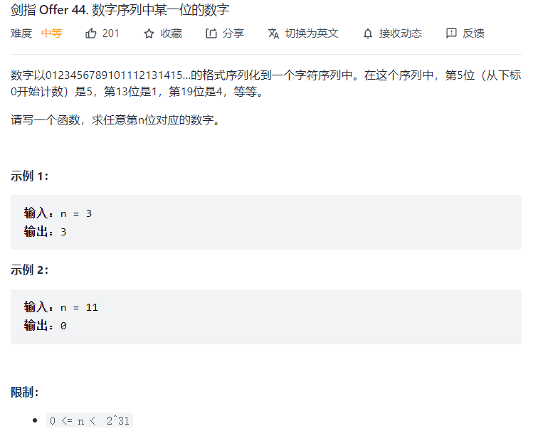
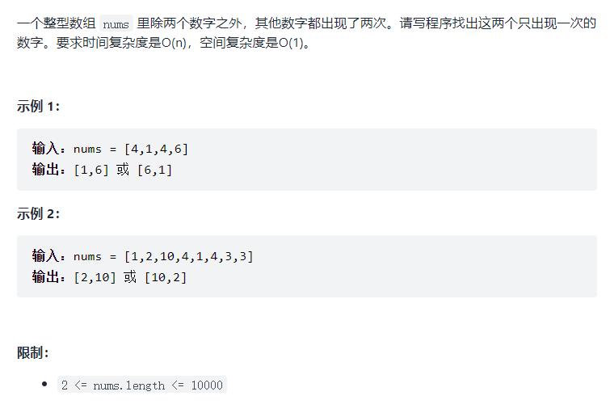

# 44.数字序列中某一位的数字

```java
class Solution {
    public int findNthDigit(int n) {
        long start=1;  //位数范围的start
        long end;     //位数范围的end
        int i=1;  //整数的位数
        while(true){
            end=(int)(i*9*Math.pow(10,i-1))+start-1;  //Math开头大写，方法参数的数据类型都为double，返回值也为double
            if (n>=start && n<=end){
                break;
            }
            else{
                start=end+1;
                i++;
            }
        }
        long nn=n;
        int kth=(int)(n-start);
        int shang=kth/i;
        int yu=kth%i;
        // 得到第n位数所在的整数
        int number=(int)(Math.pow(10,i-1))+shang;
        // 第n位对应的数字即为整数number的倒数第n_位
        int n_=i-yu;
        // 用末位取余法得到res
        int res=0;
        for(int j=0;j<n_;j++){
            res=number%10;
            number/=10;
        }
        return res;
    }
}
```
## 思路：
    1.k位数在题目中的字符序列中有各自的位数范围，根据数学规律找到n在哪个范围内[start,end]
    2.找到第n位所在的整数
    3.找到第n位对应的数字
## 问题：
    1.如果 start和end用int类型，那么当n=1000000000，执行代码时它们会溢出。
    2.如何取得整数的每一位？
    3.一个数的次方


# 56 - I.数组中数字出现的次数


## 思路：
    1.简化为除1个数字之外，其他数字都出现了两次的问题，发现对数组中所有数异或运算后结果为那个只出现了1次的数字。
    2.根据该规律将题目中的数组拆分为两个子数组，每个子数组包含一个只出现了一次的数组
      如何进行拆分呢？
      假设只出现了1次数字为a,b，那么找到a,b的二进制数哪一位不同就可以依次进行分组计算异或。