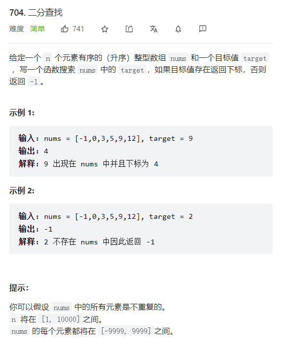

# 二分法
[力扣题解](https://leetcode-cn.com/problems/binary-search/solution/er-fen-cha-zhao-xiang-jie-by-labuladong/)
注意：  i=(low+high)/2向下取整

假设取闭区间[left,right]
## 寻找一个数
将大于target或小于target的数排在区间外

## 寻找左侧边界的二分搜索(边界索引的左边小于target)
将小于target放在left左侧，大于等于target的放在right右侧，返回left

## 寻找右侧边界的二分搜索(边界索引的右边大于target)
将小于等于target的放在left左侧，大于target的放在right右侧，返回right

# 704.二分查找

## 思路：
第一种写法： 定义target在[left,right]中     high=nums.length-1   while(left<=right)       right=middle-1
第二种写法： 定义target在[left，right)中     high=nums.length     while(left<right)       right=middle


## 代码：
第二种写法
```java
class Solution {
    public int search(int[] nums, int target) {
        int low=0;
        int high=nums.length;
        int i;
        while(low<high){
            i=(low+high)/2;
            if(nums[i]==target){
                return i;
            }
            else if(nums[i]>target){
                high=i;
            }
            else{
                low=i+1;
            }
        }
        return -1;
    }
}
```


### 寻找右侧边界的二分查找：
```java
int right_bound(int[] nums, int target) {
    if (nums.length == 0) return -1;
    int left = 0, right = nums.length;
    
    while (left < right) {
        int mid = (left + right) / 2;
        if (nums[mid] == target) {
            left = mid + 1; // 注意
        } else if (nums[mid] < target) {
            left = mid + 1;
        } else if (nums[mid] > target) {
            right = mid;
        }
    }
    return left - 1; // 注意
}
```