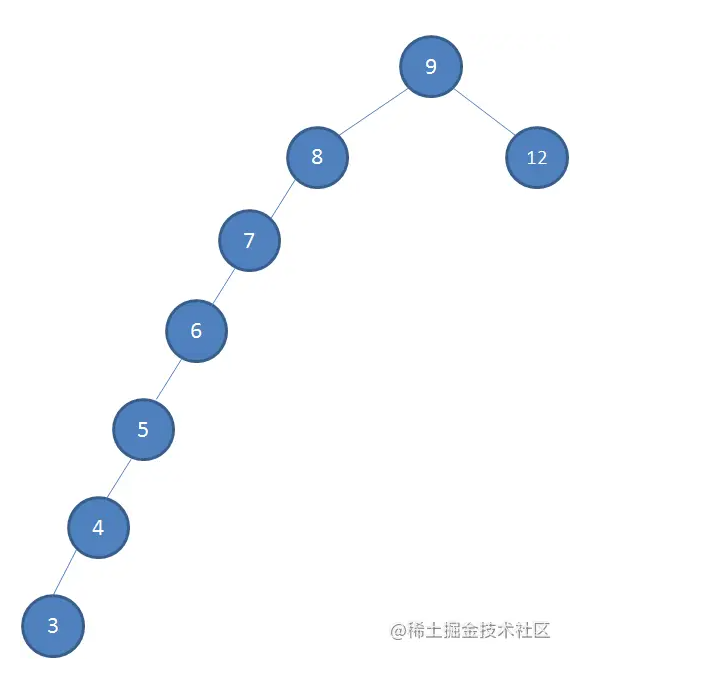
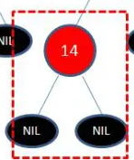
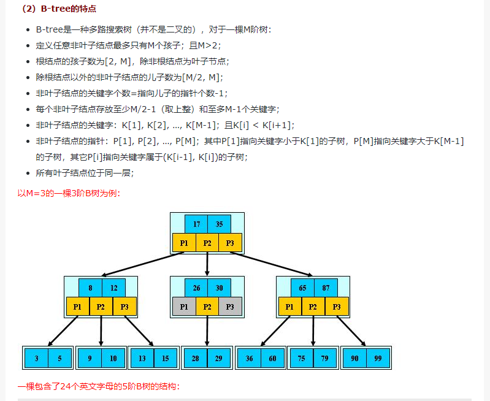
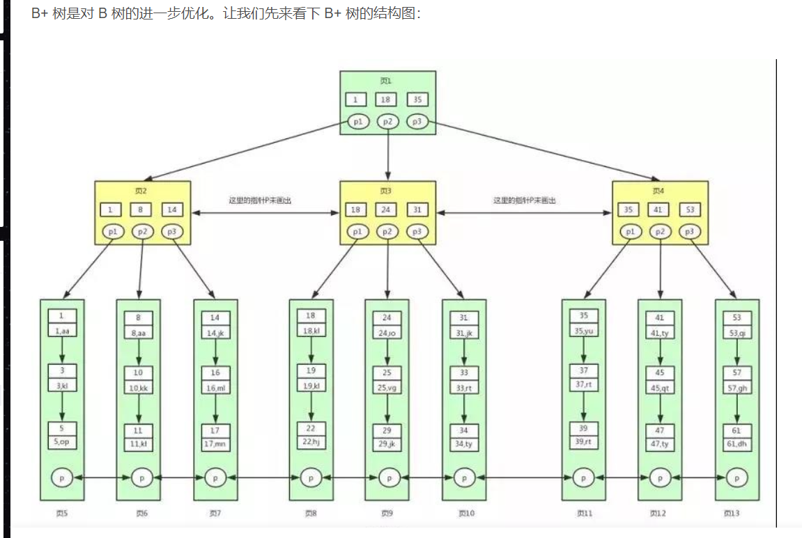
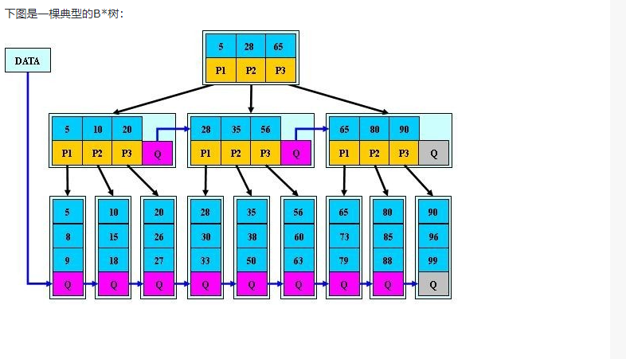

高度和深度区别
1 树的高度和深度是相同的。
2 同一层的节点的深度是相同，但是高度不一定相同。
深度：根节点到该节点的最长路径数
高度：该节点到叶子节点的最长路径数

# 二叉树
## 1.完全二叉树
从上到下，从做到右依次铺

## 2.满二叉树
从上到下，从做到右依次铺满

## 3.堆
堆是具有以下性质的==完全⼆叉树==：每个结点的值都⼤于或等于其左右孩⼦结点的值，称为⼤顶堆；或者
每个结点的值都⼩于或等于其左右孩⼦结点的值，称为⼩顶堆。

## 4.二叉查找树
1.左小右大
2.根左右都为二叉查找树
3.没有键值相等的节点

## 5.平衡二叉树
AVL树
1.二叉搜索树
2.左右子树的高度差不大于1

## 6.红黑树
为什么需要红黑树？

需要解决二叉查找树多次插入新节点而导致的不平衡

特性：
根黑、叶黑、红子黑、节到叶所有路径黑色数目相同

什么情况下破坏规则？
    当插入一个新节点的时候，需要把这个插进去红黑树
    因为需要保证叶子节点都为黑节点
    当插入位置的父节点为红节点时，就破坏了子黑的规则

## 7.B树

关键字  指针

# B树和B+树区别
[B+树详解](https://blog.csdn.net/qq_45814695/article/details/117171536)

