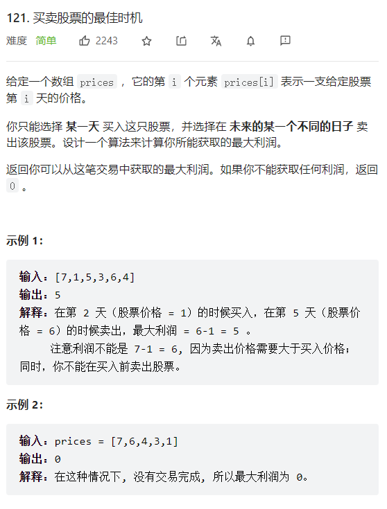

[TOC]

# 70.爬楼梯

```java
class Solution {
    public int climbStairs(int n) {
        if(n==1 || n==2){
            return n;
        }
        int[] dp=new int[n];
        dp[0]=1;
        dp[1]=2;
        for(int i=2;i<n;i++){
            dp[i]=dp[i-1]+dp[i-2];
        }
        return dp[n-1];
    }
}
```

# 121.买卖股票的最佳时机

## 思路：
第i天卖出的最大利润为与第i-1天卖出的最大利润有关


## 代码：
```java
class Solution {
    public int maxProfit(int[] prices) {
        int n=prices.length;
        int[] dp=new int[n];
        int dif=0;
        int res=0;
        for(int i=1;i<n;i++){
            dif=prices[i]-prices[i-1];
            if(dp[i-1]<=0){
                dp[i]=dif;
            }
            else{
                dp[i]=dp[i-1]+dif;
            }
            res=Math.max(res,dp[i]);
        }
        return res;
    }
}
```


# 47.全排列 II
## 思路：


## 代码：
```java
class Solution {
    List<List<Integer>> res=new ArrayList<>();
    ArrayList<Integer> path=new ArrayList<>();
    public List<List<Integer>> permuteUnique(int[] nums) {
        Arrays.sort(nums);
        int n=nums.length;
        int[] used=new int[n];
        digui(used,nums,n);
        return res;
    }
    public void digui(int[] used,int[] nums,int n){
        if(path.size()==n){
            List<Integer> tmp=(List<Integer>)path.clone();
            res.add(tmp);
            return;
        }
        for(int i=0;i<n;i++){
            if(i>=1 && nums[i]==nums[i-1] && used[i-1]==0){
                continue;
            }
            if(used[i]==1){
                continue;
            }
            path.add(nums[i]);
            used[i]=1;
            digui(used,nums,n);
            used[i]=0;
            path.remove(path.size()-1);
        }
    }
    
}
```


# 50.Pow(x,n)

## 思路：


## 代码：
```java
class Solution {
    public double myPow(double x, int n) {
        long N=n;
        if (N<0){
            return 1/fenzhi(x,-N);
        }
        else{
            return fenzhi(x,N);
        }
    }
    public double fenzhi(double x,long n){
        if (n==0){
            return 1;
        }
        double res=0;
        if(n%2==0){
            res=fenzhi(x,n/2);
            return res*res;
        }
        else{
            res=fenzhi(x,(n-1)/2);
            return res*res*x;
        }
    }
}
```


# 面试01.判定字符是否唯一
位运算


# 475 供暖器


## 思路：
为了使供暖器可以覆盖所有房屋且供暖器的加热半径最小，对于每个房屋，应该选择离该房屋最近的供暖器覆盖该房屋，最近的供暖器和房屋的距离即为该房屋需要的供暖器的最小加热半径。所有房屋需要的供暖器的最小加热半径中的最大值即为可以覆盖所有房屋的最小加热半径。


## 代码：
```java
class Solution {
    public int findRadius(int[] houses, int[] heaters) {
        int n1=houses.length;
        int n2=heaters.length;
        int res=0;
        int target=0;
        int low=0;
        int high=0;
        int middle=0;
        int diff;
        Arrays.sort(heaters);
        for (int i=0;i<n1;i++){
            diff=1;
            target=houses[i];
            low=0;
            high=heaters.length-1;
            while(low<=high){
                middle=(low+high)/2;
                if(heaters[middle]==target){
                    diff=0;
                    break;
                }
                else if(heaters[middle]<target){
                    low=middle+1;
                }
                else{
                    high=middle-1;
                }       
            }
            if (diff==0){
                continue;
            }
            else{
                if(high>=0){
                    diff=target-heaters[high];
                    if(low<heaters.length){
                        diff=Math.min(diff,heaters[low]-target);
                    }
                }
                else if(low<heaters.length){
                    diff=heaters[low]-target;
                }
            }
            res=Math.max(res,diff);    
        }
        return res;
    }
}
```


# 88.合并两个有序数组
## 思路：
原地修改，分别从两个数组的尾部向前比较，最大的依次移到到nums1尾部


## 代码：
```java
class Solution {
    public void merge(int[] nums1, int m, int[] nums2, int n) {
        int p1=m-1;
        int p2=n-1;
        int cur=m+n-1;
        while(p2>=0 && p1>=0){
            if(nums1[p1]>nums2[p2]){
                nums1[cur]=nums1[p1];
                p1--;
                cur--;
            }
            else{
                nums1[cur]=nums2[p2];
                p2--;
                cur--;
            }
        }
        if (p1<0){
            for(int i=cur;i>=0;i--){
                nums1[i]=nums2[p2];
                p2--;
            }
        }
    }
}
```

## 官方代码：
```java
class Solution {
    public void merge(int[] nums1, int m, int[] nums2, int n) {
        int p1 = m - 1, p2 = n - 1;
        int tail = m + n - 1;
        int cur;
        while (p1 >= 0 || p2 >= 0) {
            if (p1 == -1) {
                cur = nums2[p2--];
            } else if (p2 == -1) {
                cur = nums1[p1--];
            } else if (nums1[p1] > nums2[p2]) {
                cur = nums1[p1--];
            } else {
                cur = nums2[p2--];
            }
            nums1[tail--] = cur;
        }
    }
}
```


# 128.最长连续序列

## 思路：
### 1.哈希集合
1）由nums得到nums_set哈希集合
2）逐个遍历nums_set中的每个数，先判断哈希集合中是否有该数的num-1,有则跳过该数，没有则去判断num+1,num+2，nums+3...是否在数组中。

## 代码：
```java
class Solution {
    public int longestConsecutive(int[] nums) {
        // 建立一个存储所有数的哈希表，同时起到去重功能
        Set<Integer> set = new HashSet<>();
        for (int num : nums) {
            set.add(num);
        }

        int ans = 0;
        // 遍历去重后的所有数字
        for (int num : set) {
            int cur = num;
            // 只有当num-1不存在时，才开始向后遍历num+1，num+2，num+3......
            if (!set.contains(cur - 1)) {
                while (set.contains(cur + 1)) {
                    cur++;
                }
            }
            // [num, cur]之间是连续的，数字有cur - num + 1个
            ans = Math.max(ans, cur - num + 1);
        }
        return ans;
    }
}
```


# 278.第一个错误的版本


## 二分查找
### 代码：
```java
/* The isBadVersion API is defined in the parent class VersionControl.
      boolean isBadVersion(int version); */

public class Solution extends VersionControl {
    public int firstBadVersion(int n) {
        int low=1;
        int high=n;
        int middle;
        while(low<=high){
            middle=low+(high-low)/2;
            if(super.isBadVersion(middle)){
                high=middle-1;
            }
            else{
                low=middle+1;
            }
        }
        return low;
    }
}
```


# 271.存在重复元素
## 思路：
遍历数组中的元素，如果hashset有该元素则返回true，否则将该元素加入hashset中
## 代码：
```java
class Solution {
    public boolean containsDuplicate(int[] nums) {
        HashSet<Integer> nums_set=new HashSet<>();
        int n=nums.length;
        for(int i=0;i<n;i++){
            if(nums_set.contains(nums[i])){
                return true;
            }
            else{
                nums_set.add(nums[i]);
            }
        }
        return false;
    }
}
```


# 42.接雨水
## 迭代法：


## 动态规划：
### 思路：
对于下标i，下雨后水能到达的最大高度等于下标i两边的最大高度的最小值，下标i处能接的雨水量等于下标i处的水能到达的最大高度减去height[i]。


# 7.整数反转

## 思路：
x从低位到高位
res从高位到低位

## 代码：
```java
class Solution {
    public int reverse(int x) {
        int num=0;
        int res=0;
        while(x!=0){
            if(res<Integer.MIN_VALUE/10 || res>Integer.MAX_VALUE/10){
                return 0;
            }
            num=x%10;
            x=x/10;
            res=res*10+num;
        }
        return res;
    }
}
```


# 13.罗马数字转整数


## 思路：
1.HashMap存储键值对
2.从字符串尾部向前遍历，如果当前字符比上个字符小，那么就减去该字符对应的数字，否则加上对应的数字。   


## 官方代码：
```java
class Solution {
    Map<Character, Integer> symbolValues = new HashMap<Character, Integer>() {{
        put('I', 1);
        put('V', 5);
        put('X', 10);
        put('L', 50);
        put('C', 100);
        put('D', 500);
        put('M', 1000);
    }};

    public int romanToInt(String s) {
        int ans = 0;
        int n = s.length();
        for (int i = 0; i < n; ++i) {
            int value = symbolValues.get(s.charAt(i));
            if (i < n - 1 && value < symbolValues.get(s.charAt(i + 1))) {
                ans -= value;
            } else {
                ans += value;
            }
        }
        return ans;
    }
}
```


## 我的代码：
```java
class Solution {
    public int romanToInt(String s) {
        int n=s.length();
        HashMap<Character,Integer> dict=new HashMap<>();
        dict.put('I',1);
        dict.put('V',5);
        dict.put('X',10);
        dict.put('L',50);
        dict.put('C',100);
        dict.put('D',500);
        dict.put('M',1000);
        if(n==1){
            return dict.get(s.charAt(0));
        }
        int res=dict.get(s.charAt(n-1));
        for(int i=n-2;i>=0;i--){
            if(dict.get(s.charAt(i))>=dict.get(s.charAt(i+1))){
                res+=dict.get(s.charAt(i));
            }
            else{
                res-=dict.get(s.charAt(i));
            }
        }
        return res;
    }
}
```

# 5.最长回文子串

## 思路：
如果一个字符串是回文子串，那么去掉它的头部和尾部也会是回文子串

## 代码：
```java
class Solution {
    public String longestPalindrome(String s) {
        int n=s.length();
        boolean[][] dp=new boolean[n][n];
        String res="";
        int res_nums=0;
        for(int i=n-1;i>=0;i--){
            for(int j=i;j<n;j++){
                if(i==j){
                    dp[i][j]=true;
                    if(res_nums<(j-i+1)){
                        res_nums=j-i+1;
                        res=s.substring(i,j+1);
                    }
                }
                else if(j==(i+1)){
                    if(s.charAt(i)==s.charAt(j)){
                        dp[i][j]=true;
                        if(res_nums<(j-i+1)){
                        res_nums=j-i+1;
                        res=s.substring(i,j+1);
                        }
                    }
                    else{
                        dp[i][j]=false;
                    }
                }
                else{
                    if(dp[i+1][j-1]==false){
                        dp[i][j]=false;
                    }
                    else{
                        if(s.charAt(i)==s.charAt(j)){
                            dp[i][j]=true;
                            if(res_nums<(j-i+1)){
                            res_nums=j-i+1;
                            res=s.substring(i,j+1);
                            }
                        }
                        else{
                            dp[i][j]=false;
                        }
                    }
                }
            }
        }
        return res;
    }
}
```


# 14.最长公共前缀


## 纵向扫描
### 思路：
依次遍历字符串数组中的每个字符串，对于每个遍历到的字符串，更新最长公共前缀。


### 代码：


## 横向扫描
### 思路：
从前往后遍历所有字符串的每一列，比较相同列上的字符是否相同，如果相同则继续对下一列进行比较，如果不相同则当前列不再属于公共前缀，当前列之前的部分为最长公共前缀。


### 代码：
```java
class Solution {
    public String longestCommonPrefix(String[] strs) {
        int n=strs.length;
        int l=-1;
        char z=' ';
        boolean go=true;
        while(go){
            l++;
            if(l<strs[0].length()){
                z=strs[0].charAt(l);
            }
            else{
                break;
            }
            for(int i=1;i<n;i++){
                if(l>=strs[i].length() || strs[i].charAt(l)!=z){
                    go=false;
                    break;
                }
                else{
                    continue;
                }
            }
        }
        return l<0?" ":strs[0].substring(0,l);
    }
}
```


# 9.回文数

## 全部反转
### 思路：
将x全部反转后存储到res中
问题：有可能出现反转后的溢出问题
处理：若可能溢出，则返回false

### 代码：


## 部分反转
### 思路：
若一个整数是回文整数，那么它的右半部分的回文数等于该整数的左半部分


# 206.反转链表
## 双指针
### 思路：
创建一个null节点作为cur
将head节点作为next

## 代码：
```java
/**
 * Definition for singly-linked list.
 * public class ListNode {
 *     int val;
 *     ListNode next;
 *     ListNode() {}
 *     ListNode(int val) { this.val = val; }
 *     ListNode(int val, ListNode next) { this.val = val; this.next = next; }
 * }
 */
class Solution {
    public ListNode reverseList(ListNode head) {
        ListNode cur=null;
        ListNode next=head;
        ListNode tmp;
        if(next==null){
            return null;
        }
        while(next!=null){
            tmp=next.next;
            next.next=cur;
            cur=next;
            next=tmp;
        }
        return cur;
    }
}
```


# 22.括号生成
## 动态规划：
### 思路：
