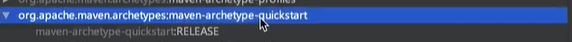
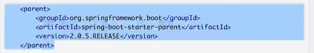
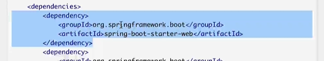
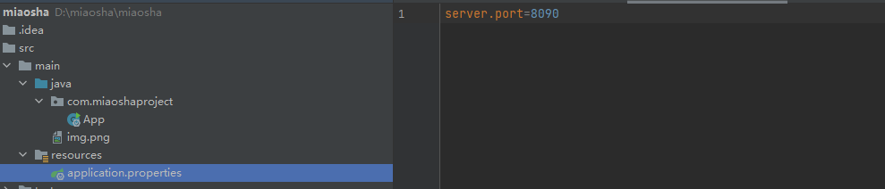

# Maven
1.
以一个jar包的方式提供对外的统一输出（最快速构建springboot研发项目），没有springboot之前会选择webapp

# Springboot
## 官方文档
https://spring.io/guides/gs/rest-service/
建立支持RESTful协议的Web项目
1.引入依赖

# 如何使用Springboot把web项目搭建起来？
## 问题
1.Tomcat容器
2.SpringMVC是用来解决Web控制层的问题，如何用springboot的配置来搞定SpringMVCcontrol的功能

# 2-3 Mybatis接入SpringBoot项目
目标：将Mybatis集成起来，完成对对应项目的读写操作
## 1.如何改变输出端口？
springboot通过对应在resources目录下寻找一个叫application.properties的配置文件，根据key和value对加载内部的配置

## 2.javaconnector + 连接池 + mybatis对spring的支持

## 3.通过在配置文件内导入mybatis需要的配置用来启动带mybatis数据库访问的Springboot工程
     1.设置mybatis.mapperLocations
     2.创建mapping文件夹
     3.使用mybatis的自动生成工具生成数据库文件的映射
        引入mybatis自动生成文件插件

# 2-4 Mybatis自动生成器使用方式
## 问题：
1.connectionURL地址后加?useSSL=false
[运行项目连接Mysql时出现警告Establishing SSL connection without server‘s identity verification is not recommende](https://blog.csdn.net/qq_41785135/article/details/85118329)
2.[java.sql.SQLException: Unable to load authentication plugin ‘caching_sha2_password‘.避坑指南](https://blog.csdn.net/w605283073/article/details/88096598)

