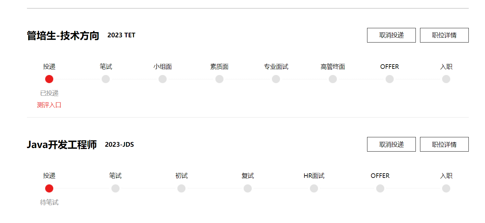

[shopee](https://app.mokahr.com/campus_apply/shopee/2962#/candidateHome/applications)    简历筛选
[Oppo](https://careers.oppo.com/campus/record)        初筛
[京东](https://campus.jd.com/home#/myDeliver?type=present)     挂

[联想](https://talent.lenovo.com.cn/resume/myapply)   8.24 
[小红书]   8.23

[中兴]     测评通过
[美团]     
[中国人寿]  
[招银科技]
[蔚来] (https://nio.jobs.feishu.cn/campus/position/application?spread=SAYV33H)  
<<<<<<< HEAD
[小米](https://app.mokahr.com/campus_apply/xiaomi/47097#/job/46973919-9f8b-46bb-9241-b76b48eb4b9c)  8.29
=======
[小鹏](https://app.mokahr.com/campus_apply/xiaopeng/22#/candidateHome/applications) 8.29 筛选
[极米科技](https://app.mokahr.com/campus_apply/xgimi/5463?sourceToken=4b59a137a692a3e12de05e00faa9ebea#/)  8.29 筛选
[滴滴]   8.29
[酷乐家]   8.29 
[小米](https://app.mokahr.com/campus_apply/xiaomi/47097?sourceToken=149669c49747bba56154ecc6b447d079#/) 8.29
[华为]      8.29、
[海康威视] 8.30

>>>>>>> 8539ed742fa880687042b680a3d4021e528ab34c

```java
public class Main{
    public static void main(String[] args){
        Scanner in=new Scanner(System..in);
        String input=in.nextLine();
        
    }
}


class Solution{
    public int n;
    public String s;
    public String getResult(n,s){
        int cur_num=0;
        int start_index=0;
        int end_index=0;
        int state=0; //0 英文  1数字
        for(int i=0;i<s.length();i++){
            if(s.charAt(i)>='0' && s.charAt(i)<=9){
                    if(state==0){
                        state=1;
                        cur_num++;
                        if(cur_num==this.n){
                            start_index=i;
                        }
                    }
                }
            else{
               if(state==1){
                    state=0;
                    if(cur_num==this.n){
                        end_index=i;
                        break;
                    }
               }
            }
        }
        return s.substring(start_index,end_index);
    }
}

```