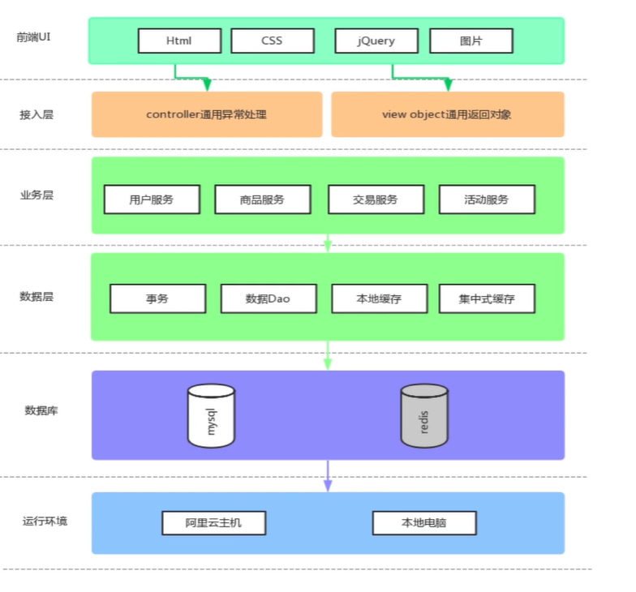
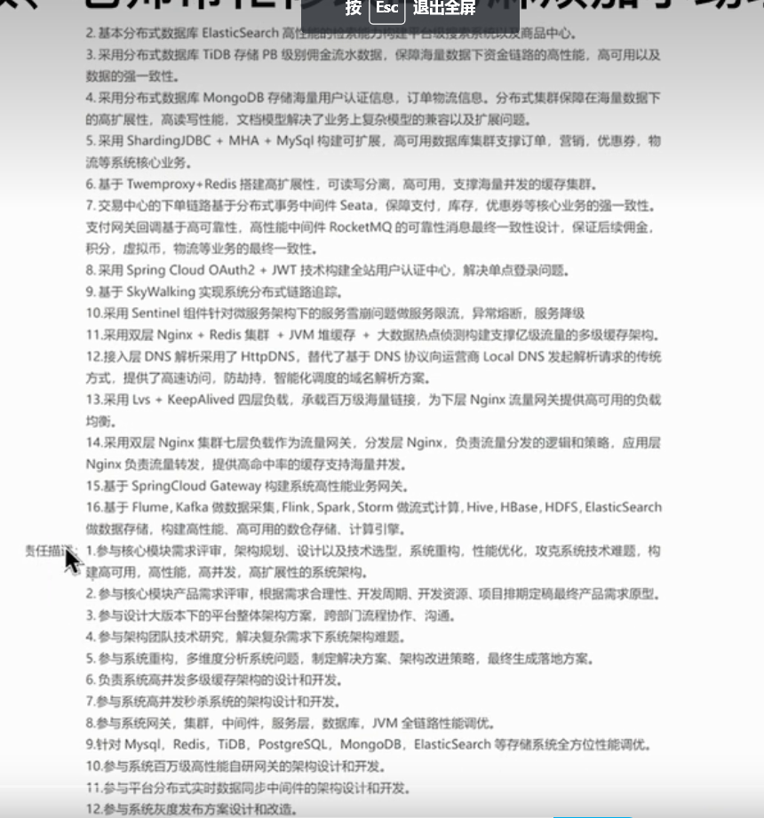

https://wenku.baidu.com/view/378f02f67ed184254b35eefdc8d376eeafaa17c1.html
https://baijiahao.baidu.com/s?id=1700243977279323832&wfr=spider&for=pc

[马士兵-简历怎么写？](https://www.bilibili.com/video/BV1dr4y1L7x1?p=11&spm_id_from=pageDriver&vd_source=7116afddac4acaa2875e31b432e7f0ed)
要学什么？

# 项目
## 科研项目

项目描述：

[项目笔记](https://blog.csdn.net/qq_35580701/article/details/106972415)
[项目笔记](https://blog.csdn.net/psj_1161885042/article/details/125941766)
技术实现：
1.使用spring-session-data-redis实现管理端分布式Session共享
2.基于Redis实现登录数据缓存，提升系统整体性能，以哨兵模式部署实现服务的高可用
3.用redis做缓存，缓存什么？过期时间？
重复提交问题怎么解决？
单点登录怎么实现？
mysql做存储层，keepalive实现高可用
集群部署
3.根据系统预测与测试结果，进行系统上线前的MySQL调优
4.代码Review，对核心接口进行优化改造
5.开发控制端核心功能，如
6.基于RocketMQ实现
搭建一个电商秒杀系统并针对高并发/高流量场景深入各个环节全面提升系统性能
项目介绍： 这是一个电商秒杀项目系统，采用的是前后端分离的设计方式，在前端的UI使用了Html、CSS、jQuery、图片等前端框架完成用户注册，登录以及商品展示，下单交易，秒杀倒计时等基本的前端功能，然后在接入层使用了SpringMVC的Controller定义了对应的ViewObject返回了通用对象，并且通过Controller层通用的异常处理方式结合通用的返回对象返回了对应的前后端分离的Data模型，之后在业务层中使用了MyBatis的接入以及Model层领域模型的概念，完成了对应的用户服务，商品服务，交易服务，以及秒杀活动服务。在数据层使用transactional标签来完成事物的切面，使用数据库mybatis的DAO来完成对数据的操作，引入本地缓存和集中式缓存解决性能问题。使用MYSQL数据库来完成对数据元的操作。利用BaseMapper工具类对数据层进行MySQL数据操作。最后，通过多种性能优化技术，打破秒杀项目性能提升的多重瓶颈从而实现全面优化。

整个页面基于HTML、CSS，然后基于JavaScript的jQuery库发送了一个动态交互的请求，给接入层controller进行通用处理，然后我们基于SpringMVC的controller层会向业务层调用相应的服务，
业务层会调用数据层的Dao，通过事务管理数据DaoMapper的方式将数据的增删改查落入到数据库中，最后到本地电脑中

通过挖掘用户的签到记录和其他类型的可用信息来预测用户在特定时间点可能访问的下一个兴趣点。
设计一个注意力机制并提出一个基于注意力的时空感知下一个兴趣点推荐模型，用来捕捉用户过去签到行为与一步签到行为的不同相关性。

1.使用springboot搭建web项目，mybatis接入springboot项目
2.使用springMVC方式开发用户信息
3.使用OpenResty框架来部署Nginx，既作为web服务器提供静态资源访问，又作为反向代理服务器响应动态资源请求，配置两个应用服务器以轮询的方式来执行负载均衡，从而最终实现动态资源和静态资源分离。
4.使用spring-session-data-redis实现服务端分布式Session共享
5.实现基于token的分布式会话
6.实现多级缓存的架构：redis作为第一级缓存，guava cache实现对热点数据进行JVM本地缓存，nginx服务器开启proxy cache作为第三级缓存，nginx定制lua脚本做nginx内存缓存
7.基于redis实现扣减库存缓存化，基于rocketmq实现异步同步数据库，保证分布式事务高可用性和最终一致性
QPS TPS

# 问题：
## 1.spring和springboot？

解决的问题：
1.单机容量瓶颈问题
2.redis是否采用分布式
1.如何发现容量问题？
2.如何使得系统水平扩展
3.查询效率低下
4.活动开始前页面被疯狂刷新
5.库存行锁问题
6.下单操作多，缓慢
7.浪涌流量如何解决
8.如何实现单点登录分布式会话

责任描述：
1.参与核心模块需求评审，架构规范、设计以及技术选型，性能优化，构建高可用，高性能，高并发，高扩展性的系统架构
2.负责系统高并发多级缓存架构的设计和开发。
3.参与系统高并发秒杀系统的架构和开发。
4.参与系统集群、中间件、服务层、数据库调优。

解决的问题：

# 技能
1.熟悉 Word 等各种办公软件以及 IDEA、Pycharm 等开发软件的使用，掌握 Java 语言以及 python 语言、Mysql 数据库、计算机网络以及数据结构等相关知识。
2.熟悉常用的关系型数据库产品Mysql，了解Oracle、SQL、Server7，对Servlet和JSP的工作原理和生命周期有一定了解。
3.熟悉MVC设计模式，能够解决常见的bug，对Spring的IoC容器和AOP原理有一定了解，熟悉运用Spring框架管理各种Web组件及其依赖关系，了解使用Spring进行事务、日志、安全性等的管理，
4.熟练的使用Java语言进行面向对象程序设计，有良好的编程习惯，熟悉常用的Java API，包括集合框架、多线程（并发编程）、I/O（NIO）、Socket、JDBC、XML、反射等。
5.对算法有相当的兴趣，参与过Ieee极限编程比赛。

1.了解多线程并发编程，锁机制，IO模型，具备良好编码能力，熟悉常见的设计模式
2.熟悉JVM原理、JMM模型、常见垃圾回收算法、垃圾回收器及JVM调优
3.了解spring，spring boot技术栈
4.熟悉SQL语言与MYSQL调优，对索引优化及存储引擎有深入理解
5.熟悉常用的缓存中间件Redis，对Redis数据持久化机制、高可用机制、多数据类型缓存应用以及多种分布式集群实现有一定理解
6.掌握RocketMQ消息中间件
7.熟悉基于Redis实现的分布式琐方案
8.熟悉Nginx架构方案
9.熟练常用的用具：Git，Maven
10.熟练使用Jmeter进行项目的压测与性能调优

自我评价
1.自学能力强，有较好的学习能力和适应能力。
2.工作积极认真，执行能力强，能够积极面对工作中的问题。
3.有良好的沟通能力，为人和谐，喜欢帮助他人。
4.服从上级管理，具有较强的团队意识。

自动化测试
# 基于遗传算法的蜕变测试
1.为什么需要蜕变测试？
缓解“测试准则问题”。 对于所选择的测试用例难以确定预期的正确结果

2.什么是蜕变测试？
https://baike.baidu.com/item/%E8%9C%95%E5%8F%98%E6%B5%8B%E8%AF%95/22723379?fr=aladdin
蜕变关系
根据蜕变关系判断输出是否满足

3.遗传算法
适应函数 选择 交叉 变异

4.如何应用？
适应函数
    1）分支语句，分配100，直传语句，分配10
    2）越长越好
选择
    适应值越高被选择概率越大

交叉

变异

# 华为云软件挑战赛
1.小数据集测试，方案验证
2.代码封装、注释
3.约束条件考虑
4.分工
5.寻找数学支撑

# 华为
首先，嗅觉敏锐，善于捕捉机会。
其次，富于进取心和攻击性，且不轻言失败。

# 多线程
状态

[同步和异步](https://blog.csdn.net/qq_37960603/article/details/83384635)
[单核CPU的机器上开多线程有什么意义？](https://www.zhihu.com/question/439604654)

# 反问
https://baijiahao.baidu.com/s?id=1660047898400578222&wfr=spider&for=pc
3、通常公司的员工培训会有哪些呢？
4、我平时的工作职责都有哪些，哪个部分最有挑战？
7、公司的使命和价值观是什么？
11、公司团队的相处方式是什么样的，一般团建搞什么形式？
12、公司的5年规划现在有吗，是如何规划的？

# Mybatis
https://blog.csdn.net/weixin_46281472/article/details/126189174

# 一些注解
@ResponseBody 
https://baijiahao.baidu.com/s?id=1719090252806994235&wfr=spider&for=pc

@Controller
http://wjhsh.net/hualishu-p-7398881.html

1.自我介绍
    
    准确率提高14.3
2.简单介绍项目，项目中遇到的难点和解决思路
    定好研究领域后如何选题或者说如何确定研究内容？ 研究领域，研读针对该领域的综述性文章，了解研究背景，主流的技术（传统技术，最近几年的技术），了解技术发展的历程。最后了解目前的挑战是什么。这样下来，我对该领域前人的相关工作有了一个整体性的了解，能够依据该领域目前的研究挑战来确定一个具有价值的研究内容和可行的研究方向
    技术瓶颈：
        看文献，多看多总结
        问师兄师姐
        请教老师
        看论坛
    
    JAVA项目遇到的难点：
        遇到bug：查看日志，网上搜索是否有相关bug，有的话看别人产生bug的原因，我的项目是否也可能因为同样的原因产生这个bug，根据已有的知识先
            当程序执行出现错误时或者编写思路中断时，自己说出在做的事情
        
        进行分析我最有可能出现问的地方，然后尝试使用的方法去解决。
        优化与调试：有时候做的改进不一定能产生效果，这时候我会去查找资料，分析原因。

        
3.华为比赛 承担的工作 遇到的问题  怎么解决的

算法设计：题目分析，数学建模，提出可行性方案
参与调试：方案改进

4.优点缺点
对于自己向往的职业，我的努力程度很大，会很愿意去学习知识与技能。（比如说学习JAVA的过程）
对一件事情喜欢从一而终，选择了就要好好做下去。（比如考研，学习计算机）
性格上来说比较乐观（考研，遇到不好的事情可以看得开，考试的失败）
情绪稳定
抗压能力强
自信（学习经历）
时间观念
擅长合理安排时间

缺点：
对真正业界的业务不熟悉
C++语言不熟悉
我的公开演讲能力比较差，公共场合讲话的时候我会感到紧张， 不过谈论我熟悉的领域我会比较放松。所以当我需要做公开发言的时候，我必须要准备得很充分。

5.职业规划
第一步：职业定位。软件方面的技术人员
第二步：发展目标。希望通过一年的努力能熟悉业务并能独立工作，保持学习并且是深度学习，早日成为骨干人员。
第三步：发展路径。也就是“How”，即如何实现自己的目标。结合自己的现在的经验和能力，以及对后续发展所需能力的理解，提出自己需要做哪些实践，主动补足哪些欠缺的地方，具备承担更大责任的能力。如何承担职责

6.了解华为吗？了解部门吗？

7.如何学习新知识？
体系化学习
碎片化学习
费曼学习法
实践
主动回忆学过的时候

# 银行
## 应聘理由
https://baijiahao.baidu.com/s?id=1708957705324266363&wfr=spider&for=pc
1.从银行前景角度来写，银行是非常有发展的行业。在银行工作可以学到很多的新知识，接受很多的新挑战，每天都会和不同的人打交道，有非常多的机会去提升自己。

2.从行业前景来写，银行属于金融业，而金融业关乎到投资，资产调配，利润最大化等方面，而这些方面都是世界经济发展的趋势。

3.从个人角度来写，比如专业对口，可以用自己学到的知识为公司带来效益，还有就是个人兴趣，计划将这个行业作为自己的职业发展，也可以写自己严谨认真的态度，与银行的工作较为符合。

4.现实点说，银行工作比较稳定，

5.银行待遇不错。朝九晚五不用加班。

6.或者可以补充，家族有在银行工作的，从小受熏陶等等

## 知乎
https://zhuanlan.zhihu.com/p/414737525
