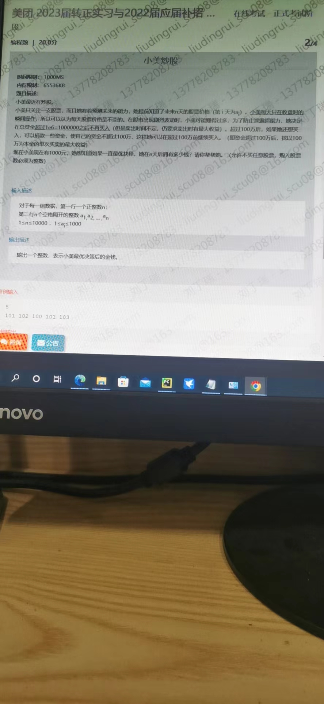
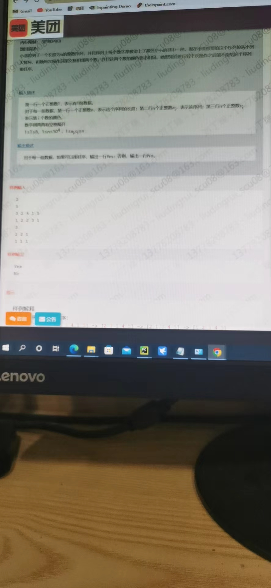
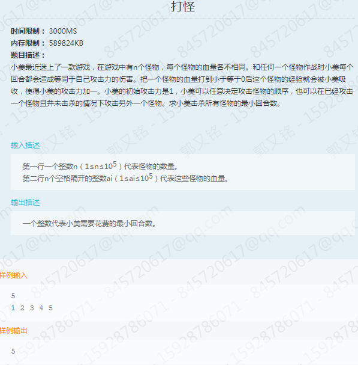

https://www.nowcoder.com/discuss/935682?type=all&order=recall&pos=&page=1&ncTraceId=&channel=-1&source_id=search_all_nctrack&gio_id=B1912EA0654501E4FCF0F49B28B4ED12-1650289848815


# 4.20华为笔试
## 第1题：
```java
public class Main {
    static  int answer=0;
    public static void main(String[] args) {
        // please define the JAVA input here. For example: Scanner s = new Scanner(System.in);
        // please finish the function body here.
        // please define the JAVA output here. For example: System.out.println(s.nextInt());
        Scanner in=new Scanner(System.in);
        int get=in.nextInt();
        int[] arr=new int[]{2,2,2,2,2,
                2,2,2,2,2,
                4,4,4,4,4,
                4,4,4,4,4,
                8,8,8,8,8};
        fun(0,0,get,0,arr);
        System.out.println(answer);
        return;
    }

    public static void fun(int i,int cur,int target,int error_num,int[] arr){
        if(error_num>=3 || cur>target){
            return;
        }
        if(cur==target){
            answer+=1;
            return;
        }
        if(i>24){
            return;
        }
        fun(i+1,cur+arr[i],target,error_num,arr);
        fun(i + 1, cur, target, error_num + 1, arr);
        return;
    }
}
```


## 第2题
```java
// We have imported the necessary tool classes.
// If you need to import additional packages or classes, please import here.


import java.util.*;
public class Main {
    public static void main(String[] args) {
        // please define the JAVA input here. For example: Scanner s = new Scanner(System.in);
        // please finish the function body here.
        // please define the JAVA output here. For example: System.out.println(s.nextInt());
        Scanner in=new Scanner(System.in);
        String input=in.nextLine();
        StringBuilder sb=new StringBuilder(input);
        sb.deleteCharAt(0);
        sb.deleteCharAt(sb.length()-1);
        String[] strs=sb.toString().split(",");
        int[] a=new int[strs.length];
        for(int i=0;i<a.length;i++){
            a[i]=Integer.parseInt(strs[i].trim());
        }


        
        String rc=in.nextLine();
        int row=rc.charAt(1)-'0';
        int coloumn=rc.charAt(3)-'0';


        sb=new StringBuilder(in.nextLine());
        sb.deleteCharAt(0);
        sb.deleteCharAt(sb.length()-1);
        strs=sb.toString().split(",");
        int[] b=new int[strs.length];
        for(int i=0;i<b.length;i++){
            b[i]=Integer.parseInt(strs[i].trim());
        }


        int root=find_root(row,coloumn);

        int[] tmp_res=new int[a.length+b.length];
        for(int i=0;i<a.length;i++){
            tmp_res[i]=a[i];
        }

        Deque<Integer> deque=new LinkedList<>();
        deque.offerLast(root);

        int get=0;
        for(int j=0;j<b.length;j++){
            get=deque.removeFirst();
            deque.offerLast(get*2+1);
            deque.offerLast(get*2+2);
            tmp_res[get]=b[j];
        }

        while(deque.peekFirst()!=null){

            get=deque.removeFirst();
            if(get>=tmp_res.length){
                break;
            }
            tmp_res[get]=0;
            if(get*2+1<tmp_res.length){
                deque.offerLast(get*2+1);
            }
            if(get*2+1<tmp_res.length){
                deque.offerLast(get*2+1);
            }
        }

        ArrayList<Integer> result1=new ArrayList<>();
        for(int i=0;i<tmp_res.length;i++){
            if(tmp_res[i]!=0){
                result1.add(tmp_res[i]);
            }
        }

        int[] result2=new int[result1.size()];
        for(int i=0;i<result2.length;i++){
            result2[i]=result1.get(i);
        }
        System.out.println(Arrays.toString(result2));
        

    }
    public static int find_root(int row,int coloumn){
        int root=0;
        for(int i=0;i<row;i++){
            root=root*2+1;
        }
        root=root+coloumn-1;
        return root;
    }

}
```


```C++
#include <iostream>
#include<vector>
#include<queue>
using namespace  std;

class node {
public:
 int num;
 node* left, *right;
};
node* creattree(vector<int>& v, int cur) {
 if (cur >= v.size() || v[cur] == 0) {
  return NULL;
 }
 node* root = new node();
 root->num = v[cur];
 root->left= creattree( v, 2 * cur + 1);
 root->right= creattree( v, 2 * cur + 2);
 return root;
} 
node* traveltree(node* root, vector<int>& v, int cur, node* son) {
 if (cur == v.size()-1 && root->num == v[cur]) {
   return son;
 }
 if (root->num == v[cur]) {
  root->left = traveltree(root->left, v, cur + 1, son);
  root->right = traveltree(root->right, v, cur + 1, son);
 }
 return root;
}

int main() {
 vector<int> v_root, v_son,v_path;
 string s_root,s_son,s_path;
 cin >> s_root;
 cin >> s_path;
 cin >> s_son;
 for (auto c : s_root) {
  if (c >= '0' && c <= '9') {
   v_root.push_back(c - '0');
  }
 }
 for (auto c : s_path) {
  if (c >= '0' && c <= '9') {
   v_path.push_back(c - '0');
  }
 }
 for (auto c : s_son) {
  if (c >= '0' && c <= '9') {
   v_son.push_back(c - '0');
  }
 }
 node  * root, * son ;
 root=creattree(v_root, 0);

 son=creattree(v_son, 0);

 root=traveltree(root, v_path, 0, son);
 queue<node*> q;
 q.push(root);
 vector<int> answer;
 while (!q.empty()) {
  int z = q.size();
  for (int i = 0; i < z; i++) {
   node* cur = q.front();
   answer.push_back(cur->num);
   q.pop();
   if (cur->left)q.push(cur->left);
   if (cur->right)q.push(cur->right);
  }
 }
 cout << '[';
 for (int i = 0; i < answer.size(); i++){
  if (i != answer.size() - 1) {
   cout << answer[i] << ',';
  }
  else
   cout << answer[i];
 }
 cout << ']';

}
```


# 4.23美团
##  第一题

```java

import java.util.Scanner;

public class main {
    public static void main(String[] args) {
        Scanner in=new Scanner(System.in);
        int n=in.nextInt();
        String a=in.nextLine();
        String n_string=in.nextLine();
        int C_start=solution(n,n_string,'C');
        int J_start=solution(n,n_string,'J');
        if(C_start!=-1 && J_start!=-1){
            System.out.println(Math.min(C_start,J_start));
        }
        else if(C_start==-1){
            System.out.println(J_start);
        }
        else {
            System.out.println(C_start);
        }
    }
    public static int solution(int n,String s,char _target){
        int stackcount=0;
        int result=0;
        int cur=0;
        char target=_target;
        while(cur<n){
            if (s.charAt(cur)==target){
                if (stackcount==0){
                    cur++;
                    if(target=='C'){
                        target='J';
                    }
                    else if(target=='J'){
                        target='C';
                    }
                }
                else{
                    result+=stackcount;
                    cur++;
                    stackcount--;
                }
            }
            else{
                stackcount++;
                cur++;
            }
        }
        if(stackcount==0){
            return result;
        }
        else{
            return -1;
        }
    }

}


```

## 第二题

```java
import java.util.Arrays;
import java.util.Scanner;

public class main{
    public static void main(String[] args) {
        //输入：指定行和列数进行输入
        //第一行：输入两个数m,n
        //后面m行，每行n个数字
        Scanner cin=new Scanner(System.in);
        int T=cin.nextInt();
        String a=cin.nextLine();

        for(int nn=0;nn<T;nn++){
            int row= cin.nextInt();
            int col= cin.nextInt();
            int[][] string=new int[row][col];
            for(int i=0; i<row;i++){
                for(int j=0;j<col;j++){
                    string[i][j]=cin.nextInt();
                }
            }
            System.out.println(judge(string));
        }


    }
    public static boolean judge(int[][] arr){
        int row_nums=arr.length;
        int colomn_nums=arr[0].length;
        // 判断最后两行是否相同
        for(int i=0;i<colomn_nums;i++){
            if(arr[row_nums-2][i]!=arr[row_nums-1][i]){
                return false;
            }
        }
        // 判断最后一列和倒数第二列是否相同
        for(int i=0;i<row_nums;i++){
            if(arr[i][colomn_nums-2]!=arr[i][colomn_nums-1]){
                return true;
            }
        }
        return true;
    }
}
```


## 第三题

```java
```

## 第四题



# 美团 
## 1.打怪

### 思路：
排序后一个个消灭


### 代码：


## 2.