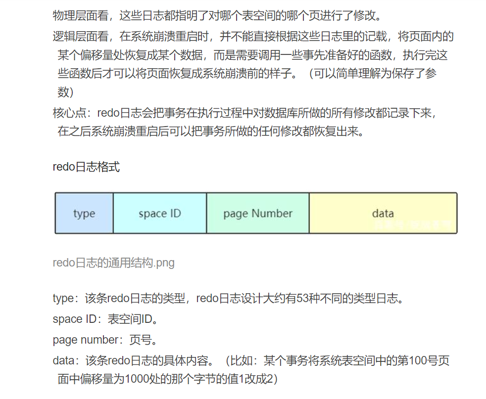

# MYSQL
## 1.MySQL的隔离级别有哪些？
### 什么是隔离？
定义规则用于限定事务内外哪些改变是可见的，哪些改变是不可见的。
级别越低效率越高，数据越不安全

### 有哪些隔离级别？
READ UNCOMMITTED 读取未提交内容    脏读、不可重复读
事务开启后，可以随便读别的事务修改的数据
READ UNCOMMITTED 读取提交内容（大多数数据库系统默认隔离级别）    不可重复读
事务开启后，可以读到别人提交的数据   
REPEATABLE READ（MySQL默认隔离级别）  可重复读   在一个事务里重复读取一个数据都会一致   产生幻读问题
事务开启后，读不到别人提交的数据
SERIALIZABLE 可串行化
在每个读的数据行加上锁，强制事务排序

### 不同的隔离级别会产生哪些不同的数据安全问题？
脏读：
不可重复读：同一个事务里对同一个数据读两次的结果不一致，例子：事务A在两次查询中间，该数据被事务B修改
幻读：发生在一个事务（T1）读取了几行数据，接着另一个并发事务（T2）插入了一些数据时。在随后的查询中，第一个事务（T1）就会发现多了一些原本不存在的记录，就好像发生了幻觉一样，所以称为幻读。

## 2.MySQL复制原理
原理：
    （1）master服务器写binlog日志
    （2）slave服务器探测Master是否改变，如果发生改变，开启IO/Thread请求master二进制事件
    （3）同时主节点为每个I/O线程启动一个dump线程，保存至中继日志，从节点启动SQL线程从中继日志中读取二进制日志，在本地重放，最后I/OThread和SQL Thread将进入睡眠状态

## 3.聚簇索引和非聚簇索引区别
数据和索引放在一起就是聚簇，否则就是非聚簇
innodb中既有聚簇索引也有非聚簇索引
myisam中只有非聚簇索引

## 4.索引的基本原理
### 为什么要索引？
一般的应用系统，读写比例在10：1左右，复杂的查询操作最容易出问题，对查询语句的优化是重中之重，索引则是为了加速查询
### 什么是索引？
索引也叫一种“键”，是存储引擎用于快速找到记录的一种数据结构，相当于字典的音序表
### 索引的原理
本质都是：通过不断缩小想要获取数据的范围来筛选出最终想要的结果。

## 5.mysql索引结构有哪些？

## 6.谈谈对mysql索引的理解
mysql里面存在对应的一些索引，索引的数据结构是通过B+树或Hash表生成的，不同类型的索引是与存储引擎相关的，myisam和innodb存储引擎对对应的数据结构是B+树，Memory存储引擎对应的数据结构是Hash表（不同的存储引擎表示的是数据在磁盘上不同的组织形式）。使用B+树的原因是索引里面存储的是keyvalue数据，key就是列值，value是一行的记录，当选择KV格式存储的时候可以用hash表，二叉树，AVL树，红黑树，B+树，如果用二叉树最后都会导致整棵树变高，树变高会影响我们IO的次数，从而影响我们访问数据的效率，使用B+树可以在某一个数据节点里尽可能多的存储数据，让这棵树变低。在mysql里，有主键索引，唯一索引，普通索引，组合索引。在主键索引和组合索引时，会存在一系列回表，覆盖索引，最多匹配，索引下推的细节。使用SQL语句的时候，还可以通过索引的点来进行优化，提高对应数据的访问效率。

[B+树详解](https://blog.csdn.net/qq_41999455/article/details/106138619)

[mysql索引面试题](https://www.bilibili.com/video/BV14K4y1W73B?p=5&spm_id_from=pageDriver&vd_source=7116afddac4acaa2875e31b432e7f0ed)

## 7.mysql锁的类型有哪些？
基于锁的属性分类：共享锁（读锁）、排他锁（写锁）
基于锁的粒度分类：行级锁、表级锁、页级锁、记录锁、间隙锁、临建锁
基于锁的状态分类：意向共享锁、意向排它锁

[索引下推](https://www.jb51.net/article/222444.htm)

## 8.MySQL三大日志（binlog、redo log和undo log）
###  redo log
MySQL挂了之后或宕机之后，重启时，innodb存储引擎会使用redo log恢复数据，保证数据的持久性和完整性
运行机制是这样的：
    我们在查询的时候，会从硬盘把一页的数据加载出来（默认16kb）放入到BufferPool中，这样做是因为之前被读取过的数据很可能被下一次读取，所以后续的查询会先从BufferPool中去找，找不到再去硬盘中查找，减少IO的开销。同样的，我们的redo log也有一个重做日志缓存，当我们去修改数据时，会先把修改命令记录在redolog buffer中，然后根据刷盘时机的具体策略来把缓存的内容写入到文件系统缓存（page cache），再调用fsync刷盘。
    事务提交时的三种策略：0不刷、1刷、2只写入page cache
    InnoDB引擎有一个后台线程每隔1秒就会去刷盘，另外redolog buffer达到设置的size的一半也会主动刷盘
[详细了解MySQL的redo日志](https://baijiahao.baidu.com/s?id=1720858732021016311&wfr=spider&for=pc)

### undo log
sql执行失败之后回滚数据，保证事务的原子性

### binlog
是数据记录的日志文件，用于数据备份，主从同步

